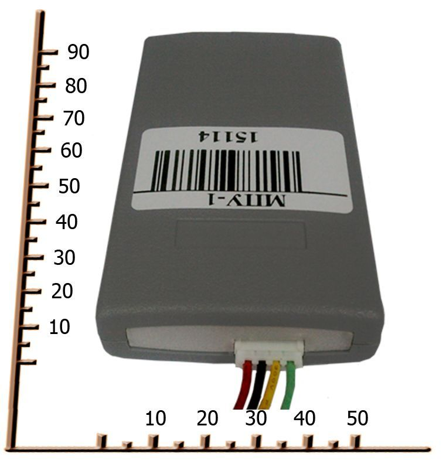

# OKB Tehnoavtomatika - MPU-01

The Tracking System MPU-01 from OKB Tehnoavtomatika is a compact GPS tracker designed to deliver accurate and dependable position reporting for a variety of mobile asset and fleet applications. It is built around a 50-channel high sensitivity GPS receiver and supports SMS communication, offering a balance of precise coordinate acquisition, compact dimensions, and modest power draw suitable for extended operation.

As a Plaspy compatible device, the MPU-01 can feed location and status information into the Plaspy fleet management platform for centralized monitoring and reporting. Its combination of accurate positioning, SMS messaging capability, and configurable inputs and outputs makes it a practical option for organizations that want to combine hardware reliability with Plaspy visibility and operational oversight.

## Key Highlights

- 50-channel high sensitivity GPS receiver for improved location accuracy and satellite reception
- SMS communication via GSM 900 1800 for message based updates and remote notifications
- Low power consumption under 250 mA to support extended operation intervals
- Compact form factor in two size options 90 × 50 × 16 mm or 90 × 50 × 25 mm depending on battery pack
- Lightweight design under 200 grams for easier deployment across assets
- Flexible I O configurations offering combinations of digital inputs outputs and an analog input to match basic monitoring needs

## How It Works with Plaspy

MPU-01 devices provide positional and message based updates that can be ingested by Plaspy to present consolidated vehicle and asset information in a single platform. Plaspy uses those inputs to give teams visibility, alerting, and historical records that support fleet operations and decision making.

- Map based visibility of device locations and historical tracks for operational oversight
- Consolidated status reporting and logs to support fleet monitoring and basic diagnostics
- Configurable alerts and notifications driven by location or input state changes
- SMS messaging can be used alongside data reporting for remote commands or notifications where supported
- Reporting and export options in Plaspy for operational analysis and record keeping

## Typical Use Cases

- Commercial vehicle fleet location and movement monitoring
- Tracking of portable or lightweight assets that benefit from a compact tracker
- Rental equipment and small machinery oversight for utilization reporting
- Field service vehicles and crews requiring position visibility and basic status inputs
- Situations where SMS messaging is useful as a supplementary communication channel

## Why Choose This Tracker with Plaspy

MPU-01 is a practical choice for organizations that need a compact, accurate tracker with straightforward configuration options and SMS capability. When paired with Plaspy, the device's positioning data and message based communication contribute to a unified view of assets and enable routine fleet management tasks such as tracking, alerts, and basic reporting.

While the MPU-01 profile is concise, its core strengths of high sensitivity GPS reception, low power consumption, and flexible I O make it a sensible candidate for integration into Plaspy for a range of operational scenarios. For more detailed device behavior and compatibility considerations, Plaspy can help map MPU-01 outputs into platform features to match your workflow.

To learn more about how Plaspy can work with the MPU-01 and other compatible trackers visit https://www.plaspy.com. Product specifications, availability, and manufacturer details can change over time, so please verify current technical information on the official OKB Tehnoavtomatika website http://www.okb-ta.ru/.
