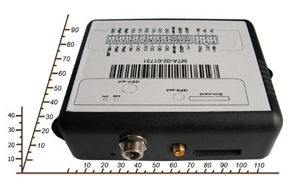

# OKB Tehnoavtomatika - MTA-02

The GPS System MTA-02 by OKB Tehnoavtomatika is a versatile and comprehensive device designed to meet various tracking and monitoring needs. With its flexible system configuration, this GPS tracker can be customized to address specific problems and requirements. Whether you need to track vehicles, specialized equipment, or even remote stationary objects, the MTA-02 has the capabilities to provide accurate and reliable information.

One of the standout features of the MTA-02 is its ability to support additional peripherals and accessories. You can connect a headset for hands-free voice communication, a sensor for fuel level control, a Bluetooth device for wireless connectivity, or even a video camera for real-time monitoring. This makes the MTA-02 a versatile solution for a wide range of applications, including fleet management, security, and asset tracking.

The MTA-02 offers multiple ways to receive notifications and monitor the device. You can receive alerts and updates via the internet using GPRS, through SMS messages to a specified number, or by monitoring through a service control center. This ensures that you stay informed about the status and location of your assets at all times.

### Key Features:

- Flexible system configuration for specific needs
- Supports peripherals like headset, sensor, Bluetooth, and video camera
- Multiple notification options: internet \(GPRS\), SMS, service control center

### Technical Specifications:

- Functions: Fuel consumption control
- Channel tie with DC: GSM 900/1800
- Power supply: DC 9V to 68V, built-in rechargeable battery
- Current consumption: Active mode - up to 180mA, standby mode - up to 65mA, sleep mode - up to 20mA
- Built-in rechargeable battery capacity: Up to 600mAh
- Time of technical readiness: Up to 3 minutes
- Enclosure: IP30
- Dimensions: 140 × 80 × 35 mm
- Weight: 330g

