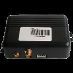

# OKB Tehnoavtomatika - MTA-12

The MTA-12 from OKB Tehnoavtomatika is a transport tracking device built for modern vehicle monitoring. It offers flexible system configuration to address a range of tracking needs and is designed to be used on different types of vehicles including specialized equipment. The model provides location data via a high sensitivity GPS receiver and supports multiple notification channels to keep operators informed.

This tracker is relevant as a Plaspy compatible device because it provides the core capabilities Plaspy uses for fleet visibility: reliable position reporting, configurable alerts, and supplementary vehicle status information via Controller Area Network telemetry. When paired with Plaspy, MTA-12 units can feed location and status updates into centralized monitoring and reporting tools for operational oversight.

## Key Highlights

- Flexible configuration to adapt to different tracking scenarios and vehicle types
- Controller Area Network telemetry for additional machine level information
- Multiple notification options including internet based data and SMS alerts
- Fuel control and ignition state monitoring as reported by the device
- 50 channel high sensitivity GPS receiver for accurate coordinate reception
- Wide DC input range and built in rechargeable battery for resilient power handling
- Compact enclosure suitable for a variety of vehicle installations

## How It Works with Plaspy

MTA-12 units can be integrated into Plaspy to provide continuous location and status visibility across a fleet. Plaspy ingests the device reporting to present maps, alerts, and historical tracks so teams can monitor vehicles and review operational data.

- Centralized map view of MTA-12 locations alongside other fleet assets in Plaspy
- Configurable alerts sent from Plaspy based on location changes, ignition state, or custom conditions reported by the tracker
- Historical route and activity reporting to assist with operations review and compliance
- Real time status visibility for fuel and ignition related signals as provided by the tracker
- Consolidated device management within Plaspy for monitoring multiple MTA-12 units

## Typical Use Cases

- Fleet management for mixed vehicle fleets including commercial trucks and specialized machinery
- Remote monitoring of vehicle status and operational readiness
- Fuel usage oversight and basic engine state monitoring for operational efficiency
- Dispatch and route tracking for logistics and field service operations
- Incident detection and notification through SMS or internet based alerts

## Why Choose This Tracker with Plaspy

The MTA-12 is suited to organizations that need a configurable tracker able to report both position and machine level signals. Its support for Controller Area Network telemetry and multiple notification channels makes it a practical choice where additional vehicle information such as fuel or ignition state is valuable for operations. Paired with Plaspy, the device's reporting can be turned into actionable dashboards, alerts, and reports that improve fleet oversight.

If you want to learn more about how Plaspy can work with the MTA-12 and other compatible trackers, visit https://www.plaspy.com. Product specifications, availability, and manufacturer details can change over time, so please verify current technical information and documentation on the manufacturer site http://www.okb-ta.ru/.
