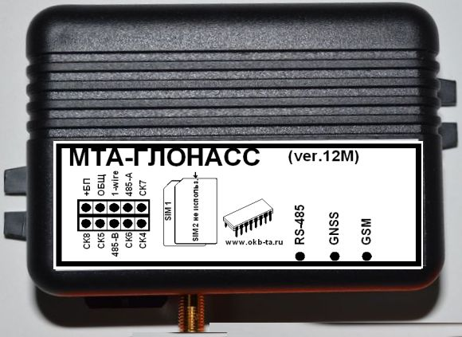

# OKB Tehnoavtomatika - MTA-Glonass (ver.12-M RS-485)

The MTA-Glonass (ver.12-M RS-485) is a vehicle monitoring terminal and GPS tracker from OKB Tehnoavtomatika designed for fleet operators and service providers. It combines a 50 channel high sensitivity GPS GLONASS receiver with GSM 900 1800 communications supporting DATA GPRS and SMS to provide real time tracking, telemetry and wired fuel monitoring through an RS-485 interface. The unit also offers multiple digital inputs, an ignition input, pulse frequency sensor support and an internal battery to preserve critical event logs during power interruptions.

As a Plaspy compatible device, the MTA-Glonass is suited to feed location and wired sensor data into Plaspy for centralized monitoring. Its RS-485 connectivity for Omnicomm style fuel sensors and configurable inputs make it useful where accurate fuel telemetry and engine hours are required alongside continuous position reporting. Plaspy can use the device feed to produce live maps notifications and historical reports that help manage operations at scale.

## Key Highlights

- Plaspy compatible GPS GLONASS tracker with a 50 channel high sensitivity receiver for accurate positioning and real time visibility.
- GSM 900 1800 communications supporting DATA GPRS and SMS for flexible reporting to servers and subscriber notifications.
- RS-485 interface for direct integration with Omnicomm and similar fuel level sensors to support fuel monitoring workflows.
- Multiple configurable digital inputs plus an ignition input for event driven telemetry and engine hours tracking.
- Internal rechargeable battery and non volatile event memory to preserve records and maintain logging during power loss.
- Compact IP30 enclosure with a small form factor suitable for discreet vehicle and asset installations.

## How It Works with Plaspy

When integrated with Plaspy the MTA-Glonass forwards position updates timed events and wired sensor telemetry to Plaspy servers allowing operators to monitor fleets in real time and analyze historical data. Plaspy can consume location and telemetry messages to trigger alerts populate dashboards and generate reports that support operational oversight and decision making.

- Real time location and telemetry updates sent to Plaspy via cellular DATA GPRS or SMS for continuous fleet visibility.
- Ignition input supplies engine on engine off status and supports engine hours tracking for maintenance planning.
- Fuel monitoring via RS-485 sensors and pulse frequency inputs with data forwarded into Plaspy fuel reports and alert rules.
- Buffered non volatile event memory ensures records are retained and later synchronized with Plaspy when connectivity is restored.
- Configurable digital inputs and optional outputs enable event driven alerts and basic remote actions when combined with platform rules.

## Typical Use Cases

- Fleet management with real time tracking route monitoring and engine hours based maintenance planning.
- Fuel monitoring and loss detection using RS-485 connected fuel level sensors and pulse inputs for consumption analysis.
- Anti theft and security workflows using location updates and configurable outputs to support immobilizer or alert procedures.
- Remote diagnostics and telemetry capture for vehicles operating in areas with intermittent cellular coverage.
- Asset and equipment tracking where compact size low power draw and wired sensor integration are required.

## Why Choose This Tracker with Plaspy

The MTA-Glonass (ver.12-M RS-485) is a practical fit for organizations that need dependable GNSS positioning together with robust wired sensor integration. Its RS-485 support for Omnicomm style fuel sensors multiple inputs internal battery and non volatile memory make it well suited to fleets that require accurate fuel telemetry event logging and continuity during power loss. When paired with Plaspy the device contributes to a centralized monitoring setup that can deliver alerts historical reporting and operational insights.

Learn more about Plaspy on the main website https://www.plaspy.com. Product specifications availability and manufacturer details can change over time so please verify current specifications on the official OKB Tehnoavtomatika website http://www.okb-ta.ru/ before making procurement or deployment decisions.
