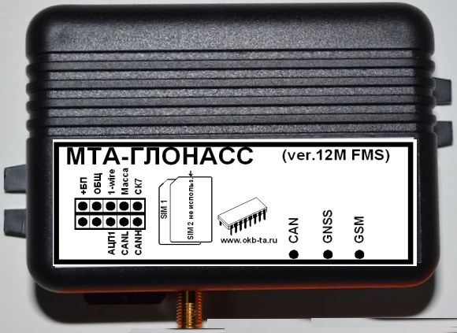

# OKB Tehnoavtomatika - MTA-Glonass (ver.12M-CAN FMS)

The MTA-Glonass (ver.12M-CAN FMS) is a compact vehicle monitoring terminal engineered for satellite based fleet tracking and telematics. Designed for commercial vehicles, this Plaspy compatible GPS tracker combines a multi channel GNSS receiver with cellular communications to deliver continuous position reporting and vehicle telemetry suitable for operational monitoring and reporting.

As a device that exposes vehicle bus telemetry and fuel sensing options while storing event records, the MTA-Glonass is well suited to integrate with Plaspy for fleet oversight. Its feature set aligns with common fleet needs such as real time tracking, fuel monitoring, event history and vehicle focused telemetry ingestion, making it a practical option to use with Plaspy dashboards and alerting workflows.

## Key Highlights

- Compatible with Plaspy for real time location and telemetry reporting to a centralized fleet platform.
- Dual GNSS support providing robust satellite positioning for commercial vehicle operations.
- Native CAN FMS connectivity to access vehicle bus parameters commonly used in heavy trucks.
- Multiple fuel sensing inputs and analog options to support fuel level monitoring and theft detection workflows.
- Non volatile event storage that preserves records for later upload and audit purposes.
- Wide DC input range and internal backup battery designed to support continuous vehicle operation.
- Compact, vehicle oriented form factor suited to discreet integration in commercial fleets.

## How It Works with Plaspy

When connected to Plaspy, the MTA-Glonass streams GNSS coordinates and vehicle telemetry to the platform where data is normalized into maps, alerts and reports. Plaspy consumes position updates, CAN FMS values and fuel sensor events so fleet managers can monitor vehicles, investigate incidents and produce historical analytics from a single interface.

- Real time location updates and position history for route visibility and playback in Plaspy.
- CAN FMS telemetry ingestion to surface engine and vehicle parameters in Plaspy dashboards and reports.
- Fuel monitoring inputs translated into consumption events and anomaly alerts for reconciliation in Plaspy.
- Event and alarm forwarding so Plaspy can notify operators on predefined conditions such as movement or sensor thresholds.
- Historical event export and reporting to support compliance, audits and maintenance planning.

## Typical Use Cases

- Heavy truck fleet management requiring vehicle bus data for maintenance planning and driver performance analysis.
- Fuel level monitoring and theft detection using pulse and analog inputs with reconciliation in Plaspy.
- Anti theft and remote immobilization workflows coordinated through Plaspy alerting and control routines.
- Temperature aware cargo monitoring by combining environmental sensor inputs and positional records in Plaspy.
- Remote diagnostics and telemetry capture to reduce unplanned downtime and support preventive maintenance.

## Why Choose This Tracker with Plaspy

The MTA-Glonass (ver.12M-CAN FMS) is focused on vehicle centric telemetry and operational reliability, which aligns well with the needs of commercial fleets. Its capability to expose GNSS positioning, CAN FMS parameters and multiple fuel sensing options makes it a practical choice for organizations that want consolidated visibility in Plaspy without adding unnecessary complexity.

Paired with Plaspy, this terminal helps turn vehicle signals into actionable information for routing, fuel analytics, incident response and maintenance oversight. For fleets that prioritize consistent tracking, event rich data and vehicle bus integration, the MTA-Glonass provides a compact, fleet oriented terminal that integrates into Plaspy powered workflows.

To learn more about Plaspy and how compatible devices like the MTA-Glonass can fit into your fleet management strategy, visit https://www.plaspy.com. Product specifications and availability can change over time, so please verify current technical details and compatibility information with the manufacturer at http://www.okb-ta.ru/.
