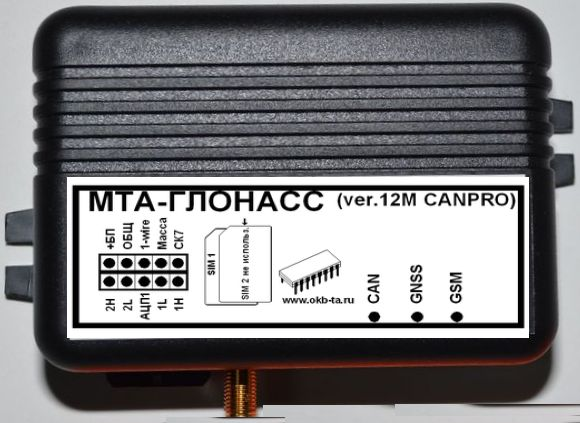

# OKB Tehnoavtomatika - MTA-Glonass (ver.12M-CAN-PRO)

The MTA-Glonass (ver.12M-CAN-PRO) is a professional vehicle monitoring terminal designed for reliable satellite positioning and telematics in fleet operations. Purpose built for vehicle telemetry, it combines high-sensitivity GNSS positioning with multi-channel communications to support continuous location updates, event logging, and remote diagnostics for dispatch centers and operations teams.

As a Plaspy compatible device, the MTA-Glonass ver12M CAN PRO can forward location and vehicle telemetry into the Plaspy platform so teams can view live tracking, receive configurable alerts, and analyze historical reports. Its integration options for vehicle bus data, pulse and analog sensors, plus optional temperature and control outputs, make it a practical choice for operators who want CAN derived vehicle information and sensor telemetry visible inside Plaspy dashboards.

## Key Highlights

- High-sensitivity 50 channel GNSS receiver for responsive satellite positioning and consistent tracking performance.  
- Multi-channel communications supporting GPRS, SMS and a dedicated DATA channel for reliable telemetry uplink and downlink.  
- Direct CAN bus integration for vehicle network parameters such as engine and ignition status useful to fleet monitoring.  
- Inputs for pulse and analog sensors to support fuel monitoring and other sensor telemetry use cases.  
- Built-in rechargeable backup battery with documented standby capability to preserve logging and basic tracking during power interruptions.  
- Large internal event storage and configurable event logging to support audit trails, alerts and anti-theft workflows.

## How It Works with Plaspy

When connected to network services, the MTA-Glonass transmits GNSS positions and vehicle telemetry to Plaspy where the platform ingests those updates for live monitoring and historical reporting. Plaspy can leverage the device data to generate alerts, visualize trips, and include sensor inputs in operational dashboards while relying on the unit's local event buffering to avoid data loss during temporary connectivity gaps.

- Live location updates and status appear on Plaspy tracking dashboards for operational visibility.  
- CAN sourced parameters allow Plaspy to determine trip start and stop events and support basic engine or ignition state reporting.  
- Pulse and analog sensor inputs enable fuel level and flow monitoring, which Plaspy can incorporate into consumption and anomaly reports.  
- Internal event storage ensures records are forwarded to Plaspy once connectivity is restored, preserving continuity of historical data.  
- Optional control outputs and temperature inputs can be used to trigger alerts or actions managed from Plaspy when configured.

## Typical Use Cases

- Fleet management and route monitoring for buses, trucks and service vehicles where location and vehicle data are needed.  
- Fuel monitoring and consumption analysis using pulse and analog sensor inputs integrated into Plaspy reports.  
- Anti-theft workflows combining event logging with optional remote control outputs and alerting.  
- Remote telemetry and diagnostics by collecting CAN derived parameters for maintenance planning.  
- Temperature sensitive cargo monitoring when an optional temperature input is used alongside Plaspy alerts.

## Why Choose This Tracker with Plaspy

The MTA-Glonass ver12M CAN PRO brings a blend of robust GNSS positioning, vehicle bus telemetry and multiple communications channels that align with common fleet management needs. For organizations already using or evaluating Plaspy, this terminal offers practical data points and event logging that can be displayed, alerted on and analyzed within the Plaspy environment without requiring extensive customization.

Its combination of sensor inputs, CAN integration and local event storage makes it suited to deployments where both continuous location visibility and vehicle parameter monitoring are important. While specific integration details and configuration will depend on your deployment and Plaspy setup, this tracker provides a strong foundation for fleet tracking, fuel oversight and telemetry driven operational workflows.

To learn more about Plaspy and how it can work with compatible trackers like the MTA-Glonass, visit https://www.plaspy.com. Product specifications and availability can change over time, so please verify current technical details and options on the manufacturer's official site http://www.okb-ta.ru/.
