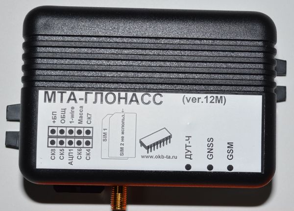

# OKB Tehnoavtomatika - MTA-Glonass (ver. 12M)

The MTA-Glonass (ver. 12M) is a compact GPS tracking terminal designed for dependable vehicle monitoring and telemetry. It pairs a 50‑channel high sensitivity GNSS receiver with GSM 900/1800 communications and supports DATA, GPRS and SMS channels for two‑way data exchange, making it suitable for real‑time tracking, event logging and remote control tasks in automotive and industrial vehicle environments. The unit is built to tolerate a wide input voltage range and includes a built‑in rechargeable battery and extensive input and output options for common telemetry needs.

As a Plaspy compatible device, the MTA-Glonass (ver. 12M) integrates with Plaspy’s fleet management platform to provide live position updates, configurable alerts and telemetry reporting. Its combination of persistent communications, onboard event storage and diverse I O capabilities allows Plaspy to consume location and status data for visibility, historical reporting and operational oversight across mixed vehicle fleets.

## Key Highlights

- Plaspy compatible tracker providing reliable real‑time tracking and telemetry integration.  
- 50‑channel high sensitivity GNSS receiver for consistent coordinate fixes in varied environments.  
- GSM 900/1800 communications with DATA, GPRS and SMS options for two‑way data exchange and alerts.  
- Wide DC input range and built‑in rechargeable battery to maintain tracking during power interruptions.  
- Comprehensive I O suited for fuel monitoring, ignition sensing, engine hours accounting and remote immobilizer control.  
- Large onboard event storage for offline logging and later upload to Plaspy.

## How It Works with Plaspy

When connected to Plaspy, the MTA-Glonass (ver. 12M) becomes a managed telematics endpoint: the terminal reports GPS coordinates and event telemetry to Plaspy where data is processed for live maps, alerting, geofence monitoring and historical analysis. Plaspy can also use the terminal's inputs and outputs to trigger operational workflows and generate maintenance data.

- Real time location updates and position history for fleet visibility on Plaspy maps.  
- Telemetry reporting such as ignition status and engine hours to support maintenance scheduling.  
- Fuel level and pulse input data integrated into Plaspy dashboards and alerts for fuel monitoring.  
- Remote control actions such as immobilizer commands available through Plaspy using the device outputs.  
- Offline event logging stored on the unit and uploaded to Plaspy when connectivity is restored.

## Typical Use Cases

- Fleet management and route monitoring where live GPS, ignition and engine hours improve dispatch and uptime.  
- Anti‑theft protection with theft alarms and remote immobilization controlled from the Plaspy platform.  
- Fuel monitoring and loss detection using analog and pulse inputs combined with Plaspy alerts.  
- Event logging and compliance reporting that rely on retained records and later upload to Plaspy.  
- Temperature sensitive cargo monitoring where optional temperature inputs are present and reported through Plaspy.

## Why Choose This Tracker with Plaspy

The MTA-Glonass (ver. 12M) is a practical choice for organizations that need a compact, robust tracker with proven satellite positioning and reliable cellular communications. Its wide voltage tolerance and backup battery help preserve tracking during power interruptions, while the available I O and storage capacity let Plaspy capture meaningful telemetry for operational decision making and historical analysis.

To learn more about how Plaspy can manage devices like the MTA-Glonass (ver. 12M) visit https://www.plaspy.com. Product specifications, availability and manufacturer details can change over time, so please verify current technical information on the official manufacturer website http://www.okb-ta.ru/.
