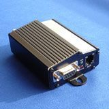

# Parallel track - Trackbox

The Parallel Track Trackbox is a compact and versatile GPS tracker designed to report the location of assets at regular intervals to a predefined web service. It can transmit updates over the mobile phone network and deliver location on request via SMS text message. The device is commonly used to provide real time position data that can be displayed through popular mapping services and embedded into a web presence.

As a device that sends data via standard POST and supports SMS reporting, the Trackbox is a practical candidate for integration with Plaspy. When configured to deliver its updates to Plaspy, the Trackbox can feed location information into Plaspy dashboards and reporting tools, enabling fleet managers and operators to include it among their monitored devices.

## Key Highlights

- Reports location at regular intervals to a predefined web service
- Sends data via standard POST for straightforward web integration
- Can transmit updates over the mobile phone network and respond to SMS requests
- Works with common mapping services for visual location display
- Compact design suitable for a variety of asset types and mounting environments
- Applicable to fleet management, asset tracking, and personal tracking scenarios

## How It Works with Plaspy

When the Trackbox is configured to deliver its POST updates to Plaspy, incoming location reports are ingested by the platform and made available for monitoring and analysis. Plaspy can present those updates alongside other devices to give a unified view of assets and routes.

- Live location display on Plaspy maps for situational awareness
- Regular interval reports populate history and route traces for review
- SMS on request provides an on demand location that can be added to Plaspy records
- Alerts and notifications in Plaspy can be triggered by location changes and operational events
- Reporting and export features in Plaspy allow historical data to be used for operational analysis

## Typical Use Cases

- Fleet vehicle monitoring for small to medium sized operations
- Tracking of rental equipment and movable assets
- Delivery and logistics visibility for route oversight
- Personal tracking for lone workers or high value portable items
- Site based tracking for construction or temporary installations

## Why Choose This Tracker with Plaspy

The Trackbox is a good fit when you need a straightforward GPS device that can push location data to a web service using standard HTTP POST and also offer SMS based location on demand. Its support for common mapping services and its compact form make it suitable for mixed fleets and asset types where simple, reliable location reporting is the primary requirement.

If you are evaluating devices for use with Plaspy, the Trackbox offers a clear integration path thanks to its POST output and SMS fallback. To learn more about Plaspy and how it can incorporate the Trackbox into a wider fleet or asset monitoring strategy, visit https://www.plaspy.com. Please note that product specifications, availability, and manufacturer details can change over time; verify current specifications with the manufacturer at http://www.paralleltrack.co.uk.
