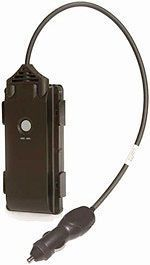

# Pointer - Cello Track 3Y

The CelloTrack 3Y Family, which includes the CelloTrack 3Y, CelloTrack Power 3Y, and CelloTrack Lighter 3Y, is a range of innovative and adaptable tracking devices designed for mobile and fixed asset management. These devices provide continuous tracking and monitoring of the precise location of valuable assets, enhancing operational productivity for businesses. 

The CelloTrack 3Y is equipped with a durable and long-life battery that can last approximately 3 years, ensuring reliable performance over an extended period. Its IP67 weatherproof casing adds an extra layer of protection, making it resistant to harsh environmental conditions. This means that the CelloTrack 3Y can function optimally even without direct access to a power supply and can withstand severe weather conditions. 

With the CelloTrack Power 3Y, businesses can monitor not only the location of their assets but also their power consumption. This feature allows for efficient energy management and helps identify any anomalies or potential issues with power usage. 

The CelloTrack Lighter 3Y is a compact and lightweight tracking device that is ideal for tracking smaller assets. Its small size and discreet design make it easy to conceal and attach to various objects, ensuring accurate tracking without drawing attention. 

Overall, the CelloTrack 3Y Family offers a comprehensive solution for asset tracking and management, providing businesses with the tools they need to optimize their operations and protect their valuable assets.

