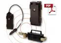

# Pointer - Cello Track XT

The Cello Track XT from Pointer is a rugged GPS tracker designed for asset tracking in extreme weather conditions. Part of the CelloTrack XT family, this device is built to operate reliably from arctic lows to desert highs, offering a wide operational temperature range and robust construction suited to demanding environments. The family includes the CelloTrack XT and the CelloTrack Power XT, sharing core capabilities and firmware with Pointer's broader CelloTrack line.

As a Plaspy compatible device, the Cello Track XT can be integrated into Plaspy for centralized location visibility and fleet oversight. Its long operational endurance and support for periodic GPS reads and GPRS transmissions make it a practical option for organizations that need reliable remote monitoring under harsh climate conditions while using Plaspy for tracking, alerts, and reporting.

## Key Highlights

- Designed for extreme temperatures with an operational range from minus 30°C to plus 70°C
- Wide charging temperature window from minus 10°C to plus 60°C to support varied climates
- Up to thirteen months of operation based on one GPS reading and one GPRS transmission per day
- Rechargeable 4.25AH Li Poly battery for extended field deployments
- Same firmware base and feature set as the standard CelloTrack 3Y family for consistent behavior
- Ruggedized product family meant for arctic and desert asset tracking environments

## How It Works with Plaspy

The Cello Track XT can be connected to Plaspy to provide persistent location updates and operational visibility for assets operating in challenging environments. When used with Plaspy, the tracker supplies the core location events and periodic transmissions that Plaspy ingests for monitoring, alerting, and reporting.

- Sends periodic GPS location updates that Plaspy displays on maps for live and historical tracking
- Enables centralized fleet monitoring so dispatch and operations teams can oversee remote assets
- Supports configurable alerts in Plaspy for motion, geofence, or scheduled reporting thresholds
- Feeds data into Plaspy reporting tools for uptime, route history, and utilization analysis
- Helps maintain operational oversight of assets in remote or extreme climate deployments

## Typical Use Cases

- Tracking remote equipment and containers in arctic or desert conditions
- Long term monitoring of seasonal or infrequently serviced assets
- Fleet visibility for operations that need devices with extended battery endurance
- Asset protection and location auditing in logistics and heavy industry
- Monitoring dispersed infrastructure in mining, oil and gas, or utilities

## Why Choose This Tracker with Plaspy

The Cello Track XT is a practical choice for organizations that require a durable tracker capable of operating across a wide temperature range while integrating into an enterprise platform like Plaspy. Its extended run capability and shared firmware lineage with Pointer s CelloTrack family help simplify device management and behavioral expectations when added to an existing deployment.

Paired with Plaspy, the tracker delivers resilient location visibility and data continuity for assets in harsh environments. This combination supports operational decision making, reporting, and alerting without requiring specialized changes to the monitoring platform.

To learn more about using Pointer Cello Track XT with Plaspy visit https://www.plaspy.com. Product specifications and availability can change over time so please verify current details on the manufacturer site http://www.pointer.com.
