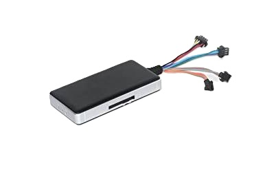

# Protrack - GT06N

The Protrack GT06N is a compact IP65 rated GPS tracker designed for reliable real time tracking of cars and motorcycles. It combines a rugged weather resistant enclosure with essential vehicle tracking features such as SOS emergency alert, geo fence and overspeed warnings, historical route playback, and fuel cutoff control. These capabilities make the GT06N suitable for both fleet management and personal vehicle security where continuous monitoring and quick incident response are important.

As a Plaspy compatible device, the GT06N can feed live location and event data into a unified telematics platform. Integrating the tracker with Plaspy enables centralized visibility of vehicles, configurable alerts for incidents like geofence breaches or SOS signals, and access to historical route data for auditing. This compatibility helps operators and vehicle owners use Plaspy to oversee mixed fleets and single vehicles with a focus on security and operational oversight.

## Key Highlights

- Plaspy compatible GPS tracker for continuous real time tracking of cars and motorcycles
- IP65 rated compact housing to resist water and dust for dependable in vehicle use
- Built in SOS emergency alert to notify operators through the Plaspy platform
- Fuel cutoff control for immobilization as part of anti theft response workflows
- Geo fence alerts and overspeed warnings for compliance and safety monitoring
- Historical route playback to support auditing and incident review
- Power outage detection that signals possible tampering or disconnection

## How It Works with Plaspy

When paired with Plaspy, the GT06N streams location and event notifications into a centralized telematics dashboard so dispatchers, managers, and owners can monitor assets and respond to issues. Plaspy ingests the tracker data and presents it as live maps, alerts, and reports that support everyday fleet operations and emergency handling.

- Real time location updates appear in Plaspy for live tracking and route visualization
- SOS emergency alerts are forwarded to Plaspy with location to support rapid response
- Geo fence and overspeed events generate configurable notifications and audit logs
- Historical route playback in Plaspy enables trip review and compliance reporting
- Fuel cutoff control can be used from Plaspy as part of theft mitigation procedures

## Typical Use Cases

- Fleet anti theft and immobilization workflows using fuel cutoff control and alerts
- Driver safety and behaviour monitoring through overspeed warnings and route review
- Route auditing and operational oversight with historical playback and geofence logs
- Personal vehicle security and emergency response via SOS alerts and location tracking
- Motorcycle and light vehicle tracking in exposed conditions thanks to IP65 housing

## Why Choose This Tracker with Plaspy

The GT06N offers a practical balance of durability and core telematics features for organizations and individuals who need dependable tracking without unnecessary complexity. Its IP65 rated design and focus on essential security functions such as SOS alerts, geofencing, and immobilizer control make it a sensible choice for cars and motorcycles that require reliable monitoring and quick incident response.

Paired with Plaspy, the GT06N becomes part of a scalable telematics solution that supports live tracking, alerting, route auditing, and theft response workflows. To learn more about Plaspy and how the platform can work with devices like the GT06N, visit https://www.plaspy.com. Product specifications and availability can change over time, so please verify current technical details and manufacturer guidance on the official Protrack site http://www.protrackgps.in/.
