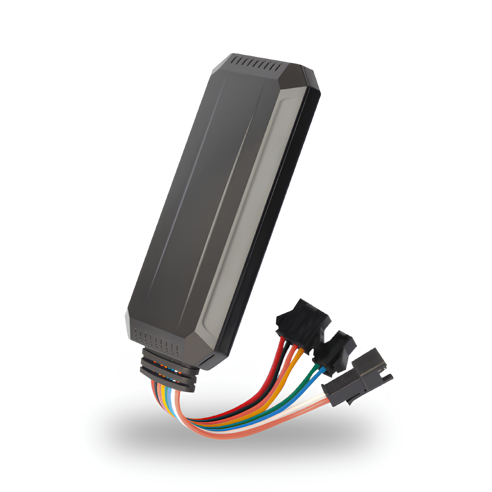

# Protrack - VT08

### A Reliable Solution for Vehicle Tracking

The VT08S is a robust and versatile GPS tracker designed for vehicle tracking. Its compact size and advanced tracking capabilities make it ideal for monitoring cars, trucks, and fleets in real-time. Whether for personal vehicle management or business purposes, the VT08S offers a seamless solution to track the location, movement, and status of vehicles.

One of the key highlights of the VT08S is its ability to provide real-time location updates, thanks to its accurate GPS positioning system. It supports multiple tracking modes, including continuous tracking and interval-based reporting. This flexibility allows users to tailor the tracking behavior to their specific needs, ensuring that the device can operate efficiently in different scenarios.

The VT08S is also equipped with a geo-fencing feature, allowing users to set virtual boundaries. If the vehicle exits or enters these predefined areas, the system triggers an alert, providing additional security. Moreover, the tracker includes low-battery and overspeed alarms, adding another layer of protection and control over vehicle management. The device’s installation process is straightforward, and it is compatible with both 12V and 24V systems, making it adaptable to various types of vehicles.

#### Key Features:

- **Real-time tracking**: Live GPS updates ensure precise location monitoring.
- **Geo-fencing**: Set up virtual boundaries and receive alerts when breached.
- **Multiple reporting modes**: Offers continuous tracking and interval-based reports.
- **Alarms**: Low battery, overspeed, and movement alarms for enhanced security.
- **Compact design**: Fits easily into any vehicle type.
- **Voltage compatibility**: Works with both 12V and 24V systems.
- **Easy installation**: Simplified process for quick setup.

#### Technical Specifications:

| Feature | Specification |
| --- | --- |
| **GPS Accuracy** | 5-10 meters |
| **Input Voltage** | 12V/24V |
| **Tracking Modes** | Real-time and scheduled reports |
| **Geo-fence Zones** | Customizable |
| **Alerts** | Low battery, overspeed, geo-fence |
| **Dimensions** | Compact, easy to conceal |
| **Battery** | Internal, rechargeable \(optional use\) |

The VT08S offers a comprehensive tracking experience, ideal for fleet managers, logistics businesses, or individuals who want to keep a close eye on their vehicles. Its powerful tracking features and user-friendly operation make it a dependable choice for vehicle security.

