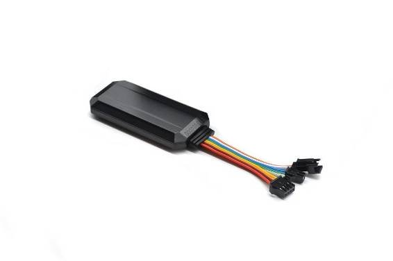

# Protrack - VT08S

The VT08S is a compact vehicle GPS tracker engineered for cars and motorbikes and presented here as a Plaspy compatible solution for real-time tracking and fleet management. With an IP65 rating for water resistance and a rugged design tested for reliable field performance, the VT08S delivers the core security and telemetry features fleet operators and vehicle owners expect: SOS panic alert, geo-fencing, over-speed warnings, historical trip data, power outage detection, and remote fuel cutoff for immobilization when needed.

Designed to be installed discreetly inside the vehicle, the VT08S works with Plaspy to convert location and event streams into actionable alerts, reports, and maps. Whether you are managing a mixed fleet, protecting high-value assets from theft, or improving driver safety, the VT08S plus Plaspy offers a practical, scalable combination for monitoring vehicles and responding to incidents quickly.

## Key Highlights

- Plaspy compatible GPS tracker for accurate vehicle location and fleet oversight.
- SOS panic alert for immediate emergency notification and faster response.
- Remote fuel cutoff \(immobilizer capability\) to support anti-theft intervention.
- Power outage detection to flag tampering or battery/power loss events.
- Geo-fencing and over-speed warnings to enforce route and safety policies.
- Historical trip data recording to support compliance, billing, and driver performance reviews.
- IP65 water-resistance and rugged construction for durable operation in everyday vehicle conditions.

## How It Works with Plaspy

When integrated with Plaspy, the VT08S streams GPS positions and event telemetry to the Plaspy platform where data is normalized, displayed, and made actionable. Plaspy handles real-time tracking, alerting, and historical playback so fleet managers and vehicle owners can monitor locations, respond to SOS alerts, and take remote action such as immobilization via the device’s remote fuel cutoff capability \(where installed and authorized\).

- Real-time location and telemetry updates for live fleet monitoring and dispatch.
- SOS panic alert forwarded to Plaspy as high-priority events for immediate notification.
- Geo-fence entry/exit and over-speed events generate instant alerts and compliance records.
- Remote immobilizer / remote fuel cutoff events can be executed or monitored through Plaspy workflows \(subject to installation and safety procedures\).
- Power outage and tamper detection notified to Plaspy to highlight potential theft or tamper attempts.
- Bluetooth sensors/beacons: VT08S platform integrations can be extended with Plaspy-managed sensors where supported by the overall system — check device variant and accessory compatibility.

## Technical Overview

| Connectivity | Mobile network data transmission for sending location and event telemetry to cloud platforms; exact cellular technology/variant depends on the product model and region. |
| --- | --- |
| Bands | Not specified in manufacturer summary — consult product page or reseller for regional band support and model variants. |
| Power & Battery | Detects vehicle power outages and reports power loss events; specific backup battery capacity or duration is not specified. |
| Interfaces | Supports remote fuel cutoff \(immobilizer\) functionality; other I/O such as dedicated ignition input or extra digital ports are not detailed in the available description. |
| GNSS | GPS-based positioning \(device marketed as a GPS tracker\). Reported accuracy not specified in the provided materials. |
| Bluetooth | Not specified — check the manufacturer’s product page for Bluetooth LE support or accessory options. |
| Remote Management | Integrates with tracking platforms such as Plaspy for real-time monitoring, alerts, and historical reports; over-the-air firmware update \(FOTA\) capability is not specified. |
| Form Factor | Compact unit intended for discreet installation in cars and motorbikes; IP65 rated for dust protection and water splashes. |

## Use Cases

- Fleet anti-theft and rapid immobilization — detect tampering, receive SOS alerts, and use remote fuel cutoff tools where permitted.
- Driver safety monitoring — over-speed warnings and panic alerts help protect drivers and reduce risk.
- Historical trip logging for compliance, route analysis, and customer billing in logistics and field service fleets.
- Geo-fence-based site or route control — automate alerts when vehicles enter or leave designated zones.
- Car and motorbike asset tracking for rental operations, executive vehicles, and high-value equipment.

## Why Choose This Tracker with Plaspy

Pairing the VT08S with Plaspy delivers a straightforward, reliable solution for vehicle telemetry and anti-theft protection. The VT08S’ compact form factor and IP65 rating make it suitable for cars and motorbikes that require discreet installation and durable operation. With key features such as SOS, geo-fencing, over-speed alerts, historical trip records, power outage detection, and remote fuel cutoff, the VT08S supplies the event feeds and location data that Plaspy transforms into real-time tracking, reports, and operational workflows.

For fleet managers seeking vehicle telemetry and anti-theft capabilities, the VT08S plus Plaspy offers practical value: immediate alerts for incidents, centralized dashboards for fleet management, and tools to support immobilization or incident response. If you require fuel monitoring, ignition-based workflows, Bluetooth sensor integration, or specific cellular bands, consult the manufacturer or authorized reseller for the exact VT08S variant and installation guidance to ensure seamless Plaspy integration and full operational compatibility.

