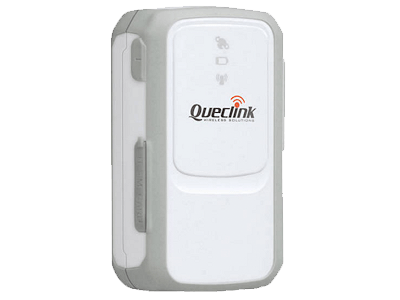

# QuecLink - GL200

The QuecLink GL200 is a compact, robust GPS tracker designed for discreet asset protection and continuous position reporting. Built for covert installations and harsh conditions, the GL200 is positioned for use cases where concealed placement and reliable, ongoing location updates are essential. Its field-proven performance includes documented real world recoveries that demonstrate dependable reporting over long distances.

As a device that is Plaspy compatible out of the box, the GL200 provides a dependable tracking foundation for fleet managers, logistics operators and security teams using Plaspy. When paired with Plaspy, the unit’s continuous position reporting becomes actionable: operators gain centralized visibility, incident logs for recovery, and an integrated view of asset movements across their operations.

## Key Highlights

- Compact and discreet design suited to concealed placement in vehicles, cargo and personal assets
- Proven field recovery case showing reliable continuous position reporting in a real anti theft scenario
- Water resistant construction suitable for outdoor use and refrigerated transport
- Wide operating temperature range −20°C to +55°C for cold chain and extreme environment deployments
- Designed for continuous position reporting and dependable telemetry delivery to backend services
- Versatile for vehicle tracking, cargo protection, lone worker safety, pet tracking and general asset security
- Durable form factor built for long term installations and covert monitoring

## How It Works with Plaspy

When integrated with Plaspy, the GL200 provides live and historical location data to a centralized dashboard so operators can track assets, investigate incidents and manage alerts from a single platform. Plaspy ingests the GL200’s reported positions and makes them available for mapping, reporting and operational workflows.

- Real time location display and position history for immediate situational awareness
- Alerting and workflow support to surface potential theft, route deviation or other incidents
- Historical route reconstruction and incident logs to support recovery and investigation
- Operational visibility for fleets and refrigerated transport operating across the device temperature range
- Expanded telemetry support where available, including ignition and immobilizer events, fuel monitoring and Bluetooth sensors provided by the device or connected peripherals

## Typical Use Cases

- Fleet anti theft and remote recovery with discreet installation in vehicles or cargo
- Cold chain and refrigerated transport monitoring across a broad temperature range
- Lone worker and personal safety tracking for individuals in remote or mobile roles
- Pet and small asset tracking for concealed, weather tolerant location monitoring
- General asset security for trailers, equipment and high value goods requiring covert oversight

## Why Choose This Tracker with Plaspy

The QuecLink GL200 pairs a compact, resilient hardware profile with Plaspy’s centralized platform capabilities to deliver reliable real time tracking and operational visibility. Its water resistant casing and broad temperature tolerance make it a practical option where environmental conditions or concealed placement are concerns. The GL200’s documented recovery case illustrates how continuous reporting can materially support incident response when combined with an integrated tracking platform.

To learn more about how Plaspy can use devices like the GL200 to improve fleet oversight and asset protection, visit https://www.plaspy.com. Product specifications, availability and manufacturer details can change over time, so please verify current specifications and documentation on QuecLink’s official site https://www.queclink.com/.
