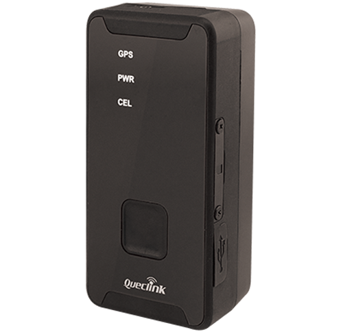

# QuecLink - GL320MG

The QuecLink GL320MG is an LTE Advanced real time asset tracker designed for long duration monitoring of people, vehicles, and portable assets. It offers global LTE Cat M1 and NB2 connectivity with 2G fallback and is part of the proven GL300 series. The device includes an internal battery that can deliver extended standby life under intermittent reporting intervals and supports optional accessories such as a high capacity external battery kit and an IP67 waterproof magnetic case.

As a Plaspy compatible device, the GL320MG can be integrated into Plaspy for centralized visibility and operational oversight. Its combination of reliable cellular coverage, long battery endurance, and accessory support makes it a practical choice for organizations that need consistent location knowledge. Plaspy users can add the GL320MG to their device inventory and manage tracking, alerts, and historical location data alongside other fleet and asset devices.

## Key Highlights

- Global LTE Cat M1 and NB2 connectivity with 2G fallback for broad coverage
- Internal battery optimized for extended standby life with periodic reporting
- Support for an external battery kit and IP67 waterproof magnetic case for tougher deployments
- Compact, lightweight form factor suitable for portable asset use
- Proven lineage as part of the GL300 series with global deployments
- Suited for both personal security and asset or vehicle monitoring scenarios

## How It Works with Plaspy

When connected to Plaspy, the GL320MG becomes part of a unified tracking platform that consolidates location updates and status information for fleet and asset managers. Plaspy captures the device's reported positions and makes them available through maps, notifications, and reports so teams can act on real time and historical data.

- Centralized map view for live location monitoring of GL320MG units
- Configurable alerts and notifications based on movement or status changes
- Historical routes and playback for audit and operational review
- Reporting tools to analyze uptime, movement patterns, and device coverage
- Grouping and tagging for organizing multiple GL320MG trackers within fleets

## Typical Use Cases

- Personal security and lone worker tracking where portability and battery life matter
- Temporary vehicle tracking for rentals, short term assignments, or investigations
- Package and delivery monitoring to verify location and transit progress
- Long distance transportation and logistics oversight requiring continuous tracking
- Event or endurance race tracking where compact, battery efficient devices are needed
- Asset and animal management in field environments using accessory kits for protection

## Why Choose This Tracker with Plaspy

The QuecLink GL320MG is a practical option for organizations that need a balance of global cellular coverage and extended battery performance. Its accessory ecosystem and compact design make it flexible for a variety of deployments, from short term assignments to longer monitoring tasks. When combined with Plaspy, the GL320MG provides a clear path to operational visibility without requiring specialized infrastructure.

Plaspy aims to simplify device management and location intelligence, and the GL320MG fits naturally into those workflows thanks to its real time reporting and accessory options. If you are evaluating trackers for portable assets, temporary vehicle monitoring, or personal security, the GL320MG is worth considering within a Plaspy managed environment.

Learn more about Plaspy on our main website https://www.plaspy.com. Product specifications and availability can change over time, so please verify current product details on the manufacturer's official website https://www.queclink.com/.
