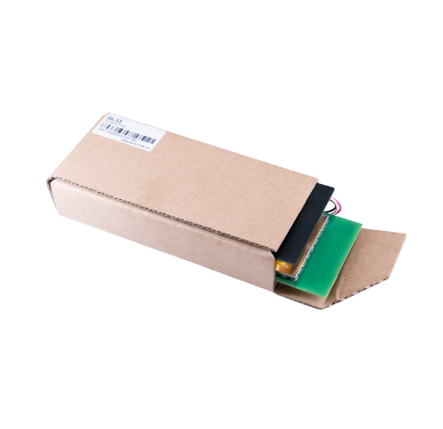

# QuecLink - GL33

# Queclink GL33

The Queclink GL33 is a compact, rechargeable 2G GPS tracker engineered for covert asset and cargo protection and fully Plaspy compatible. Designed to be disguised inside carton boxes and packaging, the GL33 brings layered positioning — GPS, Location-Based Services \(LBS\) and RF433/434 proximity signaling — to Plaspy dashboards so fleet managers, cargo owners and security teams can see reliable location data and act quickly when theft or diversion occurs.

Plaspy compatible integration makes the GL33 an effective anti-theft and recovery tool for high-value shipments and concealed assets. Its GSM/GPRS reporting delivers GPS and LBS location updates to backend servers, while RF433/434 proximity mode enables close-range homing by law enforcement or recovery teams. The result: resilient, multi-technology tracking that improves recovery rates and reduces loss exposure.

## Key Highlights

- Plaspy compatible real-time tracking using GPS and LBS to maintain visibility in urban or indoor-challenged environments.
- RF433/434 proximity transmitter for short-range homing — ideal for pinpointing hidden cargo within warehouses or vehicles.
- Rechargeable battery with long endurance: up to 30 days on hourly reporting and up to 5 days with RF mode active on 5-minute reporting.
- Motion sensor and flight-mode algorithm that automatically adapts during air transport to comply with aviation requirements.
- Remote activation and configuration via SMS or GPRS commands for flexible deployment and on-demand tracking.
- Low-battery alerts to Plaspy so teams can plan recharging and maintain continuous protection for reusable trackers.
- Compact, covert form factor intended for concealment inside packaging to maximize stealth and recovery effectiveness.

## How It Works with Plaspy

The GL33 transmits GPS and LBS location data over the cellular network to Plaspy-compatible backends where the platform normalizes and displays position, history and alerting. When the device is deployed, Plaspy ingests the device’s reports and exposes them in real-time views, geofences, and incident reports so operations and security teams can act fast.

- Real-time location and telemetry updates: GPS fixes and LBS fallbacks feed Plaspy maps and event timelines.
- LBS augmentation: when GPS is weak or blocked \(for example, inside buildings\), Plaspy receives cellular-tower-based position estimates to keep assets visible.
- RF433/434 proximity signaling: Plaspy can flag RF mode activation so recovery teams know when to switch to handheld RF detectors for room-level homing.
- Motion and flight-mode events: motion-sensor alerts and automatic flight-mode transitions are reported to Plaspy for compliant and contextual tracking.
- Remote activation & configuration: activation or RF mode can be triggered via GPRS/SMS commands and reflected in Plaspy incident workflows and alerts.

## Technical Overview

| Connectivity | GSM / GPRS \(2G\) cellular reporting |
| --- | --- |
| Positioning | GPS positioning with LBS \(cell-tower\) supplementation |
| RF Proximity | RF433/434 proximity transmitter for short-range homing |
| Power & Battery | Rechargeable battery; up to 30 days at hourly reporting interval; up to 5 days with RF mode enabled and 5-minute reporting; low-battery alerts |
| Inputs / Features | Built-in motion sensor; automatic flight-mode enable/disable for air transport |
| Remote Management | Configurable via SMS and GPRS commands; supports remote activation of RF mode |
| Form Factor | Compact, covert unit designed for concealment inside carton boxes and cargo packaging |

## Use Cases

- High-value cargo protection — conceal a GL33 inside packaging to maintain covert tracking during transit and storage.
- Stolen-goods recovery — use GPS/LBS to find asset locations, then activate RF433/434 for handheld homing to the exact room or pallet.
- Covert asset tracking for retail or logistics — discreetly monitor expensive shipments and detect unauthorized movement.
- Operational readiness for long shipments — extended battery life supports multi-day searches and recovery operations without constant recharging.

## Why Choose This Tracker with Plaspy

When integrated with Plaspy, the Queclink GL33 offers a pragmatic balance of covert form factor, layered positioning and long battery life that suits cargo security and anti-theft workflows. The combination of GPS for precise outdoors fixes, LBS for continued visibility where GPS is degraded, and RF433/434 proximity for last-meter recovery gives security teams a clear path from detection to recovery. Plaspy’s platform capabilities let you combine GL33 location feeds with broader fleet management and telemetry sources so you can orchestrate response, generate evidence for law enforcement and reduce downtime or inventory loss.

For organizations using Plaspy to manage assets across supply chains, the GL33 is a cost-effective, reusable option that complements vehicle or fleet telemetry \(such as ignition or immobilizer event data\) and other sensors. Plaspy can correlate GL33 position and motion events with third-party telemetry like fuel monitoring or Bluetooth sensors in a single dashboard, enabling comprehensive situational awareness and faster incident resolution.

