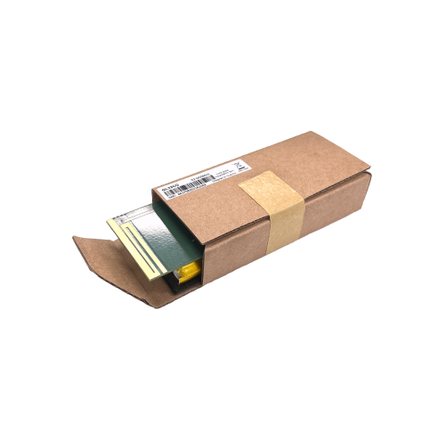

# QuecLink - GL33CG

The QuecLink GL33CG is a compact GPS tracker designed for cargo recovery and covert shipment monitoring. Disguised as a small box, it is intended to be concealed within carton packaging to track expensive merchandise during transport. The device supports LTE CAT1 with 2G fallback and offers RF433 transmission and LBS location as alternatives when GPS signals are limited. Additional features described for the model include a flight mode, a built in temperature sensor, and a long lasting 4000mAh backup battery, all within a lightweight 97 x 43.5 x 21mm enclosure.

As a Plaspy compatible device, the GL33CG can feed location and status information into the Plaspy platform to provide visibility across shipments and assets. Plaspy can present the GL33CG position reports, temperature readings, and device status so operations teams can monitor movements, configure alerts, and maintain an audit trail during transit. This compatibility makes the GL33CG a practical option for organizations that want discreet hardware combined with Plaspy software for tracking and recovery workflows.

## Key Highlights

- Discreet box disguised form factor suited for concealed placement inside cargo
- LTE CAT1 with 2G fallback for broad cellular connectivity across regions
- RF433 transmission capability for supplementary detection and locating
- LBS location support as a backup where GPS reception is poor
- Built in temperature sensor for basic environmental monitoring and alerting
- Flight mode for disabling cellular functions while airborne and minimizing regulatory issues
- Compact and lightweight design with long duration backup battery for extended deployments

## How It Works with Plaspy

When the GL33CG reports location and status, Plaspy ingests those messages and makes them available in dashboards and reports so teams can act on live and historical data. Plaspy treats the device as a trackable asset and offers tools to convert incoming device data into operational insight.

- Live map view of reported GPS and LBS positions for real time visibility
- Configurable alerts and notifications for movement, temperature thresholds, and status changes
- Historical route playback and reporting for audits and incident review
- Event driven workflows to support theft recovery and cargo chain of custody
- Consolidated device status and battery information for operational oversight
- Integration of RF based location detections into search and recovery processes where supported

## Typical Use Cases

- Covert tracking of high value merchandise inside carton boxes during transport
- Cargo recovery workflows following theft or loss incidents
- Monitoring temperature sensitive goods with alerting for out of range conditions
- Long haul shipment oversight where battery life and fallback connectivity matter
- Insurance and claims support by supplying recorded location and event data

## Why Choose This Tracker with Plaspy

The GL33CG combines a low profile form factor with multiple location reporting options, which can make it a good fit for organizations that need discreet monitoring of valuable shipments. Its RF433 capability and LBS fallback help extend the circumstances in which a device can aid recovery, while the built in temperature monitoring adds a layer of environmental awareness for sensitive cargo.

Pairing the GL33CG with Plaspy provides a practical way to turn device reports into operational value. Plaspy brings mapping, alerts, historical reporting, and monitoring workflows that complement the tracker hardware, helping teams manage fleets of devices and respond quickly to incidents without exposing detailed device configuration complexity.

Learn more about Plaspy on the main website https://www.plaspy.com. Product specifications availability and manufacturer details can change over time so please verify current technical information and compatibility on the official QuecLink website https://www.queclink.com/.
