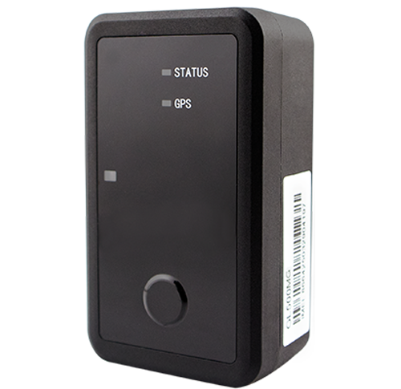

# QuecLink - GL500MG

# Queclink GL500MG — Plaspy Compatible Asset GPS Tracker

The Queclink GL500MG is a Plaspy compatible GPS tracker built for long-life, wide-area asset monitoring and lot management. Rugged and waterproof with an IP67 enclosure and a low-power Queclink platform, the GL500MG delivers multi-year standby life, on-device telemetry \(temperature, light, motion\) and reliable cellular links using LTE Cat M1 / NB1 with EGPRS fallback. It is suited for secure asset tracking, anti-theft monitoring and logistics when integrated with the Plaspy platform.

Designed for deployments that demand longevity and low maintenance, the GL500MG combines a u‑blox GNSS receiver with internal LTE and GNSS antennas, an internal 3-axis accelerometer for motion detection, and intelligent reporting modes to preserve battery life. Note: Queclink has issued an End of Life \(EOL\) notice for the GL500MG; customers are directed to GL530MG as an alternative. Existing GL500MG customers retain a one-year warranty and lifetime technical support from Queclink.

## Key Highlights

- Plaspy compatible GPS tracker: integrates with Plaspy for real-time tracking and fleet management dashboards.
- Exceptional battery life: up to 7 years on cell-ID only reporting or up to 5 years with one GNSS report per day using three CR123A 1,400 mAh batteries.
- Rugged, waterproof design \(IP67\) with optional magnetic mounting case for tamper-sensitive installations and outdoor assets.
- High-sensitivity GNSS: u‑blox receiver with tracking down to −162 dBm and position accuracy under 2.5 m CEP for precise location telemetry.
- Flexible connectivity: LTE Cat M1 / NB1 \(LTE-FDD\) with EGPRS \(2G\) fallback ensures wide-area coverage and legacy network support.
- Comprehensive onboard sensing: internal temperature and light sensors plus a 3-axis accelerometer for motion and wakeup reporting.
- Robust buffering and geofencing: stores up to 10,000 messages and supports up to 20 internal geo-fence regions for event-driven alerts.

## How It Works with Plaspy

The GL500MG sends location and sensor telemetry to Plaspy using standard communication channels. Plaspy ingests GNSS positions, motion events and internal sensor readings to provide real-time tracking, alerting and historical reports. Communication uses Queclink’s @Track protocol over TCP, UDP or SMS, making device integration straightforward within Plaspy’s device-manager and mapping layers.

- Real-time location and telemetry updates delivered to Plaspy for mapping and route history.
- Motion and tamper detection via internal 3-axis accelerometer for anti-theft workflows and wakeup reports.
- Internal temperature and light sensor data available to Plaspy for environmental monitoring and cold-chain validation.
- Scheduled timing reports, intelligent reporting frequency, low-battery alarms and buffered messages ensure resilient data delivery.
- Plaspy can correlate GL500MG telemetry with broader telematics features such as fuel monitoring, ignition/immobilizer workflows or Bluetooth sensors when used as part of an integrated solution.

## Technical Overview

| Connectivity | LTE Cat M1 & NB1 \(LTE-FDD\); EGPRS \(2G\) fallback |
| --- | --- |
| Bands | LTE-FDD supported \(regional variants\); EGPRS 850 / 900 / 1800 / 1900 |
| Power & Battery | Three CR123A lithium batteries \(1,400 mAh each\); standby current &lt; 8 µA; up to 7 years \(cell‑ID only\) or up to 5 years \(1 GNSS report/day\) |
| Interfaces & Indicators | Function button \(power/status\), GNSS and PWR LEDs, internal 3-axis accelerometer, internal temperature & light sensors |
| GNSS | u‑blox all‑in‑one GNSS receiver; tracking sensitivity down to −162 dBm; position accuracy &lt; 2.5 m CEP; TTFF ~27 s cold/warm, 1 s hot \(open sky\) |
| Protocol & Communication | @Track protocol over TCP, UDP and SMS; message buffer up to 10,000 entries |
| Sensors & Logic | Internal temperature and light sensors, 3-axis accelerometer, intelligent reporting, scheduled reports, wakeup reports, low battery alarm, up to 20 geo-fence regions |
| Enclosure & Mounting | IP67-rated rugged enclosure; internal LTE & GNSS antennas; optional magnetic mounting case for secure attachment |
| Certifications & Carrier Approvals | FCC, Verizon, PTCRB, AT&T, USCC, CE, Anatel; commercial partnerships include Orange |
| Lifecycle | Queclink EOL notice issued — GL530MG recommended alternative; one-year warranty and lifetime technical support for existing GL500MG customers |

## Use Cases

- Cold chain and environmental monitoring — internal temperature telemetry combined with Plaspy alerts ensures product integrity in transit or storage.
- Warehouse and lot management — long-life battery and IP67 protection make the GL500MG ideal for inventory and yard tracking where maintenance access is limited.
- Cargo trucking and container monitoring — LTE-M / NB-IoT coverage with 2G fallback keeps asset positions visible across wide-area routes.
- High-value or stolen asset monitoring — accelerometer-based movement detection, geofencing and buffered reports support anti-theft response workflows in Plaspy.
- Remote environmental or infrastructure monitoring — rugged design and long standby life fit long-duration deployments in harsh conditions.

## Why Choose This Tracker with Plaspy

The GL500MG is a purpose-built GPS tracker for deployments where battery life, durability and reliable telemetry matter. When used with Plaspy, the device’s precise GNSS positions, sensor readings and motion events become actionable data — enabling real-time tracking, fleet management dashboards and event-driven alerts. Plaspy’s ingestion of @Track protocol messages via TCP/UDP or SMS ensures the GL500MG’s long-life telemetry is presented in a scalable, enterprise-ready interface.

Although Queclink has announced EOL for the GL500MG, current customers benefit from certified carrier approvals, robust buffering, and integrated sensing that reduce field visits and lower total cost of ownership. For projects that require support for fuel monitoring, ignition control or immobilizer actions and Bluetooth sensors as part of a broader telematics solution, Plaspy can integrate GL500MG telemetry with vehicle systems or external peripherals to enable those workflows while preserving the GL500MG’s low-power advantages.

