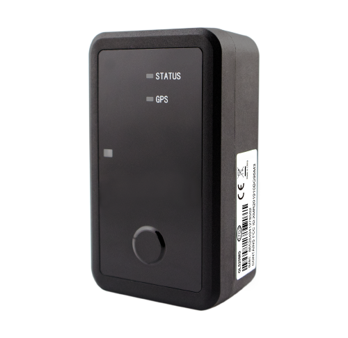

# QuecLink - GL520MG

The QuecLink GL520MG is a rugged, waterproof GPS tracker built for low maintenance asset monitoring and environmental sensing. Designed with long life operation in mind, the GL520MG combines extended battery endurance and IP67 protection with cellular connectivity and on‑device sensors to deliver dependable position reporting, temperature and light sensing, and motion detection for both static and mobile assets.

As a device that is Plaspy compatible out of the box, the GL520MG can feed location and telemetry into Plaspy’s fleet and asset management platform with minimal configuration. Its long standby characteristics, tamper sensing and reliable positioning make it a practical choice for large scale deployments where reducing field maintenance and maintaining continuous visibility are priorities.

## Key Highlights

- Plaspy compatible asset tracker offering broad cellular coverage with LTE Cat M1 and NB2 plus 2G fallback for extended reach.
- Multi year battery life suitable for low maintenance deployments and long interval reporting.
- IP67 rated waterproof enclosure with an optional magnetic housing for attachment to metal surfaces.
- Onboard environmental and security sensing including temperature and light sensors plus a 3‑axis accelerometer for motion alerts.
- High accuracy GNSS positioning and substantial internal message buffer to preserve data when connectivity is intermittent.
- Visual status indicators and vibration confirmation to simplify field checks and device handling.
- Queclink protocol support and flexible data transport options to integrate with existing telemetry workflows.

## How It Works with Plaspy

When connected to Plaspy, the GL520MG delivers position fixes, sensor readings and device status into the platform where data is normalized, visualized and made actionable. Plaspy processes incoming telemetry to provide real time visibility, historical reports and alerting that operations teams can use to monitor assets and respond to events.

- Real time location updates and telemetry appear in Plaspy dashboards for immediate operational awareness.
- Motion and tamper alerts from the accelerometer and light sensor trigger notifications and automated workflows in Plaspy.
- Temperature telemetry is forwarded to Plaspy for threshold alerts, trend charts and cold chain monitoring.
- Device health indicators such as battery and connectivity status are shown in Plaspy inventory and maintenance views.
- On device geofence events can generate Plaspy triggers for routing, anti theft actions and compliance logging.

## Typical Use Cases

- Cold chain logistics where temperature monitoring and position tracking are required for shipments and pallets.
- Static high value asset protection for outdoor equipment, containers and site infrastructure with long standby needs.
- Pallet and container tracking using rugged packaging and optional magnetic mounting for ease of attachment.
- Warehouse and inventory visibility through scheduled reporting and motion detection to reduce manual checks.
- Fleet asset pools tracking trailers, equipment and non powered items that benefit from multi year battery operation.

## Why Choose This Tracker with Plaspy

The GL520MG is a practical option for organizations that need durable, low maintenance trackers for wide scale deployments. Its combination of waterproof enclosure, extended battery life and integrated environmental and motion sensing makes it well suited to asset visibility programs where frequent field servicing is costly or impractical. Paired with Plaspy, the GL520MG becomes part of a broader operational view, contributing reliable position and telemetry that support reporting, alerts and workflow automation.

Because the GL520MG focuses on long life telemetry such as position, temperature and motion, it is a strong fit for teams that want persistent visibility with minimal maintenance burden. Plaspy can aggregate data from the GL520MG alongside other device types, giving teams a single platform to manage mixed fleets and varied asset classes while keeping maintenance overhead low.

To learn more about Plaspy and how it can integrate GL520MG devices into your tracking workflows visit https://www.plaspy.com. Product specifications and availability can change over time, so please verify current device details and official documentation on the manufacturer site https://www.queclink.com/.
