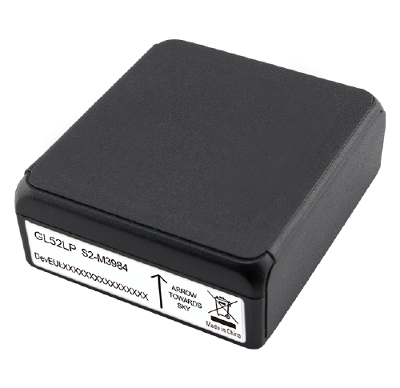

# QuecLink - GL52LP

The QuecLink GL52LP is a LoRa micro standby asset tracker designed for long term asset monitoring and tracking management. Its small form factor and extended standby life make it well suited to stationary installations where periodic location and motion information is required. The device includes a GNSS receiver and a motion sensor, and offers options such as an IP67 waterproof case for added environmental protection.

As a Plaspy compatible device, the GL52LP can feed location and motion data into Plaspy for centralized visibility and operational oversight. Plaspy can use the device data to support inventory control, fixed asset monitoring, and reporting workflows, helping teams track assets across sites while benefiting from the GL52LPs low power design and compact profile.

## Key Highlights

- LoRa enabled asset tracker with GNSS positioning for location awareness
- Very long standby life suitable for multi year deployments and low maintenance
- Micro size allows discreet or space constrained placement
- Integrated motion sensing to detect movement or tampering events
- Optional IP67 waterproof casing for improved environmental durability
- Designed to resist common jamming techniques for more reliable tracking
- Targeted at asset monitoring and inventory control applications

## How It Works with Plaspy

When connected to Plaspy the GL52LP provides periodic location and motion updates that Plaspy ingests for visualization and alerting. Plaspy standardizes incoming device data so teams can monitor assets from a single dashboard and combine location events with operational rules and reporting.

- Display device locations on Plaspy maps for site level visibility
- Generate movement alerts when the motion sensor detects activity
- Group and tag devices for inventory tracking and status reporting
- Create scheduled reports to review long term asset availability and movement
- Use geofence style monitoring and notification workflows for perimeter oversight

## Typical Use Cases

- Stationary asset monitoring such as containers, trailers, or equipment at fixed sites
- Inventory control for warehouses and storage yards where periodic location checks are needed
- Remote site asset oversight where long battery life reduces maintenance visits
- Tool and equipment security to detect unexpected movement or removal
- Asset tracking in harsh or outdoor environments when used with the waterproof case

## Why Choose This Tracker with Plaspy

The GL52LP is a practical choice for organizations that need long duration, low maintenance asset monitoring with modest reporting cadence. Its micro size and motion sensing capability make it useful where discreet placement and basic movement detection are important, while LoRa connectivity supports low power operation over wide areas.

Pairing the GL52LP with Plaspy allows teams to centralize asset visibility, automate basic alerts, and maintain historical records of location and motion events. For operations that favor long battery life and simple periodic updates rather than continuous telemetry, this combination offers a straightforward, cost effective monitoring option.

To learn more about how Plaspy can manage devices like the QuecLink GL52LP visit https://www.plaspy.com. Product specifications and availability can change over time so please verify current details and technical documentation on the manufacturer site https://www.queclink.com/ before purchase.
