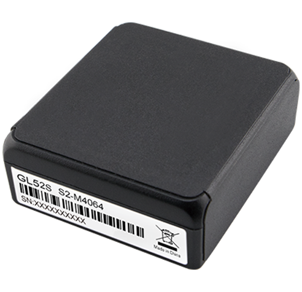

# QuecLink - GL52S

The QuecLink GL52S is a compact Sigfox micro standby asset tracker that supports GNSS positioning for accurate location information. Designed for long-term deployments, the GL52S emphasizes extended standby time and a small form factor that enables discreet placement. It is offered with an optional IP67 waterproof case to enhance durability in outdoor conditions and includes resistance to common jamming techniques to help preserve tracking continuity.

As a Plaspy compatible device, the GL52S can be integrated into Plaspy's fleet and asset management environment to provide steady visibility of high-value items over long periods. Its low power Sigfox communication and GNSS positioning align with typical Plaspy use cases such as remote asset monitoring, stolen vehicle recovery, and inventory oversight, making it a practical choice where long battery life and covert installation are important.

## Key Highlights

- GNSS positioning for reliable location reporting suitable for asset tracking
- Sigfox connectivity for low data usage and extended battery life
- Standby time of over 4 years designed for long term monitoring
- Micro size enabling discreet or concealed installations for covert tracking
- Resistance to existing jamming techniques to improve reliability in difficult environments
- Optional IP67 waterproof case for added protection in outdoor use

## How It Works with Plaspy

When used with Plaspy, the GL52S provides location updates that can be viewed and managed through the Plaspy platform, giving operators centralized insight into tracked assets. Plaspy organizes device data, enabling fleet managers and administrators to monitor status, review history, and act on alerts for assets tracked by the GL52S.

- Centralized location visibility and status monitoring for GL52S devices within Plaspy
- Historical position reporting and basic movement history for asset oversight
- Alerting and notifications through Plaspy when location or device conditions meet configured rules
- Fleet and asset grouping to manage many GL52S units across locations or customer accounts
- Integration with Plaspy reporting tools to summarize device uptime and tracking activity

## Typical Use Cases

- Long term asset monitoring for equipment stored or deployed offsite
- Stolen vehicle recovery and discreet vehicle tracking scenarios
- Inventory control of high value items requiring occasional location checks
- Covert tracking of trailers, containers, or other movable assets
- Outdoor equipment monitoring where optional waterproofing is required

## Why Choose This Tracker with Plaspy

The GL52S provides a balance of minimal form factor and extended standby that fits operational programs where battery life and concealment matter. Paired with Plaspy, organizations gain consolidated tracking visibility and operational controls to manage devices at scale without frequent maintenance cycles. The device's jamming resistance and optional rugged casing further support deployments in environments where continuity and durability are priorities.

Choosing the QuecLink GL52S for use with Plaspy can reduce manual tracking overhead and improve recovery and oversight capabilities for dispersed assets. If your requirements emphasize low maintenance, discreet installation, and long intervals between service, the GL52S is a relevant option to evaluate alongside Plaspy's monitoring and reporting features.

Learn more about Plaspy on the main website https://www.plaspy.com. Product specifications, availability, and manufacturer details can change over time; please verify current specifications with the manufacturer's official documentation at https://www.queclink.com/.
