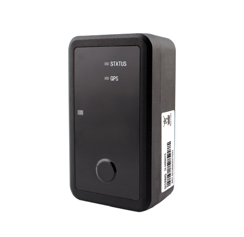

# QuecLink - GL530MG

The Queclink GL530MG is a compact, waterproof GPS tracker purpose‑built for long‑term, low‑maintenance asset monitoring and is Plaspy compatible out of the box. As the LTE Cat M1 / NB2 upgrade of the GL500MG, the GL530MG combines global low‑power cellular connectivity with EGPRS fallback, robust tamper and environmental sensing, and extremely long standby life — making it ideal for remote trailers, containers, static high‑value assets and cold‑chain pallets that require reliable real‑time tracking and telemetry without frequent battery swaps.

The device integrates a high‑sensitivity u‑blox GNSS receiver and Queclink’s low‑power management to deliver accurate position fixes \(\< 2.5 m CEP\) and adaptive reporting strategies for maximum battery life. Its IP67 enclosure, internal light and tamper sensors, clip‑on and magnetic mounting options, and support for TCP/UDP/SMS and @Track protocol make deployment and Plaspy integration straightforward for fleet management, anti‑theft workflows and long‑term telemetry projects.

## Key Highlights

- Plaspy compatible asset tracker with global LTE Cat M1/NB2 connectivity plus EGPRS \(2G\) fallback for robust network reach.
- Exceptional battery life — up to 7 years in cell‑ID only mode and up to 5 years with one GNSS report per day — reduces maintenance and replacement costs.
- Rugged IP67 waterproof enclosure and tamper/light sensors enable reliable outdoor deployments and anti‑tamper detection.
- High‑accuracy GNSS via u‑blox \(autonomous \< 2.5 m CEP\) with fast TTFF for dependable real‑time tracking and geo‑fence enforcement.
- Internal 3‑axis accelerometer for motion detection and configurable reporting modes \(power‑saving and continuous tracking\) for emergency or high‑frequency tracking needs.
- Multiple mounting options including clip‑on and optional magnetic case for quick attachment to vehicles, containers and other assets.
- Flexible data transport: TCP, UDP and SMS plus support for @Track protocol commands, scheduled reports, wake‑up reports and low‑battery alarms.

## How It Works with Plaspy

When connected to Plaspy, the GL530MG streams location and telemetry in formats Plaspy ingests via TCP, UDP or SMS using native @Track protocol commands. Plaspy interprets GNSS positions, motion and tamper events, battery state and sensor readings to provide real‑time tracking, alerts and historical reports for efficient fleet management and asset recovery.

- Real‑time location and telemetry updates delivered to Plaspy for live mapping and history playback.
- Motion, tamper and light sensor alerts for anti‑theft workflows and automatic incident escalation.
- Temperature and internal environmental monitoring reported to Plaspy for cold‑chain oversight and condition alerts.
- Scheduled timing, wake‑up and low‑battery reports for predictable maintenance and long standby operation.
- Geo‑fence events \(up to 20 configurable regions\) forwarded to Plaspy for perimeter alerts and zone reporting.

## Technical Overview

| Model | Queclink GL530MG |
| --- | --- |
| Connectivity | LTE Cat M1 / NB2 \(global variants\); EGPRS \(2G\) fallback |
| Bands | Global Cat M1/Cat NB2 band support \(model‑dependent\); EGPRS 850/900/1800/1900 MHz fallback |
| Power & Battery | Three × CR123A lithium batteries \(1400 mAh each\); up to 7 years standby \(cell‑ID only\), up to 5 years with one GNSS/day |
| Interfaces | Internal GNSS, internal 3‑axis accelerometer, internal temperature and light sensors, internal tamper detection, function button with internal vibration motor; external I/O not specified |
| GNSS | u‑blox all‑in‑one receiver; autonomous position accuracy &lt; 2.5 m CEP; high sensitivity and fast TTFF |
| Bluetooth | Not specified \(no internal BLE sensors documented\) |
| Protocols | @Track protocol; TCP, UDP, SMS |
| Firmware & Management | Scheduled reports, wake‑up reports, configurable geo‑fences \(up to 20\), power‑saving and continuous tracking modes; FOTA/remote management not specified |
| Environmental | IP67 waterproof enclosure; internal light and tamper sensors; suitable for harsh outdoor use |
| Mounting & Form Factor | Compact asset tracker with clip‑on design and optional magnetic mounting case for metal surfaces |
| Certifications | Anatel, FCC, Verizon, PTCRB, AT&T, USCC, CE, T‑Mobile |

## Use Cases

- Cold‑chain logistics: monitor location and internal temperature telemetry for refrigerated pallets and containers during long transit.
- Trailer and cargo tracking: attach via magnetic mount to trailers and shipping containers for long‑term, low‑maintenance visibility.
- High‑value static asset monitoring: secure construction equipment, generators and outdoor assets with anti‑tamper alerts and geo‑fence protection.
- Warehouse and lot management: track parked trailers, containers and inventory locations with scheduled reports and motion detection.
- Stolen‑asset recovery: use continuous tracking mode and Plaspy alerts to locate and recover stolen vehicles or trailers quickly.

## Why Choose This Tracker with Plaspy

The GL530MG stands out for deployments that prioritize low maintenance, long battery life and durable outdoor performance. When paired with Plaspy, the tracker becomes a turnkey solution for real‑time tracking, fleet management and anti‑theft operations: Plaspy receives precise GNSS fixes, motion and tamper events, battery and temperature telemetry, and geo‑fence triggers to power dashboards, alerts and automated workflows. For operations that require additional vehicle telemetry such as fuel monitoring, ignition status or immobilizer control, Plaspy can ingest complementary sensor data or integrations alongside the GL530MG’s position and environmental feeds to create a complete telemetry and security solution. The result is a scalable, Plaspy compatible GPS tracker that reduces maintenance cycles, improves asset visibility and strengthens recovery and compliance processes across global fleets and remote asset portfolios.

