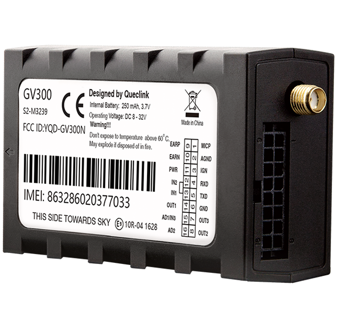

# QuecLink - GV300

The QuecLink GV300 is a proven vehicle GPS tracker designed for demanding telematics applications. As a long running best seller and QuecLink's third generation vehicle tracker, the GV300 combines a high sensitivity GNSS receiver with quad band cellular connectivity in a compact vehicle grade package. It is built to provide reliable real time location, scheduled reporting and a range of wired inputs and outputs for integrating vehicle signals and external sensors.

The GV300 is listed as compatible with Plaspy and is a common choice for organizations that need a stable, production ready tracker integrated into their fleet management workflows. When paired with Plaspy, the GV300 delivers positional data, event alarms and sensor telemetry into Plaspy dashboards and reports, enabling operational visibility, alerting and remote control as part of a fleet or security implementation.

## Key Highlights

- Proven Plaspy compatible vehicle tracker used in fleet management and recovery deployments.
- Real time tracking plus configurable scheduled reporting for time distance and mileage based updates.
- Extensive wired I O including ignition detection, multiple digital inputs and outputs, analog inputs and RS232 for accessory integration.
- High sensitivity GNSS receiver for reliable position data with typical accuracy under 2.5 m CEP.
- Compact vehicle grade form factor with wide operating voltage range and internal backup battery to handle power loss events.
- Support for CAN data capture and partner temperature humidity sensors to extend telematics for cold chain or environmental monitoring.
- Built in alarm capabilities such as geo fence tow antenna disconnect crash detection and driving behavior alerts.

## How It Works with Plaspy

The GV300 feeds position, input state changes and alarm events into Plaspy using standard transport methods supported by the device. Plaspy ingests the device reports to power live tracking, historical reports, alerting and operational workflows for fleet managers and security teams.

- Live location and telemetry updates delivered via the device's supported transport modes for near real time visibility.
- Ignition and engine status tracking through dedicated input monitoring to support trip segmentation and vehicle state reporting in Plaspy.
- Analog sensor and CAN derived telemetry captured by the device can be surfaced in Plaspy reports and charts for fuel monitoring and equipment diagnostics.
- Remote control of digital outputs enables immobilizer and intervention workflows that can be triggered from Plaspy rules and alerts.
- Integration of temperature and humidity sensors via partner accessories allows cold chain monitoring and threshold alerts within Plaspy dashboards.

## Typical Use Cases

- Fleet management with route tracking scheduled reporting and driving behavior oversight.
- Anti theft and stolen vehicle recovery using ignition detection tow and antenna disconnect alarms plus remote output control.
- Cold chain logistics combining GNSS location with partner temperature sensor data for shipment traceability.
- Insurance telematics and incident analysis using crash and harsh driving event reporting.
- Vehicle telemetry and fuel monitoring through analog inputs and CAN capture for operational reporting.

## Why Choose This Tracker with Plaspy

The QuecLink GV300 offers a practical balance of durability, input flexibility and mature firmware that aligns well with Plaspy's fleet and monitoring capabilities. Its vehicle focused feature set makes it suitable for deployments where wired sensors, reliable GNSS performance and proven field track record matter.

If you want to explore how the GV300 can fit into your Plaspy deployment, learn more about Plaspy on the main website https://www.plaspy.com. Product specifications and availability can change over time, so please verify current technical details and accessory support on the manufacturer's site https://www.queclink.com/.
