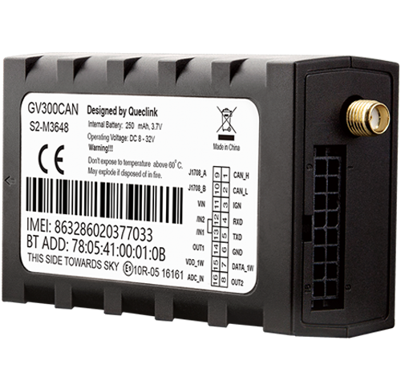

# QuecLink - GV300CAN

The QuecLink GV300CAN is a third generation vehicle GPS tracker designed for fleet management, cold chain logistics and transportation monitoring. It combines a reliable GNSS receiver with cellular communication to provide real time tracking, scheduled telemetry and event driven reporting for fleets and high value vehicles. The hardware is positioned for vehicle grade applications where ongoing location visibility and event capture are important.

As a Plaspy compatible device out of the box, the GV300CAN can deliver location, vehicle bus data, alarms and sensor telemetry into Plaspy for centralized monitoring and reporting. That compatibility makes it straightforward to include GV300CAN units in mixed fleets managed through Plaspy, enabling live maps, alerts and data driven workflows without custom integration work.

## Key Highlights

- Plaspy compatible GPS tracker for accurate real time tracking of vehicles and assets.
- GNSS positioning from a u blox All in One receiver with high sensitivity and submeter level position performance in many conditions.
- Cellular communication with multiple transport options for scheduled updates and event driven reporting.
- Vehicle bus and diagnostic data capture enabling engine status and speed telemetry to be correlated with GNSS positions.
- Configurable alarms including geo fence, parking, tow and crash detection for faster incident response.
- Inputs for fuel level and temperature sensing to support cold chain monitoring and fuel management use cases.
- Remote control of digital outputs for immobilizer and anti theft workflows when managed through Plaspy.

## How It Works with Plaspy

When connected to Plaspy, the GV300CAN streams GNSS positions, vehicle bus frames and input events into Plaspy’s tracking and reporting platform so fleet managers gain unified visibility and automated alerting. Plaspy ingests scheduled telemetry and event driven messages, then applies rules, notifications and reporting to support operational oversight.

- Live location updates and historical tracks appear on Plaspy maps for route monitoring and playback.
- Vehicle bus telemetry and diagnostic frames are relayed to Plaspy for engine status, speed trends and operational analysis.
- Sensor inputs such as temperature and fuel level feed Plaspy reports for cold chain integrity and fuel use monitoring.
- Alarms and event triggers in the device produce notifications in Plaspy for geo fence breaches, tow events or crash alerts.
- Remote output control allows Plaspy to issue commands for immobilization or other device actions when required.

## Typical Use Cases

- Fleet management for continuous location, driver event capture and utilization analytics.
- Cold chain logistics where temperature sensing and scheduled reporting keep perishable shipments visible.
- Anti theft and immobilization workflows combining geo fence and remote output control for fast response.
- Fuel monitoring and telemetry feed for fuel loss detection and cost tracking in Plaspy reports.
- Incident capture and reconstruction using accelerometer based event data correlated with vehicle telemetry.

## Why Choose This Tracker with Plaspy

The GV300CAN is well suited to organizations that need a vehicle grade tracker capable of delivering both GNSS position and vehicle bus telemetry into a single fleet platform. Its combination of scheduled and event driven reporting makes it practical for mixed operational needs from route optimization to security workflows. For Plaspy customers, the device offers a familiar data set that can be used to power live maps, alerts and analytic reports without complex custom integration.

To learn more about how Plaspy can work with devices like the QuecLink GV300CAN visit https://www.plaspy.com. Product specifications and availability can change over time, so verify current technical details and manufacturer guidance on the Queclink site at https://www.queclink.com/.
