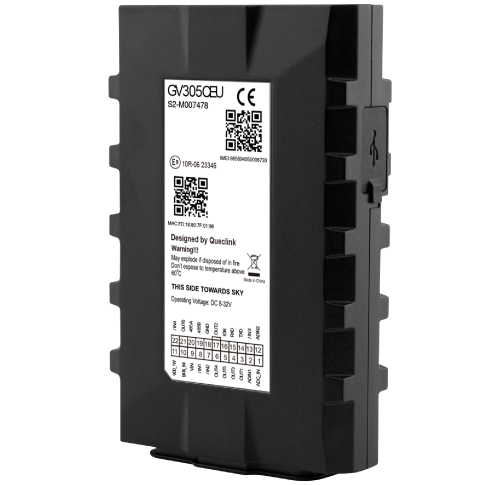

# QuecLink - GV305CEU

The QuecLink GV305CEU is a vehicle GPS tracker designed by a professional telematics manufacturer for fleet management, anti theft protection and advanced telemetry. It combines cellular connectivity with a high sensitivity u blox All in One GNSS receiver and built in BLE support to provide reliable, real time position and vehicle data suitable for mixed fleet deployments.

As a Plaspy compatible device, the GV305CEU streams positioning and vehicle telemetry into the Plaspy platform for monitoring, alerts and reporting. Its precise GNSS performance and extensive inputs and outputs make it a practical choice for customers who want to centralize tracking, security and operational workflows in Plaspy without extensive custom integration work.

## Key Highlights

- Plaspy compatible vehicle tracker offering LTE Cat 1 cellular with EGPRS fallback for resilient connectivity and timely location updates.
- High sensitivity u blox GNSS receiver providing autonomous accuracy under 2 m CEP for reliable positioning.
- Built in BLE 5.2 to connect peripheral sensors and beacons for expanded telemetry such as temperature or door status.
- Broad vehicle interfaces including serial ports 1 Wire and multiple digital and analog inputs and outputs for fuel monitoring ignition detection and remote actions.
- Backup 250 mAh Li Polymer battery and wide vehicle voltage support for continuity during power events and tamper situations.
- Built in event logic with scheduled reporting geofence support tow and low battery alarms crash detection and driving behavior monitoring.
- Remote OTA control of digital outputs and a configuration interface for firmware updates and device management.

## How It Works with Plaspy

When integrated with Plaspy, the GV305CEU delivers GNSS fixes and vehicle telemetry to the platform where data is presented on maps dashboards and reports. Plaspy ingests position, connectivity status and sensor inputs so fleet managers and security teams can monitor assets and trigger automated actions.

- Real time location and telemetry updates sent to Plaspy for live mapping and route playback.
- Ignition detection and configurable logic to record engine on off events and support mileage tracking in Plaspy reports.
- Fuel and auxiliary telemetry captured via serial and analog inputs and surfaced in Plaspy for operational analysis.
- Remote immobilizer and equipment control using OTA digital output commands for anti theft and control workflows.
- BLE sensors and beacons provide additional telemetry such as temperature door status or asset proximity to be included in Plaspy alerts and logs.

## Typical Use Cases

- Fleet management with live tracking route replay scheduled reporting and driver behavior oversight.
- Stolen vehicle recovery and anti theft workflows using continuous tracking tow alarms and remote immobilization.
- Usage based insurance and telematics programs where accurate mileage and behavior data are required.
- Fuel monitoring and engine telemetry integration for cost control and preventive maintenance.
- Sensorized cargo and environment monitoring for temperature door status and asset condition logging.

## Why Choose This Tracker with Plaspy

The GV305CEU offers a balanced combination of precise positioning, vehicle grade interfaces and flexible telemetry expansion that fits well into Plaspy based fleet and security solutions. Its GNSS performance and cellular connectivity ensure dependable tracking while BLE and multiple I O options let organizations extend monitoring to fuel sensors, cargo environment sensors and driver identification methods.

For telematics integrators and fleet managers the GV305CEU can reduce integration time thanks to standardized interfaces and built in event logic. When paired with Plaspy it supports scalable fleet oversight, improved asset security and richer telemetry driven workflows suitable for mixed vehicle fleets and professional deployments.

Learn more about Plaspy on the main website https://www.plaspy.com. Product specifications and availability can change over time, so please verify current technical details on the manufacturer site https://www.queclink.com/.
