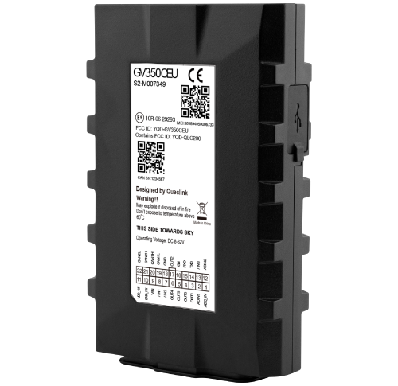

# QuecLink - GV350CEU

The GV350CEU is a professional grade vehicle tracker from QuecLink designed for demanding fleet management and commercial telematics. It combines high precision GNSS positioning with LTE Cat 1 connectivity and a suite of vehicle level interfaces to deliver continuous location tracking, telemetry and event reporting for trucks, buses and other heavy vehicles.

Built to integrate with telematics platforms, the GV350CEU is compatible with Plaspy out of the box. Its support for vehicle bus diagnostics, Bluetooth sensor integration and a broad set of inputs and outputs makes the unit well suited to feed Plaspy with the location, status and event data fleets need for real time monitoring, alerts and historical analysis.

## Key Highlights

- Professional grade GNSS positioning using a multi constellation receiver for consistent location accuracy.
- LTE Cat 1 connectivity with fallback options to help maintain continuous data transmission for real time tracking.
- Bluetooth sensor support for wireless integration of temperature or proximity monitoring and beacon devices.
- Vehicle bus compatibility for access to diagnostic and telemetry information from commercial vehicle networks.
- Rich I O set for fuel sensing, driver ID and remote output control including immobilizer applications.
- Event driven features such as geo fence, parking and tow alarms, crash detection and scheduled reporting for operational oversight.
- Designed for commercial use with a durable operating range and onboard backup power to support reporting during power loss situations.

## How It Works with Plaspy

When paired with Plaspy the GV350CEU streams location fixes, vehicle diagnostics and I O events so fleets get unified visibility and automated alerting through the Plaspy platform. Plaspy normalizes incoming data and presents it in maps, reports and dashboards that support response workflows and operational decisions.

- Real time location and telemetry updates appear in Plaspy map views for routing, dispatch and historical playback.
- Vehicle state events such as ignition, door and alarm status are captured and reflected in Plaspy alerts and activity logs.
- Fuel level and consumption trends are available in Plaspy dashboards when analog inputs and vehicle bus telemetry are reported.
- Remote outputs can be controlled and monitored from Plaspy to support anti theft workflows and vehicle immobilization procedures.
- Bluetooth sensor streams such as cargo temperature or beacon based driver ID are incorporated into Plaspy as additional telemetry channels.

## Typical Use Cases

- Fleet management for heavy trucks and commercial fleets that require real time tracking and vehicle diagnostics.
- Anti theft and stolen vehicle recovery operations using geo fences, tow alerts and remote immobilizer control.
- Fuel monitoring programs that combine analog inputs with vehicle bus data to detect discrepancies and optimize usage.
- Cold chain and cargo condition monitoring by integrating external Bluetooth temperature sensors and visualizing data within Plaspy.
- Driver identification and safety initiatives using external ID devices and event based driving behavior reporting.

## Why Choose This Tracker with Plaspy

The GV350CEU offers a balanced combination of precise positioning, vehicle level telemetry and flexible connectivity that makes it a strong match for organizations using Plaspy. Its ability to deliver real time location and bus diagnostics simplifies the process of turning raw vehicle signals into actionable fleet insights, while built in support for wireless sensors adds practical options for cargo and driver monitoring.

For teams that need operational visibility, alerting and reporting in a single platform, pairing the GV350CEU with Plaspy provides a practical route to implement tracking, anti theft and telemetry driven workflows without extensive custom development. Plaspy consumes the telemetry and events from the device and presents them in maps, alerts and reports that help fleets manage vehicles more efficiently.

To learn more about how Plaspy can work with the GV350CEU visit https://www.plaspy.com. Please note that product specifications, availability and manufacturer details can change over time and should be verified with QuecLink on their official site https://www.queclink.com/ for the most current information.
