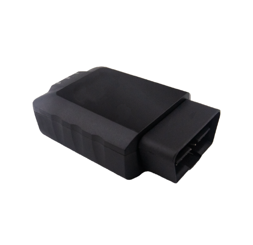

# QuecLink - GV501LG

The QuecLink GV501LG is a plug and play OBDII GPS tracker designed for cars and light trucks. It combines high speed cellular connectivity with fallback options, an integrated u‑blox GNSS receiver, BLE 5.0 and a dual band internal Wi Fi access point to provide continuous position updates, vehicle telemetry and an in cabin internet hotspot for crews and passengers. Its compact OBDII form factor makes it suitable for rapid deployment across vehicle fleets.

As a Plaspy compatible device, the GV501LG can stream GNSS positions, vehicle bus reads and sensor events into Plaspy for live monitoring, alerts and reporting. The unit’s vehicle diagnostics capabilities and event detection expand Plaspy workflows for fleet management, insurance telematics and maintenance programs, allowing operators to combine location intelligence with operational and diagnostic data in a single platform.

## Key Highlights

- Plug and play OBDII form factor for fast installation and immediate use in vehicle fleets.  
- LTE Cat 4 cellular with 3G and 2G fallback to maintain connectivity across wide areas.  
- High sensitivity u‑blox GNSS receiver with precise position reporting for route history and live tracking.  
- Reads ISO CAN bus parameters such as VIN, odometer and diagnostic trouble codes for diagnostics and maintenance insight.  
- Integrated BLE 5.0 and dual band Wi Fi access point to support short range sensors and in cabin internet sharing.  
- Built in 6 axis accelerometer for crash detection, harsh event detection and tow alarm notifications.  
- Industry certifications including FCC and Anatel for regional compliance and fleet readiness.

## How It Works with Plaspy

When connected, the GV501LG streams GNSS, CAN bus and sensor telemetry into Plaspy so the platform can present live location, geofence events, diagnostics and historical route playback. Plaspy ingests the device data to power alerts, scheduled reports and operational dashboards, enabling centralized oversight of vehicles and drivers.

- Real time location and telemetry updates delivered to Plaspy via the device uplink.  
- Vehicle bus reads such as VIN, odometer and DTCs are visible in Plaspy for diagnostics and maintenance workflows.  
- Crash detection, harsh driving events and tow alarms generate alerts inside Plaspy for rapid response and investigation.  
- Geo fence events, scheduled reporting and driving behavior metrics provide oversight and compliance reporting.  
- BLE compatibility allows pairing of short range sensors while the Wi Fi hotspot supports passenger connectivity without interrupting telematics.  
- CAN access exposes ignition status and fuel related parameters where available on the vehicle bus to enrich operational rules in Plaspy.

## Typical Use Cases

- Fleet management for real time tracking, route optimization and driver performance monitoring.  
- Usage based insurance and telematics programs using OBD derived odometer and DTC data combined with driving events.  
- Anti theft and recovery workflows using tow detection, crash alerts and geofence breach notifications.  
- In cabin connectivity and crew internet access via the device dual band Wi Fi hotspot.  
- Preventive maintenance and diagnostics programs leveraging vehicle bus reads to trigger service alerts.

## Why Choose This Tracker with Plaspy

The GV501LG pairs practical OBDII installation with enterprise oriented communications and sensor features to provide a compact yet capable telematics solution. Its combination of accurate GNSS, vehicle bus visibility and event detection supports a broad range of fleet and insurance workflows while minimizing installation complexity. For organizations that need both location intelligence and vehicle diagnostics from a single device, the GV501LG is a sensible choice to integrate with Plaspy.

For more details about how the GV501LG can fit into your Plaspy deployment, learn more about Plaspy on the main website https://www.plaspy.com. Product specifications, certifications and availability can change over time, so please verify current technical details and regional variants on the manufacturer site https://www.queclink.com/.
