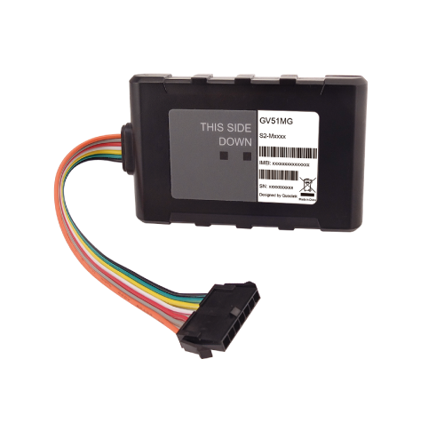

# QuecLink - GV51MG

The QuecLink GV51MG is a compact and ultra-thin LTE vehicle tracker designed for covert installation. It supports global LTE Cat M1/NB1 with 2G fallback using a unique antenna solution. With its compact size, it can be easily hidden in a vehicle, making it ideal for various tracking applications such as car leasing and buy here pay here \(BHPH\) services. 

Installation of the GV51MG is a breeze thanks to its in-line connector, allowing for quick and hassle-free setup. The tracker offers basic digital I/Os that can be used for ignition detection and vehicle control, while an extra configurable I/O enables flexible applications. It also supports AES-256 encryption to ensure the security and integrity of business-critical data, protecting against unauthorized access. 

The QuecLink GV51MG is perfect for auto financing, BHPH, car rental and leasing, basic fleet management, and stolen vehicle recovery. Its global LTE connectivity, compact size, and easy installation make it a reliable and efficient solution for tracking vehicles in various industries.

Outstanding Features:

- Global LTE Cat M1/NB1 with 2G fallback
- Compact size for covert installation
- Supports basic digital I/Os for ignition detection and vehicle control
- Extra configurable I/O for flexible applications
- AES-256 encryption for data security
- Ideal for car leasing, BHPH, car rental, fleet management, and stolen vehicle recovery

Technical Specifications:

| LTE Specifications | GSM Specifications | GNSS Specifications | General Specifications |
| --- | --- | --- | --- |
| Operating Band: LTE Cat M1/NB1Cat M1/Cat NB1 | Frequency: EGPRS 850 / 900 / 1800 / 1900 MHz | GNSS Type: Qualcomm GNSS receiver | Dimensions: 87× 55 × 12.5mm |
| Data Transmission: eMTC \(DL\) 375 Kbps, eMTC \(UL\) 375 Kbps, NB1 \(DL\) 32 Kbps, NB1 \(UL\) 70 Kbps | Data Transmission: GPRS multi-slot class 33, EDGE multi-slot class 33 | Sensitivity: Cold Start: -146 dBm, Reacquisition: -157 dBm, Tracking: -157 dBm | Weight: 95g |
|  |  | Position Accuracy \(CEP\): Autonomous: \< 2.5m | Backup Battery: Li-Polymer, 190 mAh |
|  |  | TTFF \(Open Sky\): Cold start: 31s average, Warm start: 21s average, Hot start: 3s average | Operating Voltage: 8V to 32V DC |

With its advanced features and reliable performance, the QuecLink GV51MG is the perfect choice for businesses in need of a compact and covert vehicle tracking solution. Whether you're in the car leasing industry, offering BHPH services, or managing a fleet, this tracker provides the necessary features and security to ensure efficient operations and peace of mind.

