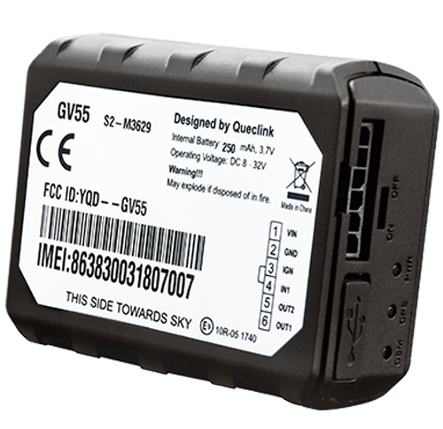

# QuecLink - GV55

The GV55 is a compact, covert vehicle GPS tracker designed for in-vehicle telematics. It combines an internal u-blox GNSS receiver with built-in GSM GPRS connectivity and an internal backup battery to provide continuous position reporting and buffered telemetry. The device is aimed at applications that need discreet installation and reliable event reporting for light vehicles.

As a Plaspy compatible device out of the box, the GV55 provides the core position and event signals that feed Plaspy for real-time tracking, alerts and historical reporting. Its event rich telemetry and message buffering make it a practical choice for fleet managers and service providers who want to integrate compact tracker hardware with Plaspy for operational visibility and anti theft workflows.

## Key Highlights

- Plaspy compatible mini vehicle tracker with internal u-blox GNSS for accurate location reporting
- Built in GSM GPRS connectivity with TCP UDP and SMS transport options for flexible data delivery
- Event detection and control including ignition detection, remote immobilizer control and panic input
- Crash and driving behavior reporting with geo fencing, tow and speed alarms for safety and security
- Compact covert form factor with internal antennas and an internal backup battery for continuous tracking
- Message buffering to protect against temporary connectivity loss and support reliable data delivery

## How It Works with Plaspy

When integrated with Plaspy, the GV55 streams GNSS positions and device event telemetry into Plaspy dashboards, maps and alerting systems so operators can monitor vehicles in real time and act on important events. Plaspy aggregates the device data to provide visibility, notifications and historical playback for operational oversight.

- Real time location updates and historical replay for route analysis and dispatching
- Event driven alerts for ignition changes, immobilizer actions and panic activation
- Crash and harsh driving events routed into incident workflows and driver scoring in Plaspy
- Geo fencing and alarms delivered as immediate notifications for boundary breaches and tow events
- Buffered message delivery and scheduled reporting help maintain data continuity during brief connectivity gaps
- Telemetry aggregation in Plaspy enables combined views of position, status and alarm history for each vehicle

## Typical Use Cases

- Fleet management and route monitoring with live tracking and utilization reporting
- Stolen vehicle recovery and anti theft operations using remote immobilizer and geo fence alarms
- Usage based insurance style monitoring with driving behavior and trip logging
- Rental and shared vehicle programs requiring discreet tracking and scheduled reporting
- General light vehicle asset tracking where covert installation and buffered telemetry are important

## Why Choose This Tracker with Plaspy

The GV55 is a practical choice where a small, covert tracker is required alongside event rich telemetry. Its combination of GNSS positioning, cellular connectivity and input based event signals provides the essential data Plaspy needs to deliver maps, alerts and reports for fleet and security workflows. Message buffering and multiple transport options reduce the impact of intermittent connectivity on data quality.

Paired with Plaspy, the GV55 can serve as a dependable building block for operational tracking, anti theft response and telemetry driven services without adding unnecessary complexity. To learn more about Plaspy and how this device can fit into your telematics stack visit https://www.plaspy.com. Product specifications, certifications and availability can change over time, so please verify current technical details and compliance information with the manufacturer at https://www.queclink.com/.
