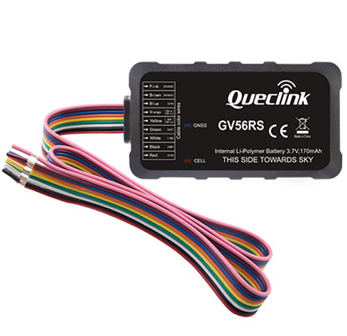

# QuecLink - GV56RS

The GV56RS is a compact GPS tracker from QuecLink designed for fleet management, car rental, usage based insurance, and stolen vehicle recovery. It combines quad band GSM/GPRS communication with a high sensitivity GNSS receiver and integrated Bluetooth Low Energy in a low profile housing that fits light vehicles and rental fleets. The unit expands the GV56 platform with an RS485 serial port for multiple wired sensors and supports driver ID and temperature probe options.

As a Plaspy compatible device, the GV56RS streams location and vehicle telemetry into Plaspy to enable live tracking, historical reporting, and event driven workflows. Plaspy can read GNSS fixes, sensor values, and input/output states from the GV56RS to power alerts, analytics and remote control actions such as immobilization, making the tracker a practical choice for operators who need integrated visibility and operational oversight.

## Key Highlights

- Plaspy compatible GPS tracker for real time tracking and fleet management
- Quad band GSM GPRS connectivity for broad cellular coverage
- High sensitivity GNSS receiver for accurate position reporting and reliable fixes
- RS485 expansion port supports multiple external sensors for fuel and load monitoring
- Integrated Bluetooth Low Energy for peripherals like keyfobs and environmental sensors
- Ignition detection, driver ID support and open collector output for remote immobilizer control

## How It Works with Plaspy

When connected to Plaspy the GV56RS continuously reports location and telemetry so operators can monitor fleets in real time and replay historical journeys. Device event triggers and programmable reporting feed Plaspy's rules and alerting engine so teams receive timely notifications and can execute automated responses. Plaspy surfaces driver identification, sensor readings and I/O states from the GV56RS on dashboards and in reports to support operational decisions.

- Live location and telemetry updates for mapping and route replay
- Trip recording and driver ID association to support billing and accountability
- Fuel and sensor telemetry from RS485 or analog inputs integrated into Plaspy dashboards
- Remote immobilizer actions driven by Plaspy commands using the device output
- BLE peripherals and temperature probes visible to Plaspy for environmental alerts

## Typical Use Cases

- Fleet anti theft and controlled immobilization for recovery workflows
- Car rental monitoring with driver identification and ignition reporting
- Usage based insurance and telematics with trip and driving behaviour data
- Logistics and multi tank vehicles using RS485 connected sensors for fuel and load telemetry
- Temperature sensitive shipments monitored via BLE and 1 wire probes integrated into fleet alerts

## Why Choose This Tracker with Plaspy

The GV56RS offers a balanced combination of compact form factor, strong GNSS performance and extended sensor connectivity that fits many Plaspy deployments. Its RS485 expansion and BLE accessory support give integrators options for fuel monitoring, environmental sensing and driver identification without increasing device footprint. For fleet operators, rental companies and telematics providers, the GV56RS supplies the core location and event data Plaspy needs for maps, alerts, reporting and operational automation.

Learn more about Plaspy and how compatible devices like the GV56RS can be used in your fleet on https://www.plaspy.com. Product specifications and availability can change over time, so please verify current technical details and manufacturer documentation at https://www.queclink.com/.
