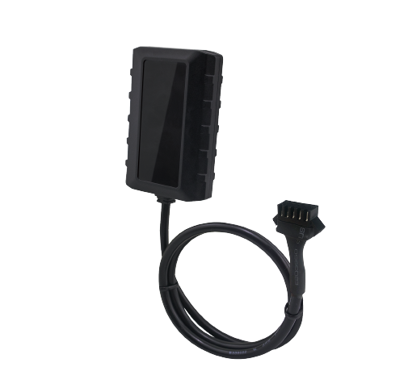

# QuecLink - GV57MG

The QuecLink GV57MG is a compact IP67 waterproof GPS tracker engineered for light vehicles and motorcycles. It is designed for outdoor use and combines robust GNSS positioning, low power operation and Bluetooth Low Energy support to provide dependable location and telemetry in challenging environments. The GV57MG includes features such as buffered message transmission and over the air configuration to support reliable reporting and lifecycle management in mobile deployments.

As a Plaspy compatible device, the GV57MG can feed live location, alarms and historical telemetry into Plaspy for fleet monitoring and security workflows. Its compact, rugged form and power saving capabilities make it a practical option for managers who need continuous visibility, ignition awareness and remote control options within the Plaspy platform.

## Key Highlights

- Plaspy compatible device with wide area cellular connectivity and fallback for resilient coverage.
- IP67 rated rugged enclosure suited for motorcycles, light vehicles and exposed equipment.
- High sensitivity GNSS performance with tight position accuracy for reliable tracking.
- Low power design and zero power consumption features to reduce battery drain during long parking periods.
- BLE 5.1 support for local sensor and beacon interoperability.
- Buffered telemetry and multi channel uplink for improved data continuity after connectivity loss.
- Simple physical footprint and remote management features to support lifecycle operations.

## How It Works with Plaspy

When integrated with Plaspy, the GV57MG streams position, status and alarm events so dispatchers and fleet managers can monitor assets in real time and act on security or operational events. Plaspy receives buffered messages after connectivity is restored and presents location and status data for mapping, alerting and reporting.

- Real time location and telemetry displayed on Plaspy maps for route monitoring and asset visibility.
- Alarm routing for SOS, parking and geofence breaches to enable rapid response.
- Ignition and status events reported to Plaspy to support fuel, dispatch and idle monitoring workflows.
- Remote output control and event driven actions coordinated through Plaspy to support immobilization and other control scenarios.
- BLE sensor and beacon data forwarded to Plaspy when in range for short range telemetry and local monitoring.

## Typical Use Cases

- Stolen vehicle recovery and anti theft operations that require covert tracking and remote control coordination.
- Motorcycle monitoring where waterproofing and compact size are essential.
- Light fleet tracking for delivery vans and service vehicles with ignition aware reporting and route visibility.
- Unattended parking and storage monitoring with extended standby performance to minimize battery drain.
- Local telemetry aggregation from BLE sensors for temperature or proximity reporting when vehicles are nearby.

## Why Choose This Tracker with Plaspy

The GV57MG is a balanced choice for organizations using Plaspy that need a rugged, low power tracker for motorcycles and light vehicles. Its compact enclosure and GNSS performance provide reliable positioning while buffered messaging and remote configuration help maintain data continuity and simplify device management within a Plaspy deployment. BLE support and remote output capability add flexibility for local sensor integration and control workflows.

If you want to learn more about how the GV57MG works with Plaspy and whether it fits your deployment, visit https://www.plaspy.com for general platform information. Product specifications, availability and manufacturer details can change over time, so please verify current specifications and certifications on the manufacturer site https://www.queclink.com/.
