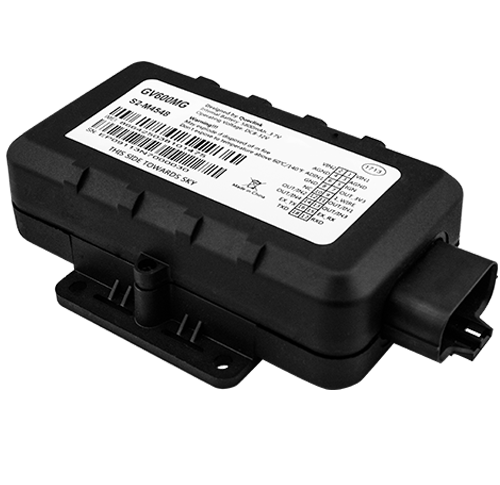

# QuecLink - GV600MG

The QuecLink GV600MG is a rugged LTE tracker engineered for heavy duty vehicles such as trailers, tankers, and flatbed trucks. Its IP67 rated enclosure is built to withstand harsh transport environments, and the device includes a GNSS receiver and G sensor for reliable location and motion awareness. The GV600MG is designed to support extended field deployments with an internal large battery pack that can provide up to 120 days of standby operation, making it suitable for assets that are frequently decoupled from vehicle power.

As a Plaspy compatible device, the GV600MG can feed asset location, motion events, and sensor information into Plaspy's fleet management platform for consolidated visibility. Compatibility lets organizations monitor trailers and refrigerated units alongside powered vehicles, receive alerts for movement or status changes, and include long duration assets in reporting and operational workflows managed through Plaspy.

## Key Highlights

- Rugged IP67 enclosure suited for trailers, tankers, and flatbed trucks operating in harsh conditions
- Extended internal battery life with up to 120 days standby for long term asset tracking
- Global LTE Cat M1 NB1 connectivity for wide area data reporting and positioning
- Support for external sensors and accessories such as temperature and humidity sensors and security padlocks
- Dual power source capability and serial interface for integration with refrigerated trailer systems
- GNSS positioning and a G sensor for motion and speed related events
- Designed for long term trailer monitoring where intermittent external power is common

## How It Works with Plaspy

When paired with Plaspy, the GV600MG supplies location updates, motion events, and sensor data into a centralized management view. Plaspy ingests those device messages to provide real time visibility, historical playback, and event driven notifications across your fleet.

- Display live location and historical trips of trailers and heavy assets on Plaspy maps
- Receive motion or vibration alerts derived from the device G sensor to detect movement or tampering
- Monitor external sensor readings like temperature and humidity when used with compatible sensors to support refrigerated cargo oversight
- Track battery and connectivity status in Plaspy to plan maintenance and device replacement for long term deployments
- Include GV600MG data in Plaspy reports and dashboards for fleet performance and asset utilization analysis

## Typical Use Cases

- Trailer fleet management for long haul and intermodal operations requiring intermittent power
- Monitoring refrigerated trailers by combining dual power inputs and serial interface integration for refrigeration units
- Tracking tankers and hazardous cargo movements where rugged mounting and robust enclosure are needed
- Long duration asset surveillance for trailers in storage or staging yards using extended battery capacity
- Securing and monitoring unpowered assets with BLE accessories such as padlocks and sensor tags

## Why Choose This Tracker with Plaspy

The GV600MG is a practical option for organizations that need a durable tracker built specifically for trailers and heavy transport equipment. Its combination of ruggedized protection, long standby battery life, and support for auxiliary sensors makes it well suited to fleets that manage mixed powered and unpowered assets. When used with Plaspy, operators gain a single pane of glass for visibility, alerts, and reporting across powered vehicles and trailer fleets.

If your operation requires dependable trailer tracking with the ability to monitor environmental sensors and manage refrigeration interfaces, the GV600MG paired with Plaspy offers a capable solution. For more details about Plaspy and how it can integrate fleet and asset tracking data, learn more at https://www.plaspy.com. Product specifications and availability can change over time, so please verify current technical details and compatibility on the manufacturer site https://www.queclink.com/.
