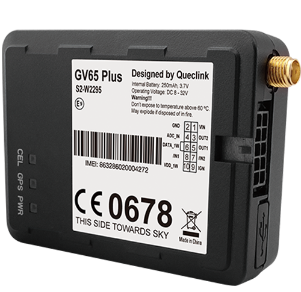

# QuecLink - GV65 Plus

# GV65 Plus

The GV65 Plus is a compact vehicle GPS tracker designed for professional fleet management and vehicle security. Purpose-built for logistics, courier services, stolen vehicle recovery and long-distance trucking, the GV65 Plus is Plaspy compatible and integrates cleanly into real-time tracking platforms to deliver dependable location, telemetry and event data.

With an internal Li‑Polymer backup battery and a small footprint, the GV65 Plus ensures continuous operation during power loss or tampering and supports flexible sensor and vehicle-bus integration. Pairing the GV65 Plus with Plaspy unlocks real-time tracking, alerting and reporting workflows for fleet managers who need reliable anti-theft, telemetry and fuel monitoring capabilities.

## Key Highlights

- Plaspy compatible for real-time tracking and fleet management dashboards, alerts and reports.
- Internal 250 mAh Li‑Polymer backup battery keeps the GPS tracker operational during external power removal or tampering.
- Compact, covert form factor \(73 × 54 × 22.7 mm, 62 g\) with internal GNSS/GSM antennas and optional external GNSS antenna for challenging installations.
- Quad-band GSM \(850/900/1800/1900 MHz\) with GPRS multi-slot class 10 and multiple reporting modes \(TCP/UDP/SMS\) for broad cellular coverage.
- Rich I/O and expandability: 1‑wire for temperature/iButton, ignition and digital inputs, analog input, digital outputs, and CAN bus capture via CAN100 accessory.
- On-board sensors and alarms including a 3‑axis accelerometer, geo-fencing \(up to 20 regions\), tow/speed alarms and crash/accident data collection for reconstruction.
- Buffers up to 10,000 messages to maintain data integrity if connectivity is intermittent.

## How It Works with Plaspy

When connected to Plaspy, the GV65 Plus streams location and vehicle telemetry so dispatchers and managers see actionable, near real-time information. Plaspy ingests the device’s TCP/UDP or SMS reports and maps position, triggers alarms, and compiles telematics reports for compliance and operations.

- Real-time location and telemetry updates via TCP/UDP/SMS for continuous fleet visibility.
- Ignition status and digital input events \(positive ignition input plus two negative inputs\) reported to Plaspy for trip start/stop and alarm logic.
- Fuel monitoring support via analog input and fuel sensing integrations; Plaspy can graph fuel level trends and trigger low-fuel alerts.
- Remote immobilizer capability implemented via OTA control of outputs \(latching/open-drain outputs can be driven by Plaspy commands to control vehicle circuits where permitted\).
- Sensor integration: 1‑wire temperature sensors and iButton driver ID readers can be reported into Plaspy; note the GV65 Plus does not include built-in Bluetooth sensors, but Plaspy supports Bluetooth sensors where a separate gateway is available.

## Technical Overview

| Connectivity | Quad-band GSM GPRS multi-slot class 10; reporting via TCP, UDP or SMS |
| --- | --- |
| Bands | GSM 850 / 900 / 1800 / 1900 MHz |
| Power & Battery | Operating voltage 8–32 V DC; internal Li‑Polymer backup battery 250 mAh |
| Interfaces | 1‑wire \(temperature / iButton\), 1 positive ignition digital input, 2 negative digital inputs, 1 digital output, 1 latched open-drain digital output \(150 mA max\), 1 analog input \(selectable 0–12V or 0–30V\); CAN bus via CAN100 accessory; mini‑USB port for firmware/debugging |
| GNSS | u‑blox All‑in‑One GNSS receiver; autonomous position accuracy &lt;2.5 m CEP; TTFF cold/warm ~27 s, hot ~1 s; sensitivity down to -162 dBm |
| Bluetooth | No built-in Bluetooth \(supports external sensor integration via 1‑wire / CAN / I/O expanders\) |
| Remote Management | Remote OTA control of outputs; mini‑USB port for firmware upgrades and debugging |
| Form Factor | Compact vehicle tracker — 73 × 54 × 22.7 mm; 62 g; internal GNSS/GSM antennas; optional external GNSS antenna for covert installs |
| Operational & Certifications | Operating temperature -30°C to +80°C \(storage -40°C to +80°C\); message buffer up to 10,000 messages; CE, E‑Mark and Anatel certified |
| RF Performance | GSM RF output: GSM850/900 ~33±2 dBm, DCS1800/PCS1900 ~30±2 dBm; receiver sensitivity –107 dBm \(Class II RBER 2%\) |

## Use Cases

- Fleet anti-theft and stolen vehicle recovery — continuous tracking plus backup battery keeps the device online if main power is cut.
- Driver identification and behavior monitoring — iButton driver ID and accelerometer-based harsh braking/acceleration detection feed Plaspy safety and compliance reports.
- Fuel monitoring and telemetry — analog fuel level sensing and scheduled/mileage-based reporting help optimize fuel consumption and reduce shrinkage.
- Long-distance trucking and logistics — compact install, optional external GNSS antenna for hidden mounting, and large message buffer for intermittent connectivity.
- Vehicle bus data capture and diagnostics — CAN100 accessory enables CAN data capture for richer telematics and maintenance insights.

## Why Choose This Tracker with Plaspy

The GV65 Plus delivers a reliable, discreet GPS tracker that pairs easily with Plaspy for a complete fleet management solution. Its internal backup battery, robust GNSS accuracy and quad-band cellular connectivity ensure persistent real-time tracking and telemetry. Flexible I/O, 1‑wire sensors and CAN expansion let you collect ignition, fuel and driver ID data without replacing existing vehicle systems. Combined with Plaspy, the GV65 Plus provides fleet managers with timely anti-theft alerts, remote output control for immobilization workflows where allowed, and comprehensive reporting for operations and maintenance. For deployments that demand a small form factor, proven positioning performance and scalable sensor integration, the GV65 Plus is a practical Plaspy compatible choice.

