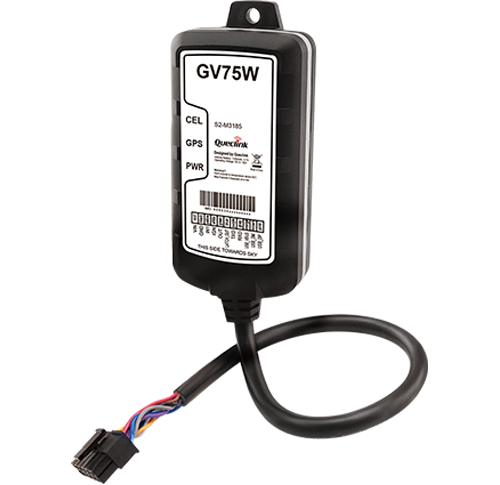

# QuecLink - GV75W

The GV75W by Queclink is a rugged, waterproof GPS tracker engineered for motorcycles, quad bikes, watercraft and light heavy machinery. Plaspy compatible out of the box, the GV75W pairs high-sensitivity GNSS positioning with worldwide cellular connectivity and extreme low-power behavior to deliver reliable real-time tracking, theft protection and fleet telemetry for harsh outdoor environments.

Designed for compact-vehicle installations where space, durability and battery preservation matter, the GV75W combines an IP67 enclosure, u‑blox GNSS performance, and Queclink’s zero-power consumption technology when ignition is off. Integrate the GV75W into Plaspy for live location, geo-fence alerts, driving behaviour reporting and remote control of digital outputs — all essential for motorcycle security, fleet management and asset tracking.

## Key Highlights

- Plaspy compatible for seamless real-time tracking and telemetry integration via TCP, UDP or SMS.
- IP67 waterproof housing suited to motorcycles, watercraft and outdoor equipment.
- Ultra-low power behaviour: zero power consumption with ignition off to prevent battery drain.
- High-sensitivity u‑blox GNSS with position accuracy under 2.5 m CEP and −162 dBm tracking sensitivity.
- Wide cellular coverage with UMTS/HSPA and quad-band GSM for global data transmission.
- Built-in backup Li‑Polymer 1100 mAh battery and broad operating voltage \(8–32 V DC\) for vehicle use.
- Multiple I/O and RS232 interface for ignition detection, external device integration and event reporting.

## How It Works with Plaspy

When paired with Plaspy, the GV75W streams GNSS positions and vehicle telemetry to the cloud using TCP, UDP or SMS. Plaspy consumes scheduled timing reports, geo-fence events and alarm signals from the tracker to provide live maps, history, alerts and analytics. The unit’s event-driven reporting and OTA control capabilities let operators respond quickly to theft, collisions or unauthorized movement.

- Real-time location and telemetry updates via UMTS/HSPA or GSM to Plaspy servers.
- Accurate ignition status via positive trigger input for ignition detection \(used in Plaspy dashboards for runtime and engine-on analytics\).
- Alarm and geo-fence events \(parking alarm, tow alarm in ignition-off state, low battery, special digital-input alarms\) forwarded to Plaspy for immediate notifications.
- Remote control of digital outputs through Plaspy using OTA commands to activate relays or other accessories; suitable for remote immobilization strategies when wired accordingly.
- Driving behaviour and crash detection events \(harsh braking, acceleration, collision\) sent to Plaspy for fleet-driver scoring and incident reconstruction.

## Technical Overview

| Model | GV75W |
| --- | --- |
| Connectivity | UMTS/HSPA \(850/1900/2100 MHz\); Quad-band GSM \(850/900/1800/1900 MHz\); HSDPA downlink up to 3.6 Mbps; WCDMA R99 rates |
| Bands | UMTS 850/1900/2100 MHz; GSM 850/900/1800/1900 MHz |
| Power & Battery | Operating voltage 8–32 V DC; Li‑Polymer backup battery 1100 mAh; standby times vary by reporting interval \(examples: ~140 hours without reporting; ~70 hours with 5‑minute reporting; ~80 hours with 10‑minute reporting\) |
| Interfaces | One positive trigger input \(ignition detection\), one negative trigger input \(TPM compatible\), one digital output, one latched digital output \(open drain, 150 mA max\), RS232 serial port on 11‑pin cable \(GARMIN protocol supported\), USB on cable for firmware upgrades |
| GNSS | u‑blox All‑in‑One receiver; sensitivity −162 dBm; position accuracy &lt; 2.5 m CEP; optimized hot/warm/cold start TTFF |
| Antennas & Indicators | Internal cellular and GNSS antennas; LED indicators for CEL, GPS and PWR status |
| Enclosure & Form Factor | IP67 waterproof; dimensions 102 × 46 × 20.5 mm; weight 122 g |
| Operating Environment | Temperature range −30°C to +70°C |
| Protocols & Remote Management | TCP, UDP, SMS communications; OTA control of digital outputs; firmware upgrades via USB cable |
| Certifications | FCC, CE |
| Bluetooth | No built-in Bluetooth \(external BLE sensor integration possible via third-party gateways if required by your Plaspy deployment\) |

## Use Cases

- Motorcycle anti-theft and recovery: waterproof, compact, and battery-preserving for long parked periods.
- Fleet management for small vehicles and utility fleets where ruggedness and low power are essential.
- Asset monitoring for quad bikes, light construction equipment and watercraft requiring reliable location reporting and tow alarms.
- Driver behaviour and incident reporting for safety programs using harsh-braking/acceleration and crash detection data.
- Remote control scenarios where Plaspy triggers digital outputs for disabling accessories or activating immobilization relays wired to the tracker.

## Why Choose This Tracker with Plaspy

The GV75W delivers a focused balance of durability, precise GNSS positioning and power-saving design that complements Plaspy’s real-time tracking and fleet analytics. Its IP67 enclosure and wide operating temperature range make it suitable for exposed deployments, while the u‑blox receiver and reliable cellular links ensure consistent location and telemetry delivery to Plaspy dashboards. Built-in event reporting \(geo-fence, tow alarm, low battery, driving behaviour, crash detection\) and OTA control of outputs give operators the remote visibility and actionable control required for anti-theft, fleet management, telemetry-driven fuel monitoring workflows and immobilizer strategies when wired appropriately. For organizations needing a compact, waterproof and low-power Plaspy compatible GPS tracker, the GV75W is a practical, certified solution.

