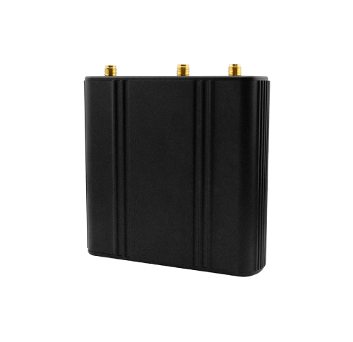

# QuecLink - WR100 LEU

# WR100LEU Industrial LTE Router — Plaspy compatible gateway

The WR100LEU is a compact industrial LTE Cat 4 router engineered as a robust network gateway for Plaspy-compatible GPS tracker deployments. Built for data-intensive IoT and telematics, the WR100LEU provides resilient cellular connectivity, dual‑SIM redundancy and flexible wired/WiFi interfaces so Plaspy-enabled GPS tracker data reaches the cloud reliably for real-time tracking, fleet management and remote telemetry.

The WR100LEU is ideal where persistent, secure transport of telemetry, location and event data is critical. With OpenWrt-based routing, hardware VPN, firewall protections and remote management \(Web UI, SSH, SMS, FOTA\), it complements Plaspy-compatible trackers by delivering secure backhaul, automatic failover and packet-level protections that keep anti-theft alerts, ignition events, fuel monitoring telematics and immobilizer commands flowing between vehicles or assets and the Plaspy platform.

## Key Highlights

- Plaspy compatible gateway — reliable cellular/WiFi backhaul for GPS tracker telemetry and real-time tracking feeds.
- 4G LTE Cat 4 performance \(up to 150 Mbps downlink FDD\) with WCDMA/GSM fallback for broad coverage and speed.
- Dual‑SIM failover and automatic load balancing to minimize service interruptions in fleet management and remote deployments.
- Industrial I/O and serial support \(RS485/RS232 on demand\) to carry ignition, door/alarm, fuel monitoring and other telemetry from connected devices.
- Advanced security — OpenVPN/IPsec/GRE, firewall rules, DDoS and port-scan protections for secure Plaspy data transport.
- Flexible connectivity — IEEE 802.11 a/b/g/n 2.4 GHz WiFi, two FE Ethernet ports \(one WAN/LAN configurable\), and multiple antenna connectors for optimized signal.
- Rugged, compact form factor with wide voltage input \(8–32 V DC\) and extended temperature range for vehicle and outdoor installations.

## How It Works with Plaspy

The WR100LEU acts as a secure, high-availability communications gateway that carries data from Plaspy-compatible GPS trackers and telematics devices to the Plaspy platform. Trackers connected via cellular, serial or local WiFi send GPS coordinates, telemetry and event messages to the router, which forwards them over its LTE/WiFi/ethernet links. Dual-SIM redundancy and link monitoring keep real-time tracking and alerting operational even when a primary network drops.

- Real-time location and telemetry updates — the router forwards GPS tracker packets promptly for Plaspy real-time tracking and mapping.
- Ignition, door and alarm status — carries digital/serial signals from trackers or attached equipment so Plaspy can trigger rules and notifications.
- Fuel monitoring and other telematics — transports sensor and CAN/serial telemetry from field devices into Plaspy dashboards and reports.
- Secure command/control — VPN and firewall protect immobilizer or remote configuration commands routed through the gateway to Plaspy-managed devices.
- Bluetooth sensors/beacons — while WR100LEU does not include Bluetooth, it supports connectivity for Plaspy trackers that relay BLE sensor data via serial/Ethernet/USB-connected gateways.

## Technical Overview

| Connectivity | 4G LTE Cat 4 \(FDD/TDD\) with WCDMA and GSM backward compatibility; IEEE 802.11 a/b/g/n 2.4 GHz WiFi; 2x FE Ethernet |
| --- | --- |
| Bands | LTE Cat 4 FDD/TDD supported; specific frequency bands vary by model/region \(refer to product flyer\) |
| Power & Battery | 4-pin power socket, wide input 8–32 V DC. No internal backup battery specified in product description. |
| Interfaces | Dual-SIM \(redundancy\); two FE Ethernet ports \(one WAN/LAN configurable\); serial port \(RS485 or RS232 on demand\); multiple antenna connectors \(2x SMA mobile, 1x RP-SMA WiFi\); LEDs; reset button |
| GNSS | No integrated GNSS module listed — device is a cellular/WiFi gateway that transports GPS data from connected Plaspy-compatible trackers or external GNSS modules. |
| Bluetooth | No Bluetooth reported; local BLE sensor support is achieved via connected trackers or external BLE gateways. |
| Remote Management | OpenWrt-based Web UI, SSH access, SMS control and FOTA for remote updates; connection monitoring with ping reboot and scheduled reboot; automatic load balancing/backup link configuration |
| Form Factor | Compact industrial housing, 90 × 90 × 24 mm, 200 g, operating temp -30°C to +70°C; CE certified |
| Memory & Storage | 128 MB DDR2 RAM, 16 MB SPI Flash |

## Use Cases

- Fleet management: provide resilient cellular backhaul for Plaspy GPS trackers on buses, trucks and service vehicles to enable continuous real-time tracking and route telemetry.
- Anti-theft and immobilization: ensure secure, low-latency transport of tracker alarms and immobilizer commands between vehicles and the Plaspy control center.
- Remote telemetry for industrial automation: relay sensor data, serial telemetry and status signals from remote sites to Plaspy for monitoring and maintenance scheduling.
- Smart city and transport installations: act as a local gateway for roadside or in-vehicle trackers delivering location, passenger-counting or environmental telemetry to Plaspy.
- Retail and kiosk connectivity: keep Plaspy-connected POS tracker devices and asset trackers online via LTE with Ethernet/WiFi fallback.

## Why Choose This Tracker with Plaspy

Although the WR100LEU is an industrial LTE router rather than a GPS tracker, it is a strategic choice for any Plaspy deployment that requires rock-solid connectivity, advanced security and flexible I/O for telemetry. Using WR100LEU as the network gateway ensures Plaspy-compatible GPS trackers and sensors have redundant cellular links, VPN-protected tunnels and automatic failover — reducing downtime for real-time tracking, fleet management and anti-theft workflows. The router’s serial interfaces make it simple to integrate ignition status, fuel monitoring and other telematics into Plaspy reports, while remote management \(FOTA, Web UI, SSH\) keeps fleets and distributed gateways easy to maintain at scale.

For projects that need an industrial-grade communications backbone for Plaspy-compatible GPS trackers — from vehicle-installed telematics to smart infrastructure — the WR100LEU delivers the networking, resilience and security required to keep location and telemetry data flowing when it matters most. Consult the downloadable product flyer or contact your Plaspy integration specialist for model-specific band details and deployment guidance.

