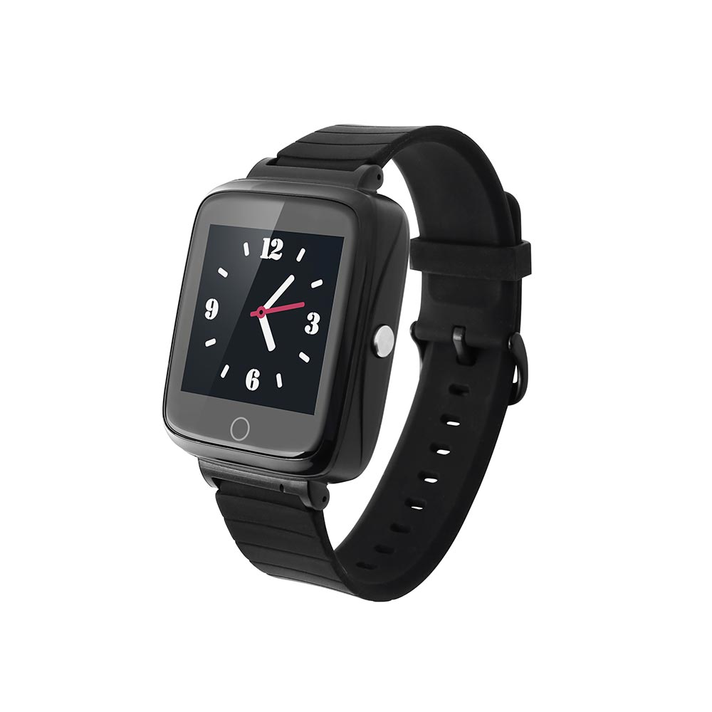

# Reachfar - RF-S1

The RF-S1 is a wearable personal GPS tracker and health smart watch designed for continuous health supervision and reliable real time location tracking. Built with caregivers and families in mind, the device combines positioning, an SOS panic button, two way voice calling and removal alerts with ongoing health telemetry such as heart rate, blood oxygen and body temperature. It also includes features to support daily care routines like medicine reminders and voice alarm notices while offering an IP67 level of water resistance for everyday use.

As a Plaspy compatible device, the RF-S1 integrates its location, health telemetry and emergency events into the Plaspy platform so caregivers and operators can monitor status and respond from a single dashboard. That compatibility makes the RF-S1 a practical option for organizations and families who want wearable personal safety data and alerts to appear alongside other assets managed in Plaspy for streamlined oversight.

## Key Highlights

- Compatible with Plaspy for centralized real time tracking and telemetry visibility.
- SOS panic button and two way voice calling for rapid caregiver contact.
- Continuous health monitoring including heart rate, blood oxygen and temperature.
- Removal alarm, medicine reminders and voice notifications to support routine care.
- IP67 water resistance suited to daily wear and light exposure to water.
- Designed for fast response with predefined number dialing and voice alert features.

## How It Works with Plaspy

When the RF-S1 is used with Plaspy, device events and telemetry are ingested and presented in Plaspy views so caregivers can see location and health status at a glance. Emergency events such as SOS presses and removal alarms are routed to configured alert channels while ongoing health updates and reminders are available for review and reporting. Integration focuses on personal safety workflows to complement Plaspy’s broader monitoring and reporting capabilities.

- Real time location and health telemetry shown on Plaspy maps and status panels.
- SOS panic button events logged as high priority alerts for immediate attention.
- Health metrics such as heart rate and blood oxygen reported as status updates.
- Removal alarms and voice reminder events forwarded to Plaspy for prompt notification.
- Call and message events available for caregiver follow up when device and platform settings permit.

## Typical Use Cases

- Elderly care and assisted living monitoring for faster response to emergencies.
- Child safety during school outings or daily travel with one touch contact.
- Remote patient supervision where continuous telemetry supports early intervention.
- Personal security for vulnerable individuals who need immediate alerting and location tracking.
- Routine care management with medicine reminders and audible alarms.

## Why Choose This Tracker with Plaspy

The RF-S1 is well suited for organizations and families that need a compact wearable focused on personal safety and basic health telemetry. Its feature set aligns with common caregiver needs—location visibility, SOS alerting, two way voice contact and vital sign monitoring—while Plaspy provides the centralized dashboard, alert routing and historical context that make those features operationally useful. For teams that manage both wearables and other tracked assets, the RF-S1 can be presented alongside vehicles and equipment in Plaspy to give a single view of diverse device types.

Because the RF-S1 is optimized for personal monitoring rather than vehicle telematics, it is an appropriate choice when the primary goals are safety, caregiver notification and straightforward health status tracking. Plaspy compatibility helps ensure those events and telemetry appear in the same platform used for broader monitoring and reporting across your organization.

To learn more about how Plaspy can display and manage RF-S1 data visit https://www.plaspy.com. Product specifications, availability and manufacturer details can change over time, so please verify current technical and network information on the Reachfar official site https://www.reachfargps.com/.
