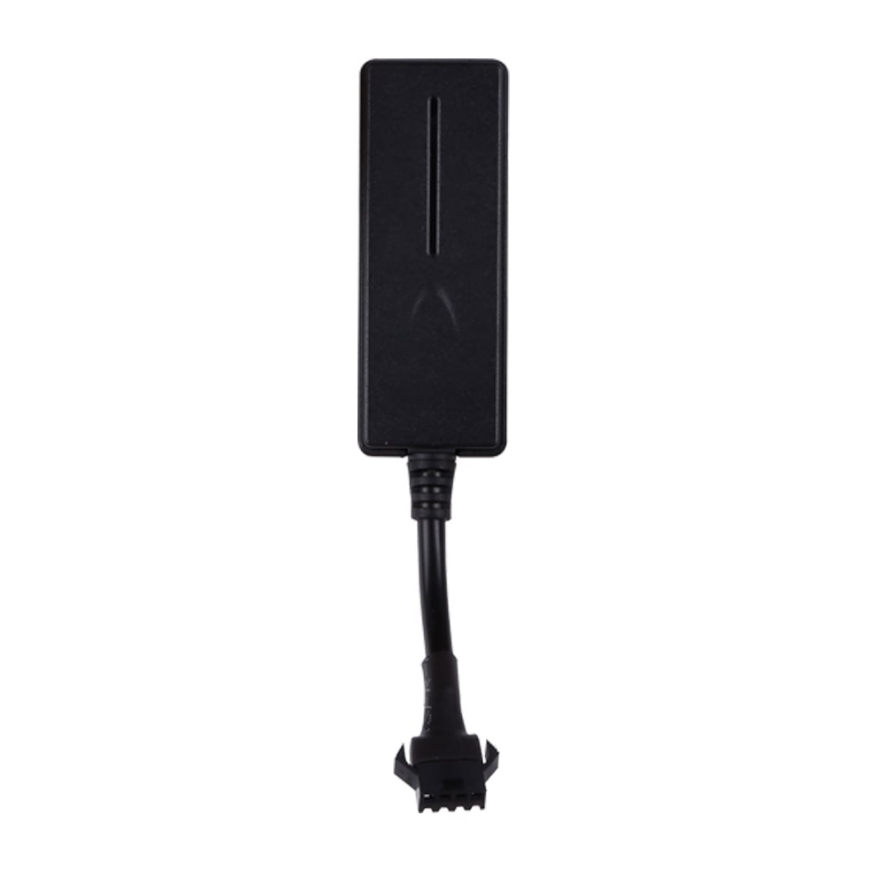

# Reachfar - RF-V03

The RF-V03 is a compact vehicle GPS tracker from Reachfar designed for reliable real-time tracking and fleet management. It offers multi mode positioning using GPS Wi‑Fi and LBS alongside a low power design and vehicle security features so fleets can monitor routes review playback history and receive timely alarms through a centralized platform.

As a Plaspy compatible device the RF-V03 integrates into Plaspy to provide centralized telemetry alerts and reporting across fleets. Its rugged IP66 enclosure wide input voltage range and optional remote cut off capability make it a practical choice for anti theft workflows route oversight and long term telemetry when paired with Plaspy dashboards and reporting tools.

## Key Highlights

- Plaspy compatible for real time tracking route playback and centralized fleet management
- Multi mode positioning with GPS Wi‑Fi and LBS to maintain location coverage in varied environments
- Vehicle security features including geo fence over speed alarm and cut wire detection
- Optional remote oil and power cut off support when used with appropriate external hardware
- Built in microphone and G sensor for movement detection and event verification
- Rugged IP66 enclosure and wide operating voltage range suited for vehicle deployments

## How It Works with Plaspy

When connected to Plaspy the RF-V03 sends location and event updates that Plaspy ingests to present live maps alerts and historical playback. Plaspy transforms device events into configurable notifications reports and operational workflows so fleet teams can act on alarms and analyze vehicle behavior over time.

- Live location and telemetry appear on Plaspy maps for real time visibility
- Geo fence over speed and cut wire alarms surface as Plaspy alerts for immediate attention
- Historical route playback and event logs are available for audit and incident review
- Remote immobilizer or cut off actions can be coordinated through Plaspy when the required external hardware is installed
- Device status and basic health indicators are visible in Plaspy to support operational oversight

## Typical Use Cases

- Fleet management for small to medium vehicle fleets requiring centralized tracking and route analysis
- Anti theft monitoring with alarms and remote immobilization support for stolen vehicle response
- Rental and shared vehicle oversight including route playback and event verification
- Long distance or international deployments that benefit from multi mode positioning and centralized reporting
- Incident auditing and compliance where historical route data and event logs are required

## Why Choose This Tracker with Plaspy

The RF-V03 is a practical option for organizations that need a compact rugged tracker with multiple positioning methods and built in security features. Its combination of location modes and event reporting helps reduce blind spots while supporting standard fleet monitoring workflows.

Paired with Plaspy the RF-V03 becomes a source of consistent telemetry and alarms that can be turned into automated notifications reports and operational tasks. For teams looking to centralize vehicle tracking and improve response to security events the RF-V03 offers a balanced mix of durability and capability when integrated into Plaspy.

To learn more about how Plaspy can work with the RF V03 visit the Plaspy main website https://www.plaspy.com. Product specifications availability and manufacturer details can change over time so verify current specifications on the Reachfar official site https://www.reachfargps.com/
