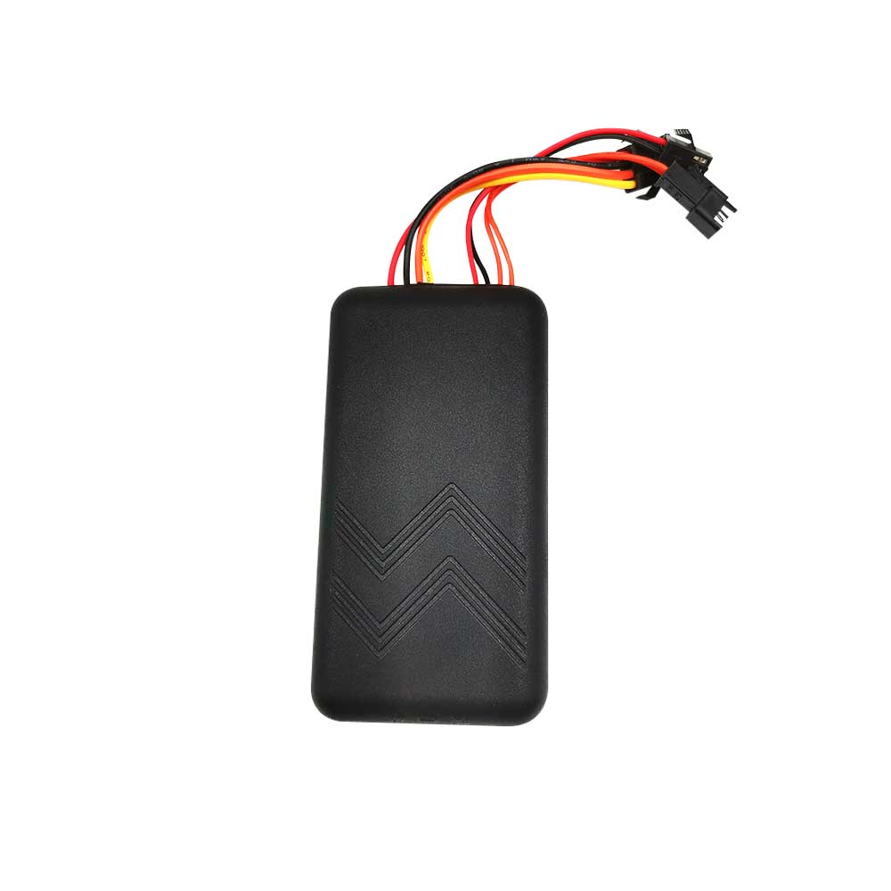

# Reachfar - RF-V03-SOS

The RF-V03-SOS is a rugged, multi-function vehicle GPS tracker designed for reliable real-time tracking and fleet telematics. It supports a wide input voltage range to suit cars, trucks and industrial vehicles, and provides dual positioning with GPS and cellular based location for open sky accuracy up to about 10 meters. The device emphasizes safety and remote control with features such as a one-click SOS, remote engine or power cut, vibration alarm and optional voice monitoring on certain variants, while offering a waterproof enclosure, internal backup battery and local data storage for continuity.

As a Plaspy compatible GPS tracker, the RF-V03-SOS can integrate into Plaspy dashboards to provide live location, alerts and history playback for operational oversight. This compatibility makes the unit a practical option for fleets, rental operations and private owners who want centralized visibility and alerting through Plaspy while relying on a device built for vehicle applications and resilience in mixed coverage environments.

## Key Highlights

- Compatible with Plaspy for live tracking, alerting and history playback to support fleet management workflows
- Wide input voltage support that fits a broad range of vehicles without extra converters
- One-click SOS and vibration alarm for rapid incident notification and tamper detection
- Remote engine or power cut and engine status detection to support immobilization and control workflows
- Dual positioning GPS plus cellular based location with typical open sky accuracy up to 10 meters
- Built for continuity with waterproof enclosure, internal backup battery and dead-zone storage of more than 2,000 points

## How It Works with Plaspy

When used with Plaspy, the RF-V03-SOS reports position, events and status updates to Plaspy servers so vehicles and assets appear on live maps and in reports. Plaspy consumes the tracker data to power alerts, store history and present operational dashboards for fleet teams.

- Real-time location and telemetry updates appear in Plaspy for immediate route monitoring and dispatch decisions
- Ignition and engine status are visible in Plaspy to support start/stop reporting and idle time analysis
- Remote engine or power cut can be controlled through Plaspy workflows where supported by vehicle setup and local regulations
- Geo-fence events and vibration alarms are delivered via Plaspy alerting channels for tamper and movement detection
- Dead-zone data stored on the device is uploaded to Plaspy automatically when connectivity is restored
- SOS activations and voice monitoring events (where supported) can be surfaced in Plaspy to aid incident response

## Typical Use Cases

- Fleet anti-theft and recovery with immobilization and live tracking during incidents
- Driver safety and emergency response using one-click SOS and voice monitoring options
- Route history, delivery verification and compliance using stored telemetry and playback
- Telemetry based operational oversight including ignition and runtime monitoring
- Deployments in areas with intermittent coverage where dead-zone storage preserves tracking continuity

## Why Choose This Tracker with Plaspy

The RF-V03-SOS pairs practical vehicle-oriented features with Plaspy's centralized management to deliver a resilient tracking solution for many fleet and asset scenarios. Its broad voltage tolerance and compact, waterproof design reduce compatibility concerns across mixed vehicle fleets, while onboard safety and anti-theft features support security and rapid response workflows. Dead-zone storage and dual positioning help maintain continuity and location quality where coverage varies.

Because this model is listed by the manufacturer as out of production, verify availability and recommended alternatives before procurement. To learn more about how Plaspy can use this tracker in your operations visit https://www.plaspy.com and consult the manufacturer for current specifications and availability at https://www.reachfargps.com/. Product specifications, availability, and manufacturer details can change over time so confirm the latest documentation with the manufacturer.
