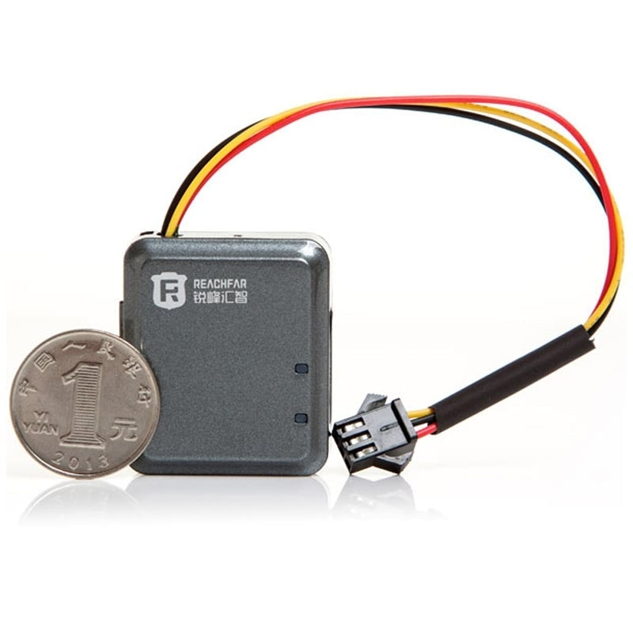

# Reachfar - RF-V10+

The RF-V10+ is a compact, super power saving GPS tracker built for vehicle and motorcycle security. It provides real time tracking combined with long standby performance and a suite of anti theft alarms. The device supports GPRS and SMS reporting and uses dual positioning to keep location updates reliable even when GPS coverage is limited, making it suitable for owners and small fleets that need continuous oversight without frequent recharging.

As an out of the box Plaspy compatible device, the RF-V10+ can feed location, alarm and status data directly into Plaspy dashboards and mobile views. That compatibility means fleets and individual users can use Plaspy to receive timely alerts, view live positions and review playback history while benefiting from the tracker’s low power design and vehicle oriented features.

## Key Highlights

- Plaspy compatible device delivering real time tracking with GPRS telemetry and SMS fallback for dependable updates.
- Ultra low power design with a built in 520 mAh battery for extended standby between charges.
- Quad band GSM and GPRS connectivity for broad cellular coverage in most regions.
- Dual positioning using GPS with LBS fallback to maintain location when GPS signals are weak.
- Comprehensive anti theft feature set including vibration alarm, SIM change and low battery notifications, geo fence alerts, and remote arm disarm and start stop control via SMS or key fob.
- Rugged automotive oriented build tolerating wide temperature and humidity ranges for vehicle and motorcycle use.

## How It Works with Plaspy

When paired with Plaspy, the RF-V10+ transmits position fixes, alarm events and device status to Plaspy’s platform where those streams become live maps, alerts and historical tracks. Plaspy ingests GPRS telemetry and can also handle SMS based alerts so operators get consolidated visibility and can act on events from a single place.

- Real time location and telemetry delivered into Plaspy with SMS as a fallback channel.
- Alarm and status forwarding so vibration events, SIM change and low battery warnings appear in Plaspy alerting workflows.
- Geo fence notifications and track playback in Plaspy using the device’s stored location history.
- Historical reporting and trip playback for operational review and incident analysis.
- Support for remote immobilizer and start stop workflows triggered by Plaspy alerts and confirmed via the device’s remote command capabilities.

## Typical Use Cases

- Motorcycle anti theft protection where compact size, vibration detection and remote immobilizer reduce theft risk.
- Car security and owner monitoring with live tracking, geo fence alerts and status notifications.
- Small fleet management for low power or infrequently used assets where long standby is important.
- Asset tracking that requires timely alerts and playback to investigate unusual movements.
- Remote vehicle monitoring for seasonal or backup vehicles that need occasional location checks without constant power draw.

## Why Choose This Tracker with Plaspy

The RF-V10+ is a practical choice for organizations and owners who need a balance of long standby, dependable location reporting and useful anti theft features. Its combination of GPS plus LBS positioning helps keep tracking effective in marginal signal areas, while quad band cellular support provides wide reach for telemetry delivery. Being Plaspy compatible out of the box allows teams to onboard the device quickly and use Plaspy features like live maps, rule based alerts and historical playback to improve oversight and response.

If you want to learn more about how the RF-V10+ can fit into your Plaspy deployment, visit https://www.plaspy.com to explore the platform. Product specifications and availability can change over time, so please verify the latest technical details and manufacturer documentation at https://www.reachfargps.com/.
