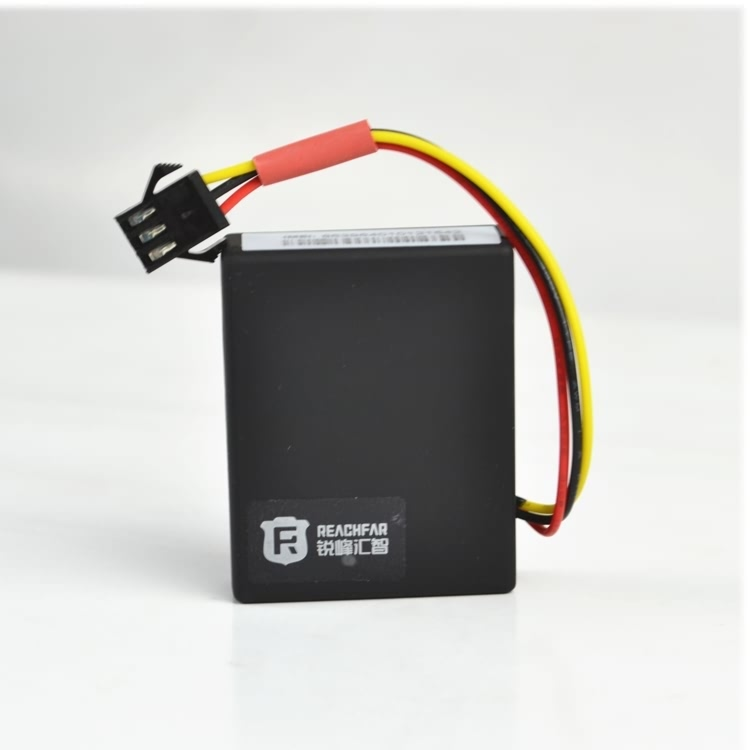

# Reachfar - RF-V12

# RF‑V12 GSM GPRS Real-time Tracker — Plaspy compatible

The RF‑V12 GSM GPRS Real‑time Tracker is a compact GPS tracker built for electric bicycles and motorcycles that brings robust anti‑theft protection and live location visibility to Plaspy compatible fleets and individual users. Designed for straightforward installation and continuous monitoring, the RF‑V12 combines real‑time tracking, vibration and sound sensor alarms, remote listening, and tamper detection so you can protect assets with confidence on the Plaspy platform.

As a Plaspy compatible GPS tracker, the RF‑V12 feeds position and telemetry into online platforms \(including the device's vendor portal, WeChat, mobile apps and web interfaces\) for real‑time tracking, trace replay and alarm notification. Its compact form, long standby internal battery and quad‑band GSM make it a cost‑effective choice for fleet management, anti‑theft monitoring and remote asset supervision where tamper and displacement alerts are essential.

## Key Highlights

- Plaspy compatible GPS tracker with real‑time tracking and history playback via web and mobile interfaces.
- Dedicated anti‑theft sensors: vibration alarm, sound alarm and line‑cut detection to detect tampering or removal.
- Remote listening function for audible monitoring of the device’s surroundings when an alarm is triggered.
- Ignition detection and displacement alerts provide telemetry useful for fleet management and security workflows.
- Built‑in battery with long standby and low‑battery notification \(alerts when battery falls below 10%\).
- Quad‑band GSM \(850/900/1800/1900 MHz\) for wide cellular compatibility and SMS/GPRS reporting options.
- Compact dual‑host form factor suitable for concealed installation on bicycles, scooters and motorcycles.

## How It Works with Plaspy

When integrated with Plaspy, the RF‑V12 streams location and alarm events into your Plaspy dashboard or API endpoint for immediate situational awareness and historical analysis. The device uses GSM GPRS to upload GPS coordinates and event data to online servers and also supports SMS for direct alerts. Plaspy leverages those incoming telemetry points to provide live maps, geofence alarms, trace replay and configurable notification rules.

- Real‑time location and telemetry updates delivered via GPRS \(or SMS where configured\) to Plaspy.
- Ignition and line‑cut/power‑loss status reported as events for fleet management and anti‑theft workflows.
- Vibration and sound sensor alarms trigger immediate notifications and calls to master numbers.
- Remote listening available to corroborate alarm conditions and verify surrounding activity.
- Geofence \(eco‑fence\) alerts and trace replay for history review and route verification on Plaspy.

## Technical Overview

| Connectivity | GSM GPRS \(quad‑band\) |
| --- | --- |
| Bands | 850 / 900 / 1800 / 1900 MHz \(quad‑band\) |
| Power & Battery | Built‑in battery; operating battery voltage range 36 V – 96 V \(designed for electric bicycles/motorcycles\); low‑battery alert at &lt;10% |
| Interfaces & Sensors | Vibration sensor alarm, sound sensor alarm, line‑cut \(power‑cut\) detection, ignition detection, displacement alerts, remote listening; supports SMS and master‑control call alerts; 2 remote controls included |
| GNSS | GPS real‑time tracking \(GPS coordinates reported via GPRS/SMS\) |
| Bluetooth | Not specified / no Bluetooth sensors reported in product description |
| Remote Management | Online platform support \(www.gps123.org\), WeChat, mobile app and web interfaces for live tracking and history playback \(FOTA not specified\) |
| Form Factor & Packaging | Main host: 65 × 65 × 20 mm; Auxiliary host: 45 × 35 × 13.5 mm; Packaging: 230 × 150 × 50 mm; Package weight: 340 g; Color: black |

## Use Cases

- Electric bicycle and motorcycle anti‑theft monitoring — vibration, sound and line‑cut alerts protect parked and in‑service vehicles.
- Fleet management where tamper detection and displacement alerts improve security and reduce unauthorized use.
- Rental or shared mobility operations that require remote real‑time tracking, audible verification and history replay.
- Campus or community asset protection — monitor vehicles that are parked for long periods and receive low‑battery and movement notifications.
- Any remote asset scenario needing immediate SMS/call alarms and web‑based trace replay for incident investigation.

## Why Choose This Tracker with Plaspy

The RF‑V12 is a practical Plaspy compatible GPS tracker for operators who need reliable anti‑theft features and clear telemetry without complex installation. It reports GPS location and critical events \(ignition, power‑cut, vibration, sound and displacement\) so Plaspy can deliver real‑time tracking, geofence alerts and trace replay for fleet management and security teams. The built‑in battery and quad‑band GSM support make it suitable for broad deployments, while the compact hosts allow discreet mounting on e‑bikes and motorcycles.

For customers seeking additional telemetry types such as fuel monitoring, immobilizer control or Bluetooth sensors, Plaspy supports those capabilities when paired with compatible external sensors or specific tracker variants. Note that RF‑V12 operation depends on device power and vehicle regulator behavior — if the vehicle battery is depleted or fused off, the tracker may not operate normally. Use the included SMS commands, mobile apps or vendor web portal to commission devices and configure Plaspy alerts quickly.

