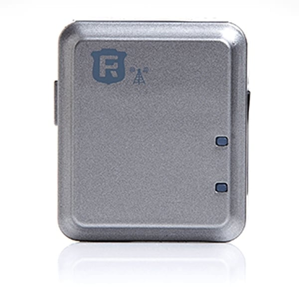

# Reachfar - RF-V13

The Reachfar RF-V13 is a compact wireless door/window alarm and GSM alarm system from Reachfar designed for discreet perimeter security. Plaspy compatible when configured to accept its GPRS/TCP-IP or SMS alarm reports, the RF-V13 combines magnet-sensor intrusion detection, LBS/GPS location awareness, and two-way voice alarm verification into a small form factor ideal for homes, shops, and small offices.

Built for simple installation and remote notification, the RF-V13 reports alarms over quad-band GSM \(850/900/1800/1900MHz\) and supports GPRS Class 12 TCP/IP as well as SMS alerts and the Reachfar mobile app. Because it provides LBS positioning and GPS positioning-time data, it can feed Plaspy with location and event data for real-time tracking and anti-theft monitoring — while its compact 40 × 34 × 14 mm host and rechargeable battery support unobtrusive mounting on doors or windows.

## Key Highlights

- Plaspy compatible: integrates with Plaspy via GPRS/TCP-IP reporting or formatted SMS messages for alarms and location updates.
- Compact and discreet: small host \(40 × 34 × 14 mm, 27 g\) mounts easily with supplied Velcro for low-visibility security installation.
- Reliable GSM alarm reporting: quad-band GSM and GPRS Class 12 enable remote SMS, push and platform notifications.
- Door/window intrusion detection: dedicated magnet sensor box detects opening events and reports them immediately.
- Basic location awareness: LBS positioning \(200–800 m\) plus GPS positioning-time characteristics for contextual location info when GPS is available.
- Rechargeable battery: built-in 520 mAh battery with typical GSM standby of 4–5 days, suitable for intermittent alarm use.
- Two-way verification: supports two-way voice calls for instant event confirmation and better response in emergencies.

## How It Works with Plaspy

When configured for Plaspy, the RF-V13 can deliver alarm events, basic telemetry and location readings to Plaspy’s platform either by sending GPRS/TCP-IP packets to a Plaspy endpoint or by forwarding formatted SMS messages that Plaspy ingests. Plaspy then timestamps events, maps approximate locations, and pushes alerts to users by app notification, SMS or email according to your account rules. Because the RF-V13 focuses on door/window intrusion and GSM reporting, it provides dependable anti-theft and perimeter-alert functionality rather than high-frequency fleet telemetry.

- Real-time location and telemetry updates — via GPRS/TCP-IP or SMS; LBS accuracy is approximately 200–800 meters \(coarse position\).
- Door/window alarm status — magnet sensor open/close events and alarm triggers sent to Plaspy for alerting and logging.
- Battery and device health — rechargeable 520 mAh battery status and device connectivity reports available through SMS/app.
- Two-way voice call verification — immediate voice calls to preset numbers for event confirmation and response coordination.
- Bluetooth sensors/beacons — RF-V13 does not include BLE sensor support; Plaspy can combine RF-V13 data with other Plaspy-compatible BLE devices where needed.

## Technical Overview

| Connectivity | Quad-band GSM \(850/900/1800/1900 MHz\); GPRS Class 12, TCP/IP |
| --- | --- |
| Bands | 850 / 900 / 1800 / 1900 MHz |
| Power & Battery | Built-in rechargeable 520 mAh battery; typical GSM standby 4–5 days \(usage dependent\) |
| Interfaces | 1 × Magnet sensor box for door/window; SMS command configuration; two-way voice call functionality |
| GNSS | Built-in GSM/GPS antenna; LBS positioning accuracy ≈ 200–800 m; positioning time \(open sky\) — Cold start ~30 s, Warm start ~29 s, Hot start ~5 s |
| Bluetooth | Not supported / Not specified |
| Remote Management | Configurable via SMS commands and Reachfar mobile app/platform; TCP/IP reporting to online services \(Plaspy integration via TCP-IP or SMS\) |
| Form Factor | Compact host 40 × 34 × 14 mm; host weight ≈ 27 g; supplied Velcro for mounting |

## Use Cases

- Home and apartment anti-theft: discreet door/window monitoring with immediate SMS/push alerts and two-way call verification through Plaspy.
- Small shop or kiosk perimeter protection: remote alarm notification to owners and staff, with coarse location awareness for mobile or pop-up locations.
- Remote property and asset monitoring: basic location and intrusion alerts for cabins, storage boxes or unattended small assets where precise GPS telemetry is not required.
- Verified alarms for sensitive entrances: two-way voice calls allow rapid confirmation of events and reduce false alarm response costs.

## Why Choose This Tracker with Plaspy

The RF-V13 delivers an affordable, easy-to-install door/window alarm solution that integrates with Plaspy for centralized alerts and event logging. Its quad-band GSM and GPRS TCP/IP support make it straightforward to route alarms and location data into Plaspy, while the magnet sensor, two-way voice, and rechargeable battery provide the essential functionality needed for anti-theft and perimeter monitoring. Although the RF-V13 is optimized for intrusion detection and coarse LBS location rather than full fleet telemetry, pairing it with Plaspy gives you centrally managed alerts, historical event records, and app-based notifications for fast response.

Note: The RF-V13 product page indicates this model is marked "out of production." The specifications above reflect original manufacturer data. Before deployment, confirm current software compatibility, server endpoints and platform support with Reachfar or Plaspy support to ensure seamless integration and ongoing service.

