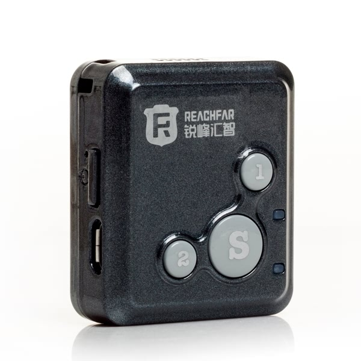

# Reachfar - RF-V16

# RF-V16 GPS SOS Tracker

The RF-V16 is a super-mini GPS tracker and SOS communicator designed for fast emergency response and reliable personal location tracking. With an ultra-compact 40 x 30 x 14 mm housing and a lightweight 27 g body, the RF-V16 is Plaspy compatible and easy to carry — ideal for parents, caregivers, lone workers, and anyone who needs a simple one-button emergency solution. Its SiRF Star IV GPS and quad-band GSM connectivity enable quick fixes and flexible reporting to Plaspy for real-time tracking and alerts.

The RF-V16 pairs compact hardware with multiple real-time tracking channels — web tracking, iOS/Android apps, WeChat, and SMS — so Plaspy users can receive location updates, SOS alarms, and status notifications through the platform they prefer. Built for dependable on-person protection, the RF-V16 focuses on rapid location, two-way voice, and event alerts rather than vehicle telemetry features like ignition or fuel monitoring.

## Key Highlights

- Plaspy compatible: sends real-time location and alarms over GPRS \(TCP/IP\) to integrate with Plaspy dashboards and mobile apps.
- Compact and lightweight: 40 × 30 × 14 mm, 27 g — unobtrusive for children, elderly, and lone workers.
- Fast and accurate positioning: SiRF Star IV GPS with typical accuracy of 5–15 m and quick TTFF \(hot ~5s, warm ~29s, cold ~30s\).
- One-touch SOS with automatic calling: SOS alarm sends location and auto-calls up to five emergency contacts until answered.
- Two-way voice and remote listening: hands-free talk and remote monitoring for immediate situational awareness.
- Multi-channel tracking: web portal, iPhone/Android apps, WeChat, and SMS ensure redundancy if data or mobile networks vary.
- Theft protection features: SIM-change alert and low-battery notifications for prompt response and anti-theft awareness.

## How It Works with Plaspy

The RF-V16 uses GSM GPRS \(Class 12, TCP/IP\) to transmit GPS positions and event data to servers. When configured for Plaspy, the device pushes location packets and alarm messages over the mobile data channel or, where applicable, falls back to SMS for emergency notifications. Plaspy ingests this data to provide real-time tracking, trace replay, and configurable alerts to administrators and emergency contacts.

- Real-time location and telemetry updates sent via GPRS \(TCP/IP\) to Plaspy servers.
- SOS one-touch alarm delivers location and triggers auto-calls to preset emergency contacts.
- Two-way voice and remote listening provide live audio access for verified emergencies.
- Geo-fence and movement \(displacement\) alarms report events to Plaspy for instant notifications.
- Low-battery and SIM-change alerts ensure Plaspy can alert managers or guardians to potential device or theft issues.
- Trace replay and historical location logs available through Plaspy for audit and review.

## Technical Overview

| Connectivity | GSM quad-band; GPRS Class 12 \(TCP/IP\) |
| --- | --- |
| Bands | GSM 850 / 900 / 1800 / 1900 MHz |
| Power & Battery | Standby up to ~300 hours \(GSM standby\); ~50 hours when uploading every 10 minutes. Low-battery SMS alert at &lt;10%; 10% charge ≈ 2 hours standby or ~5 minutes talk time. |
| Interfaces & Controls | SOS one-touch button, click-to-call \(preset numbers\), two-way voice \(hands-free\), remote listening; geo-fence, displacement alarm, low-battery and SIM-change alerts. |
| GNSS | GPS \(SiRF Star IV\); typical accuracy 5–15 m in open sky; TTFF: hot ~5 s, warm ~29 s, cold ~30 s. |
| Bluetooth | Not specified / no Bluetooth sensors described. |
| Remote Management | Device supports GPRS/TCP-IP reporting to platforms \(e.g., Plaspy\) and multiple user apps; FOTA or web-based device management not specified. |
| Form Factor & Physical | Host size 40 × 30 × 14 mm; host weight 27 g. Packaging size 138 × 118 × 46 mm; package weight 218 g. Colors: black, blue, pink. |
| Operating Conditions | -20°C to +70°C; relative humidity 5%–95%. |

## Use Cases

- Personal safety and anti-theft alerting — instant SOS location sent to caregivers and Plaspy monitoring teams.
- Childcare and elderly care — compact wearable for children or seniors who need quick access to help and location sharing.
- Lone-worker protection — discreet device for staff working alone, with emergency call and remote listen capabilities.
- Small-scale field personnel tracking within fleet management programs — track on-foot staff and coordinate response without vehicle telematics.
- General asset or portable equipment tracking where rapid location and alarm are required rather than vehicle telemetry or fuel monitoring.

## Why Choose This Tracker with Plaspy

Paired with Plaspy, the RF-V16 delivers a compact, reliable solution for real-time tracking, emergency response, and basic telemetry for people and portable assets. Its lightweight form factor and one-button SOS make it easy to deploy to children, seniors, or lone workers, while GPRS \(TCP/IP\) reporting and SMS fallback give Plaspy administrators multiple ways to receive critical alerts. Although the RF-V16 is not a vehicle telematics unit \(ignition, immobilizer, and fuel monitoring are not part of this device\), it complements fleet management efforts by covering personal safety and on-foot staff tracking.

Choose the RF-V16 with Plaspy when you need a trustable, easy-to-integrate personal tracker that emphasizes fast GPS fixes, clear two-way voice, and robust emergency alerts. The result is improved situational awareness, faster response, and a straightforward path to scale personal protection across teams and vulnerable individuals.

