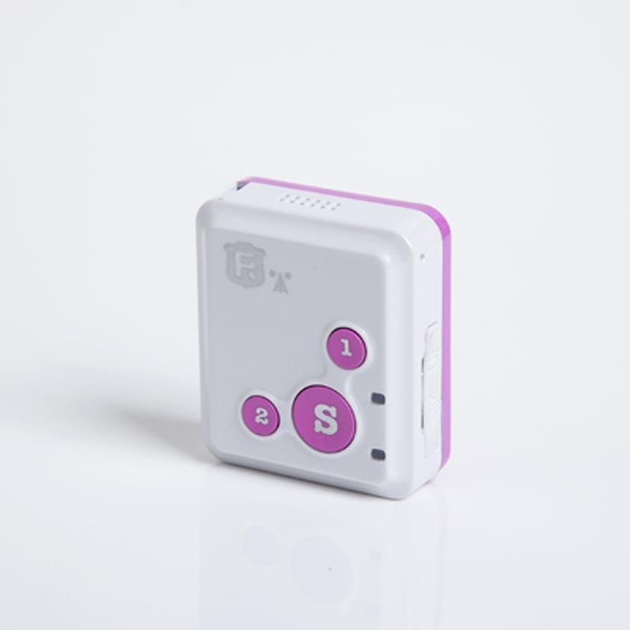

# Reachfar - RF-V18

The RF-V18 is a compact personal GPS tracker designed for discreet protection and continuous monitoring. Built for wearability, the device combines GPS, A GPS, and LBS positioning with quad band GSM GPRS connectivity to provide location updates, SOS alerts, and two way voice calling. Its small form factor and long standby performance make it suitable for carrying on a lanyard or wearing as a pendant for children, the elderly, or other vulnerable users.

As a Plaspy compatible device out of the box, the RF-V18 transmits position and event data to cloud platforms over GPRS with SMS fallback for critical notifications. When paired with Plaspy, caregivers and administrators can view live location, receive geofence and low battery alerts, manage tracking intervals, and access historical location playback through Plaspy dashboards and mobile interfaces, making the RF-V18 a practical choice for monitored personal safety workflows.

## Key Highlights

- Plaspy compatible real time tracking via GPRS reporting with SMS fallback for essential alerts
- Compact and lightweight design for unobtrusive wearable use on a lanyard or necklace
- Multiple positioning modes including GPS, A GPS, and LBS to improve availability of location fixes
- SOS button plus two way voice calling to authorized numbers for direct emergency communication
- Long standby performance suitable for extended monitoring between charges
- Geofence notifications and low battery alerts to help caregivers respond proactively
- Temporary higher frequency tracking modes for concentrated monitoring during critical periods

## How It Works with Plaspy

The RF-V18 sends location and event data to Plaspy over GPRS so positions and device states appear in the Plaspy platform in near real time. Plaspy consumes the device reports to power live maps, alerts, and historical playback while allowing caregivers to adjust tracking behavior and receive centralized notifications.

- Live position updates via GPS and assisted methods, with LBS as a backup when satellite reception is limited
- SOS events and two way voice alerts forwarded to Plaspy for centralized notification and logging
- Geofence entry and exit notifications delivered to Plaspy for automated alerting and workflows
- Low battery and motion related events visible in Plaspy so administrators can maintain device readiness
- App based configuration and control workflows supported so Plaspy receives consistent telemetry and status for reporting

## Typical Use Cases

- Child safety and guardian monitoring with SOS and voice communication for rapid response
- Elderly care and remote supervision where notifications and location history support caregiver decisions
- Personal protection for vulnerable users who require unobtrusive continuous tracking
- Short term close supervision using higher frequency update modes for concentrated visibility
- School or activity oversight where centralized alerts and location playback help manage groups

## Why Choose This Tracker with Plaspy

The RF-V18 is a practical option for organizations and individuals who need a compact, reliable personal tracker integrated with a cloud platform like Plaspy. Its combination of multiple positioning methods, SOS and two way voice features, and Plaspy compatibility makes it straightforward to centralize monitoring, alerting, and basic device management for caregiver workflows.

To learn more about how the RF-V18 works with Plaspy and whether it fits your monitoring needs, visit https://www.plaspy.com. Product specifications, availability, and manufacturer details can change over time, so please verify current technical information and support resources on the manufacturer site https://www.reachfargps.com/.
