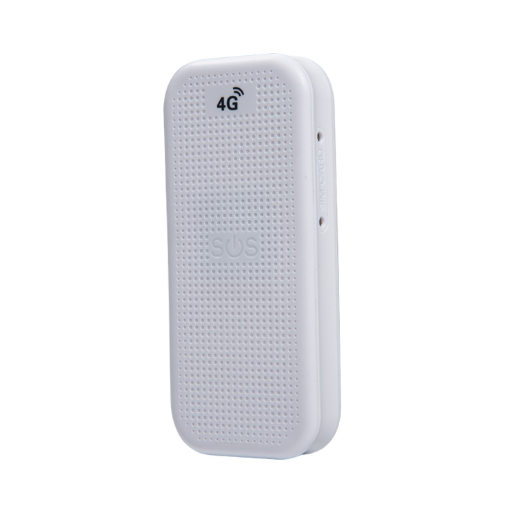

# Reachfar - RF-V22

The Reachfar RF-V22 Telecom Smart Door Alarm is a compact cellular door-status detector designed for supervised entry control in quarantine facilities, healthcare settings, assisted living, and other controlled environments. It reports door opening and closing events over GSM GPRS networks and is built with an IP67 rated enclosure for reliable operation in indoor and semi-outdoor locations. The product is available in white or black and is supplied with a product manual and installation video to streamline deployment.

As a Plaspy compatible device, the RF-V22 provides door state telemetry that can be ingested by Plaspy for centralized monitoring and operational oversight. When integrated, V22 events become part of the Plaspy data stream, allowing teams to use Plaspy dashboards, alerting rules, and historical logs to manage access, automate responses, and correlate door activity with other field data where available.

## Key Highlights

- Plaspy compatible integration for door state telemetry and centralized monitoring
- GSM GPRS quad band connectivity for cellular reporting without local Wi Fi
- IP67 rated enclosure for dependable indoor and semi outdoor installation
- Intended for quarantine, healthcare, assisted living, and controlled entry scenarios
- Near real time reporting of open and close events to support fast response
- Installer resources and an installation video to reduce deployment time
- Available in white or black to match facility aesthetics

## How It Works with Plaspy

The RF-V22 transmits door open and close events via cellular communications to a configured endpoint, where Plaspy receives those events as telemetry inputs. Plaspy becomes the central management layer that captures alerts, stores event history, and enables automation based on door state. Integration in Plaspy lets operators combine V22 telemetry with other monitored devices to form a single operational picture.

- Deliver near real time door open and close events into Plaspy for immediate visibility
- Trigger notifications and escalation workflows in Plaspy when door events match alert rules
- Maintain event logs and history in Plaspy for auditing and compliance reporting
- Correlate door state with location and asset data managed in Plaspy to enrich situational awareness
- Use door telemetry in Plaspy to support coordinated responses across teams and devices

## Typical Use Cases

- Quarantine and isolation rooms where access events must be monitored and logged
- Healthcare and assisted living facilities for staff notification and patient safety workflows
- Perimeter and facility access supervision in sites without reliable onsite networks
- Temporary clinics and field sites that require rapid deployment of door monitoring
- Combined operations where door events are correlated with asset location and status in Plaspy

## Why Choose This Tracker with Plaspy

Although the RF-V22 is a dedicated door alarm rather than a GPS tracker, its focused cellular door telemetry complements Plaspy’s real time monitoring and fleet management capabilities. Feeding reliable open and close events into Plaspy helps organizations build richer operational workflows, enabling faster notifications, better auditing, and improved coordination between access control and other monitored assets.

Choose the RF-V22 with Plaspy when you need a low cost, cellular based door supervision device with rugged enclosure options and straightforward integration into a central monitoring platform. Its installer resources and near real time reporting make it practical for facilities that must manage access across multiple locations while minimizing on site network dependencies.

To learn more about how Plaspy can incorporate door telemetry like the RF-V22 into your monitoring workflows visit https://www.plaspy.com. Product specifications, availability, and manufacturer details can change over time, so please verify current specifications and documentation on the Reachfar website https://www.reachfargps.com/.
