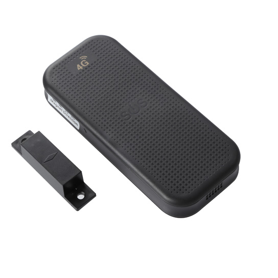

# Reachfar - RF-V23

The RF-V23 is a rugged, long life GPS tracker designed for outdoor asset protection and continuous remote monitoring. It ships in configurations that include a large capacity battery and optional solar charging, and the enclosure meets IP66 waterproofing for demanding environments. The device supports GNSS positioning and multiple location modes to maintain reliable tracking for vehicles and field equipment while minimizing maintenance visits.

As a Plaspy compatible device, the RF-V23 can stream location and device status into Plaspy to provide centralized visibility and operational oversight. Its endurance features, tamper sensing and voice alerting functions make it well suited to fleet managers and asset custodians who need persistent location data, timely alerts and historical playback inside Plaspy dashboards and reports.

## Key Highlights

- Plaspy compatible for centralized real time tracking and fleet management.
- Long endurance design with a high capacity battery and optional solar charging for extended off grid operation.
- Rugged outdoor rating with IP66 protection and a compact form factor suitable for equipment and asset mounting.
- Multi mode positioning that combines GNSS, WiFi detection and LBS to improve fix reliability in varied environments.
- Practical security features including SOS two way voice, remote voice monitoring, audio buzzer alerts and tamper sensing.
- Low power operation and configurable reporting intervals to balance visibility and battery life.
- Built to support continuous monitoring use cases such as vehicle and equipment tracking.

## How It Works with Plaspy

When integrated with Plaspy, the RF-V23 sends location data and device health indicators to the Plaspy platform for mapping, alerting and reporting. Plaspy aggregates GNSS, WiFi and network based position inputs together with device status so teams can monitor assets in real time and review historical movement.

- Live location updates and device telemetry feed Plaspy dashboards for operational awareness.
- Geofence creation and instant alerts for entry and exit events to protect assets and manage zones.
- Historical route playback for trip review and operational auditing over retained time windows.
- Tamper and SOS alerts forwarded to Plaspy to trigger notifications and response workflows.
- Battery and device status reporting to help schedule maintenance and reduce downtime.
- Configurable upload intervals and blind spot supplemental uploads to improve data continuity in intermittent coverage areas.

## Typical Use Cases

- Fleet management and route monitoring for light vehicles, trailers and service fleets requiring long battery life.
- Anti theft protection for outdoor equipment and assets using SOS, remote ringing and tamper alerts.
- Remote site equipment monitoring where solar charging and IP66 protection reduce visits and maintenance.
- Historical trip playback and compliance review for operations needing route records.
- Hybrid location tracking that combines GNSS with WiFi and network positioning in urban or partially covered environments.

## Why Choose This Tracker with Plaspy

The RF-V23 is well suited for organizations that need a durable, long endurance tracking device paired with a full featured fleet and asset platform. Its combination of extended battery life, optional solar charging and multiple positioning methods helps maintain visibility in remote and outdoor deployments while lowering the frequency of site visits. Integrated with Plaspy, the unit becomes part of a complete solution for real time monitoring, alerts and historical analytics.

If you want to explore how the RF-V23 can fit into your fleet or asset management program, Plaspy provides the platform tools to visualize location, configure alerts and analyze device data in context. Learn more about Plaspy on the main website https://www.plaspy.com and verify current product specifications and availability on the manufacturer site https://www.reachfargps.com/ . Product specifications and availability can change over time so please consult the official manufacturer documentation for the latest details.
