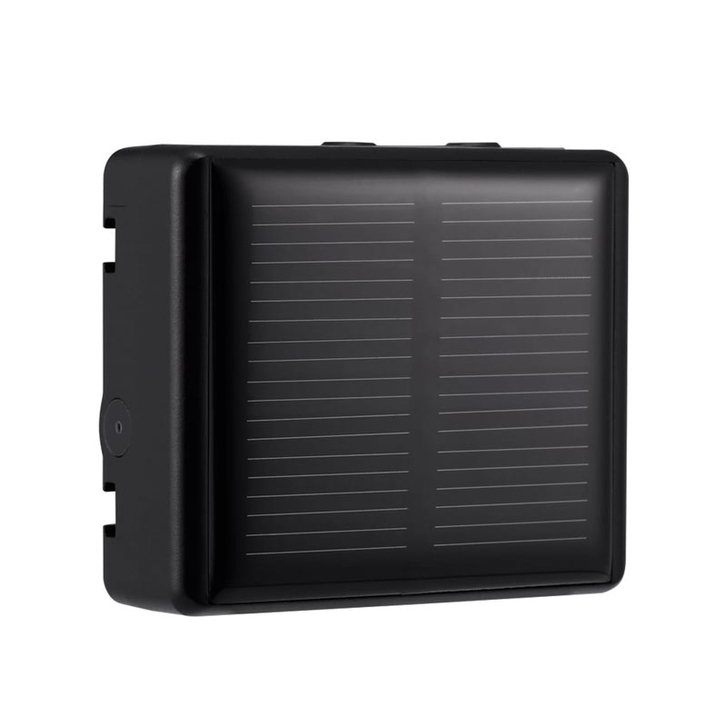

# Reachfar - RF-V26+

The RF-V26+ is a compact animal GPS tracker purpose built for livestock and large animals such as sheep, horses and cows. It combines a rugged waterproof enclosure with solar assisted charging to provide extended field operation. The device is small and lightweight at 6.5 x 5.5 x 1.7 cm and approximately 73 g and ships with a holder, a magnet USB charging cable and a user manual, making it suitable for collar or holder mounting in grazing environments.

As a Plaspy compatible device by design, the RF-V26+ can feed standard location and status data into Plaspy for real time tracking and basic farm telemetry. This makes the tracker relevant for operations that need straightforward on-animal positioning for grazing management, anti loss monitoring and remote supervision of farm assets while using Plaspy for maps, alerts and reporting.

## Key Highlights

- Compact lightweight form factor designed for comfortable collar mounting on sheep, horses, cows and similar livestock
- Solar assisted charging to extend operational life and reduce maintenance intervals in the field
- Rugged waterproof enclosure built for outdoor grazing and harsh environmental conditions
- Supplied with holder and magnet USB charging cable for straightforward on site setup and charging
- Intended to provide position and basic device status suitable for Plaspy integration and mapping
- Practical packaging and documentation options to support fleet deployments and inventory handling

## How It Works with Plaspy

When integrated with Plaspy, RF-V26+ location points and device status are presented on Plaspy maps and dashboards so managers can monitor animals in real time and review historical movement. Plaspy turns the incoming device feeds into visual tracks, alerts and reports that support operational oversight of grazing stock and mounted equipment.

- Live positions and movement trails displayed on Plaspy maps for situational awareness
- Historical location history for grazing pattern analysis and seasonal planning
- Status indicators such as charging or battery conditions reported to Plaspy when available from the device
- Geofence alerts and perimeter notifications for anti loss monitoring and boundary management
- Exportable reports and logs to support record keeping and integration with other farm workflows

## Typical Use Cases

- Grazing management to map pasture usage and optimize rotation across fields
- Animal anti loss monitoring with geofence alerts to notify when animals stray beyond set boundaries
- Remote herd supervision to reduce the need for routine physical checks across large areas
- Tracking collars and holders used on working animals or mounted tools in pastoral operations
- Reviewing historical movement for breeding decisions, health monitoring or resource planning

## Why Choose This Tracker with Plaspy

The RF-V26+ is a focused solution for farms and grazing operations that need reliable on-animal positioning with a durable enclosure and extended operation through solar assistance. Its compact size and included mounting accessories make it practical to deploy across herds, while the device design supports straightforward data feeds into Plaspy for mapping, alerts and reporting.

If your goals are real time location visibility, basic device status monitoring and simple historical reporting within Plaspy, the RF-V26+ is a sensible option to consider. Learn more about Plaspy on the main website https://www.plaspy.com. Product specifications, availability and manufacturer details can change over time, so verify current specifications and support information with the manufacturer at https://www.reachfargps.com/
