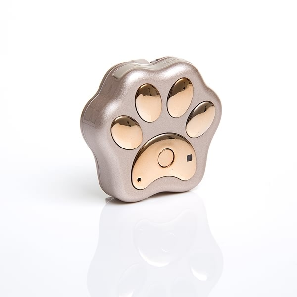

# Reachfar - RF-V30

The RF-V30 is a compact, Plaspy compatible GPS tracker engineered for everyday pet protection and reliable real-time tracking. Combining quad-band GSM connectivity, integrated GPS and WiFi-assisted positioning, the RF-V30 delivers accurate location updates, geo-fence alerts and up to 90 days of historical route playback — all in a small, lightweight package that mounts comfortably to collars.

The device is built for practical pet use: IP66 water and dust resistance, a 400 mAh rechargeable battery with flexible standby modes, and an automatic LED smart rolling light for nighttime locating. As a Plaspy compatible tracker, the RF-V30 integrates directly with the Plaspy platform to provide owners fast access to location, route history and alerting via web and mobile interfaces.

## Key Highlights

- Plaspy compatible for seamless real-time tracking and map-based management of pets.
- Quad-band GSM + GPRS \(Class 12, TCP/IP\) for reliable mobile data transmission and live updates.
- Dual positioning: GPS \(10–15 m open sky\) plus WiFi-assisted positioning for improved urban/indoor coverage.
- Compact, lightweight design \(47×50×15 mm, 33 g\) made to attach comfortably to collars.
- IP66 rated housing and wide operating temperature \(-20°C to +70°C\) for everyday outdoor use.
- 400 mAh built-in battery with multiple standby modes — configurable up to ~10–12 days in low-frequency settings.
- Geo-fence alerts and up to 90 days of historical route recording for activity review and recovery.

## How It Works with Plaspy

When paired with Plaspy, the RF-V30 transmits location and telemetry over cellular data so owners can monitor pets in real time and review historical movements. Plaspy ingests GPRS TCP/IP packets from the device and maps GPS/WiFi positions, triggers alerts and stores routes for playback. The result is a straightforward integration path for pet tracking workflows and owner notifications.

- Real-time location updates via quad-band GSM and GPRS for live tracking on the Plaspy map.
- Geo-fence events: immediate alerts when a pet leaves or returns to a defined area.
- Historical route playback: up to 90 days of recorded tracks accessible through Plaspy for activity review.
- Battery and standby telemetry reported to Plaspy so owners receive low-battery notifications.
- WiFi-assisted positioning to improve coverage and location accuracy in urban or indoor environments.

## Technical Overview

| Connectivity | GSM quad-band \(850/900/1800/1900 MHz\), GPRS Class 12, TCP/IP |
| --- | --- |
| GNSS / Positioning | GPS module \(open-sky accuracy ~10–15 m\); WiFi-assisted positioning \(~15–100 m\) |
| Positioning Time | Cold start ~30 s; Warm start ~29 s; Hot start ~5 s \(open sky\) |
| Battery & Standby | Built-in 400 mAh battery; GSM-only standby ~300 hours \(GPS off\); GPS standby ~60 hours at 10-minute interval; extended standby up to ~10–12 days with timed positioning disabled \(subject to settings\) |
| Antenna | Built-in GSM/GPS antennas \(integrated design\) |
| Durability | IP66 water & dust resistance; operating temperature -20°C to +70°C; humidity 5%–95% RH |
| Dimensions & Weight | Host size 47×50×15 mm; host weight 33 g |
| Package Contents | RF-V30 tracker, multi-function USB cable, user manual, lanyard and optional collar |
| Colors | Black, Blue, Golden |

## Use Cases

- Pet tracking and recovery — real-time location and geo-fence alerts help owners quickly locate lost dogs or cats.
- Monitoring outdoor exercise and routes — review historic tracks via Plaspy to understand activity patterns and distances.
- Nighttime locating — automatic LED smart rolling light improves visibility in low-light conditions for easier retrieval.
- Safe roaming management — set virtual boundaries in Plaspy and receive immediate notifications when pets stray.
- Everyday pet protection — a small, waterproof tracker that balances runtime and frequent position reporting for daily use.

## Why Choose This Tracker with Plaspy

The RF-V30 offers a focused, reliable pet tracking experience when used with Plaspy. Its combined GPS and WiFi positioning ensures better coverage across open and urban environments, while GPRS TCP/IP transport keeps live tracking responsive. The small form factor, IP66 rating and configurable standby modes give owners a flexible balance of continuous monitoring and battery life. Integrated LED lighting and up to 90 days of route history add practical features for recovery and review.

Note: the RF-V30 is optimized for pet and small-asset tracking and does not include vehicle-specific interfaces such as ignition inputs, immobilizer control, or Bluetooth sensor support. However, as a Plaspy compatible device it complements the broader Plaspy ecosystem — which supports a wide range of trackers for fleet management, telemetry, fuel monitoring and sensor integrations — allowing customers to choose the right device for each use case.

