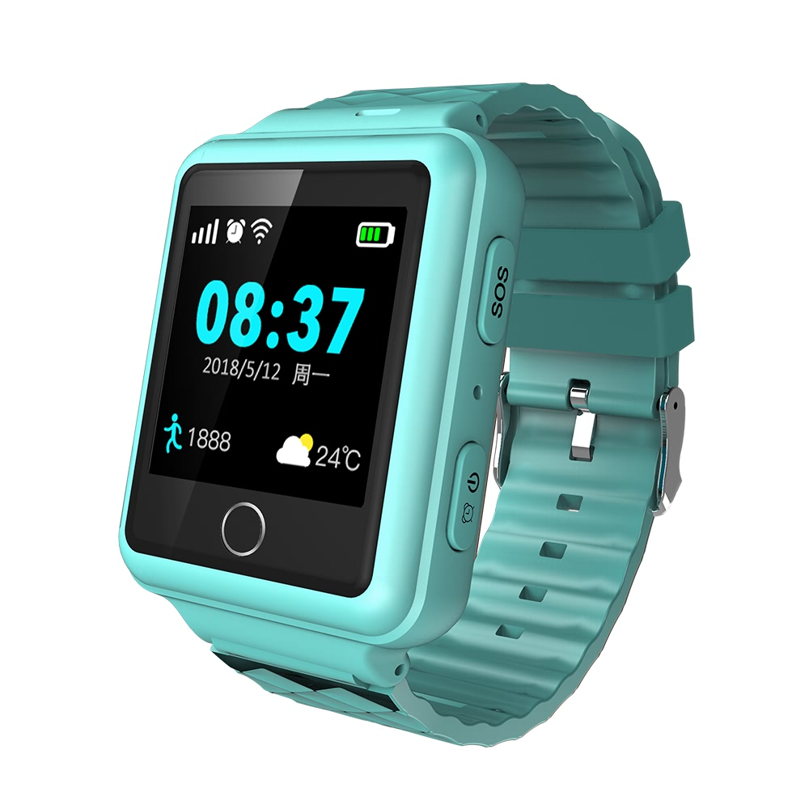

# Reachfar - RF-V38

The RF-V38 is a compact 2G GPS smartwatch designed for dependable personal monitoring and emergency response. It combines GPS, Wi‑Fi and LBS positioning with a one‑touch SOS and two‑way voice to provide real‑time tracking and immediate caregiver communication. The form factor and feature set make the RF‑V38 suitable for children, seniors and patients who require continuous oversight and quick access to assistance.

As a Plaspy compatible device, the RF‑V38 streams location and device status over GPRS so Plaspy can display live positions, store historical routes and trigger event alerts. Built‑in notifications such as SIM change and low battery extend device visibility within Plaspy, while activity features like step counting and vibration/ring alerts provide additional context for caregivers and institutions using the Plaspy platform.

## Key Highlights

- Plaspy compatible real time tracking via GPRS with historical route playback and live updates
- Multi mode positioning using GPS, Wi‑Fi and LBS for broader coverage in different environments
- One touch SOS and two way voice for immediate caregiver communication and emergency response
- Device health and activity alerts including SIM change, low battery, step counting and vibration/ring notifications
- Wearable design with IP67 water resistance and compact dimensions for everyday personal use
- Practical features for monitoring programs such as geofence alerts and route history

## How It Works with Plaspy

When connected, the RF‑V38 transmits location points and status telemetry to Plaspy so operators and caregivers can monitor wearers in real time and review historical movement. Plaspy consolidates those signals into dashboards, alert workflows and reports, enabling coordinated responses to SOS events and device alarms.

- Real time location and telemetry updates for live tracking and operational visibility
- SOS alerts routed into Plaspy for rapid notification and escalation to designated contacts
- Two way voice capability to help establish immediate communication between wearer and caregiver
- Activity and behavior context such as step count and vibration alerts shown alongside location data
- Device health notifications like SIM change and low battery visible in Plaspy for proactive management
- Historical route playback and geofence event logging for investigation and reporting

## Typical Use Cases

- Child safety monitoring with live location, geofence alerts and SOS to guardians
- Elderly care and dementia support using route playback and two way voice for caregiver contact
- Clinic and community health follow up for patients that need regular check ins and emergency assistance
- Institutional caregiver systems where centralized dashboards receive device alarms and telemetry
- Everyday wellness and outdoor safety where waterproof wearable design and activity tracking are useful

## Why Choose This Tracker with Plaspy

The RF‑V38 pairs a purpose built wearable design with multi mode positioning and practical alarm features, making it a good fit for personal safety programs managed through Plaspy. Integrating the RF‑V38 into Plaspy lets organizations consolidate location, activity and alert data from individual wearables alongside other tracking endpoints, improving situational awareness and response coordination without adding unnecessary complexity.

If you want to evaluate the RF‑V38 for a Plaspy deployment, consider its emphasis on personal monitoring and emergency communication rather than vehicle tracking. For more information about Plaspy and how compatible devices are managed on the platform visit https://www.plaspy.com. Product specifications and availability can change over time, so please verify current technical details and manufacturer documentation at https://www.reachfargps.com/.
