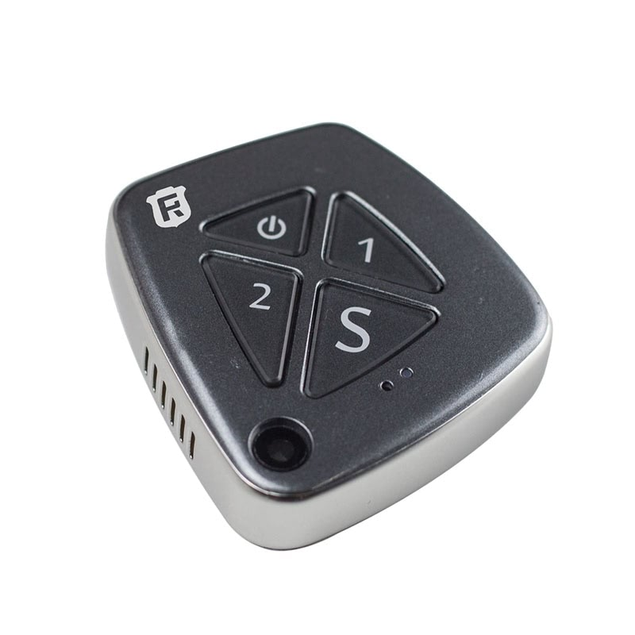

# Reachfar - RF-V42

The Reachfar RF-V42 is a versatile GPS tracker that offers a range of features to help you keep track of your loved ones or valuable assets. One of its standout features is its compatibility with 3G networks, ensuring reliable and fast communication. This means you can easily track the device and receive real-time updates on its location.

In case of emergencies, the RF-V42 has an SOS call function, allowing the user to quickly send out a distress signal. Additionally, it also supports ordinary calls, so you can easily communicate with the device's user. This can be particularly useful for elderly or vulnerable individuals who may need assistance.

Another handy feature of the RF-V42 is its talking clock. This feature allows the device to announce the time, making it convenient for those who may have difficulty reading a traditional clock. Whether it's for personal use or for monitoring a fleet of vehicles, the RF-V42 offers real-time GPS tracking. You can easily track the device's location using a smartphone or computer, ensuring you always know where it is.

The RF-V42 also provides a historical route feature, allowing you to view the device's past movements. This can be useful for analyzing patterns or tracking the device's route over a specific period of time. Additionally, the device supports geo-fencing, which allows you to set up virtual boundaries. If the device crosses these boundaries, you will receive an alert, ensuring you can take immediate action.

With its range of features and reliable performance, the Reachfar RF-V42 is an excellent choice for anyone in need of a GPS tracker. Whether it's for personal use or for business purposes, this tracker offers the functionality and convenience you need to keep track of your loved ones or valuable assets.

