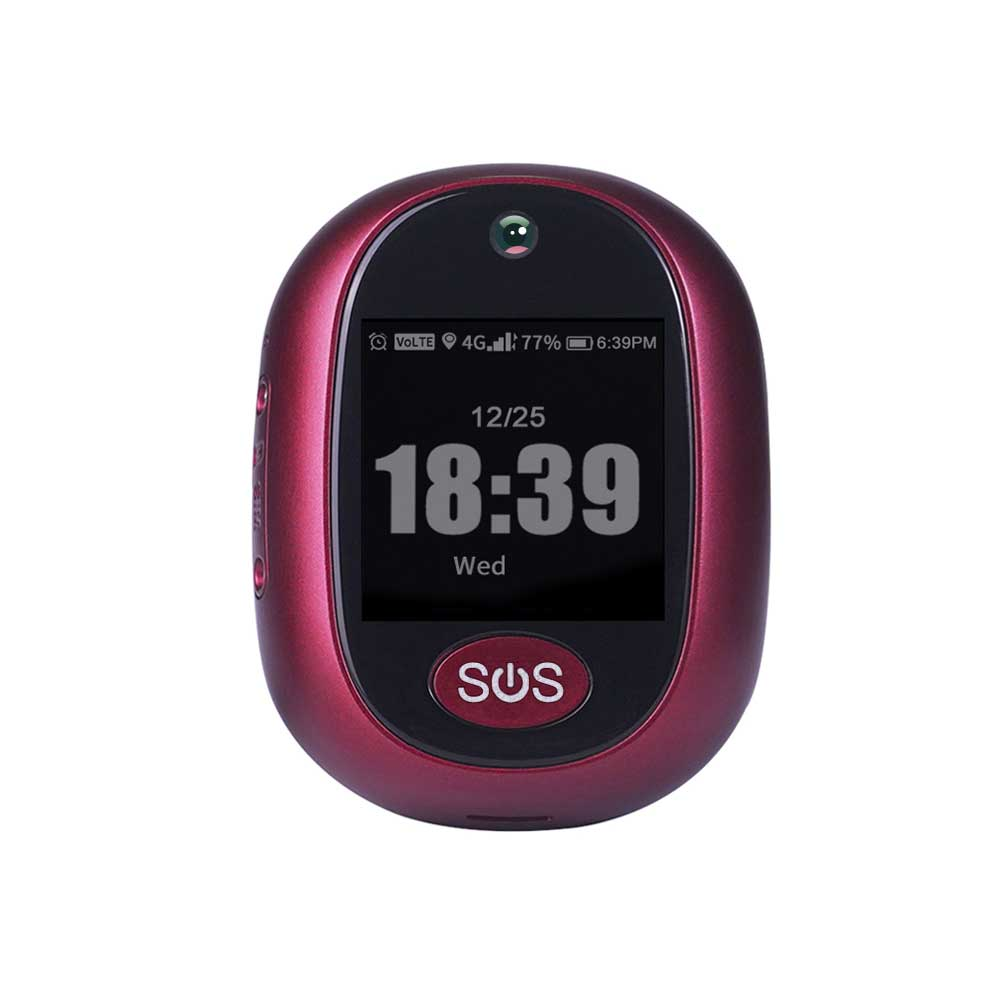

# Reachfar - RF-V45

The RF-V45 is a compact 4G LTE personal GPS tracker offered as a smart pendant that is Plaspy compatible for real-time tracking and reliable remote monitoring. Designed for seniors, children or anyone who needs extra care, the RF-V45 combines multi-mode positioning \(GPS/AGPS/LBS/Wi‑Fi\), two-way HD audio, an HD camera and one-key SOS to deliver fast alerts and clear situational awareness through the Plaspy platform. Its lightweight, IP67-rated housing and magnetic charging make it comfortable for all-day wear and simple to manage.

When integrated with Plaspy, the RF-V45 provides continuous telemetry and location data to help families and care coordinators act quickly during emergencies and maintain ongoing health and activity monitoring. The device supports geo-fence alerts, historical route playback and multi-terminal access \(mobile and PC\), making it a practical choice where dependable personal safety, anti-theft signaling and remote oversight matter most.

## Key Highlights

- Plaspy compatible for real-time tracking and centralized monitoring across mobile and PC apps.
- Multi-mode positioning \(GPS/AGPS, LBS and Wi‑Fi\) for improved accuracy indoors and outdoors.
- One-key SOS with preset numbers plus two-way HD calling and auto-answer for rapid emergency communication.
- Built-in HD camera with auto-capture and image upload to the companion platform for visual verification.
- Lightweight smart pendant design \(≈41 g\), IP67 water resistance and magnetic charging for daily convenience.
- Activity and basic health features—step counting, pill reminders, alarms and low-battery alerts—useful for caretaking programs.
- Supports 4G/3G/2G cellular connectivity \(LTE Cat4, DC-HSPA+, EDGE\) across broad regional bands for wide coverage.

## How It Works with Plaspy

The RF-V45 streams its positioning and status data to Plaspy using its cellular connection and on-device sensors. Plaspy-compatible integration lets caregivers receive live location updates, SOS alerts, images and essential telemetry via secure notifications and dashboards. Data flows are optimized for real-time tracking while preserving battery life through smart reporting modes.

- Real-time location and telemetry updates \(GPS/AGPS plus Wi‑Fi and LBS-assisted positioning\).
- Instant SOS alerts with preset numbers and two-way HD voice calling for on-the-spot intervention.
- HD camera captures and auto-uploads images to the companion app for visual context after an event.
- Geo-fence entry/exit alerts and historical route playback accessible from Plaspy for incident review and reporting.
- Activity and status telemetry such as step counts, alarms and battery level reporting to support remote health monitoring.

## Technical Overview

| Connectivity | 4G FDD/TDD \(LTE Cat4\), 3G WCDMA \(DC‑HSPA+\), 2G GSM \(EDGE\) |
| --- | --- |
| Bands | Multi-band support including examples such as B1/B2/B3/B5/B7/B8 and broader regional band sets |
| Data Rates | 2G EDGE, 3G DC‑HSPA+, 4G LTE Cat4 |
| Power & Battery | Magnetic charging; average standby current ~5 mA/h; average working current ~10 mA/h; battery capacity not specified |
| Interfaces & I/O | Single Nano‑SIM slot; one-key SOS button; HD camera; colorful display; two-way HD audio with auto-answer |
| GNSS | GPS with A‑GPS support; 22 channels; typical accuracy 5–15 m; cold‑start ~26 s; sensitivity ~‑165 dBm \(trace\) / ‑148 dBm \(capture\) |
| Wi‑Fi | 802.11b/g/n for Wi‑Fi localization to improve indoor positioning |
| Bluetooth | N/A \(no Bluetooth sensors reported\) |
| Remote Management | Companion app with image upload, multi‑terminal access \(PC and mobile\); FOTA not specified |
| Form Factor & Durability | Smart pendant, ≈41 g; IP67 water resistance |
| Environmental | Operating temperature ‑20 to 70 °C; operating humidity 5%–95% non‑condensing |
| Storage | Built‑in NAND+LPDDR2 \(2 GB + 4 GB\); no external memory card support |
| Platform | 32‑bit dual‑core ARM Cortex‑A7 \(chipset 9820E\) |

## Use Cases

- Senior care monitoring — SOS alerts, two‑way calling and activity tracking for quick response and remote oversight.
- Child safety — lightweight pendant form, geo‑fence alerts and location sharing via Plaspy for caregiver peace of mind.
- Personal anti‑theft and travel security — continuous location telemetry and emergency signaling when immediate action is needed.
- Health and medication management — pill reminders, alarms and step counts integrated into care workflows accessed through Plaspy.
- Small-scale asset monitoring — use in limited fleet or asset pools where personal safety features and visual verification are beneficial.

## Why Choose This Tracker with Plaspy

The RF-V45 delivers a balanced mix of reliable positioning, emergency communications and everyday wellness features that make it an effective Plaspy compatible GPS tracker for personal safety programs. Its multi-mode positioning and Wi‑Fi assistance improve location accuracy where GPS alone can struggle, while the HD camera and two‑way audio add visual and verbal confirmation during incidents. Lightweight and water resistant, the unit is easy to wear and simple to maintain with magnetic charging.

For caregivers, telemetric visibility through Plaspy—geo‑fence alerts, route history and multi‑terminal access—translates into faster responses and clearer situational context. Note that the RF‑V45 focuses on personal safety and health telemetry; features such as ignition inputs, immobilizer controls, fuel monitoring and Bluetooth sensor support are not part of this model. If your deployment requires deep vehicle telematics \(ignition or fuel monitoring\), review requirements against device specifications before purchase. For personal safety, anti‑theft signaling and reliable real‑time tracking with image and voice verification, the RF‑V45 integrated with Plaspy is a practical, easy‑to‑deploy solution.

